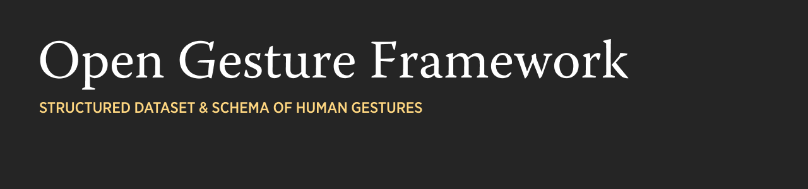

# Open Gesture Framework

An open, structured dataset of **99 human gestures** across **21 categories**, annotated with research-backed metadata for computer vision, affective computing, and human-computer interaction applications.

Each gesture includes a reference image and a rich metadata schema covering physical form, communicative intent, emotional dimensions, and cultural context -- grounded in established gesture taxonomy and affective science research.

## Why This Exists

A growing number of autonomous machines -- vehicles, delivery robots, drones, service kiosks -- are entering our shared spaces. They roam, interact, and increasingly impact our daily lives. Yet most of them cannot understand what we are trying to tell them with our bodies.

Consider a video that inspired this project: a grandmother was standing at the edge of a road, drying peppers on the pavement. An autonomous vehicle approached. She raised both of her hands -- palms out, arms extended -- conveying the universal human signal for *stop*. The vehicle didn't understand. It rolled forward over her peppers, angering the grandma. In that moment, voice interaction was not an option. The road was noisy, the vehicle had no conversational interface, and there was no time. A simple, instinctive gesture should have been enough. It wasn't.

This is not an edge case. Humans and machines are increasingly sharing the same physical world -- sidewalks, roads, warehouses, homes, operating rooms -- and coexistence demands communication. We do not rely on a single channel to understand each other; we speak, gesture, make eye contact, shift our posture. Machines that share our spaces need the same fluency across diverse modalities. Voice alone is not enough. It fails in noise, at distance, through glass, in social contexts where speaking aloud is inappropriate, and in split-second moments where there is simply no time to talk. In all of these situations, gesture is what humans instinctively reach for.

Pedestrians, cyclists, construction workers, and bystanders already use gestures every day to communicate with oncoming traffic, with each other, and increasingly, with autonomous machines. The same need is emerging in AR glasses and mixed-reality headsets, where hands and body become the primary input. When you are wearing a headset and your voice is occupied, drowned out, or socially inappropriate -- in a meeting, on a loud factory floor, across a crowded room -- gesture becomes the natural interface. AR platforms need to distinguish a subtle "come here" wave from a dismissive backhand flick, a pleading palm-press from a confident thumbs-up. When machines cannot read these signals, the gap between human intent and machine understanding becomes a real-world failure -- sometimes inconvenient, sometimes dangerous.

Gesture recognition systems need more than image labels to close this gap. They need to understand *what the body is doing*, *what it means*, and *how it feels*. Existing gesture datasets typically provide a class label and a bounding box, but lack the semantic and affective layers required for machines to interpret human intent in context -- especially in noisy, outdoor, voice-unreliable environments where gesture may be the only communication channel available.

Open Gesture bridges this gap by pairing reference images with a multi-dimensional metadata framework drawn from peer-reviewed research in gesture taxonomy, affective computing, and embodied cognition.

## Dataset Structure

```
manifest.json             # Machine-readable metadata for all 99 gestures
manifest.md               # Human-readable reference guide
gesture_images/
  affirmative-and-positive/
    affirm-01-thumbs-up.png
    affirm-02-ok-sign.png
    ...
  directional-and-wayfinding/
  greetings-and-farewells/
  negative-disapproval/
  ... (21 category folders)
annotations/               # Machine-generated, produced by annotate/
  quality_report.md        # Curated-vs-predicted disagreements
  _meta.json                # Model versions and per-weight licences
  faces.json, action_units.json, valence_arousal.json,
  pose.json, embeddings.json           # gitignored; regenerate locally
annotate/                  # The annotation pipeline (see annotate/README.md)
```

## Categories

| Category | Count | Description |
|----------|------:|-------------|
| Affirmative & Positive | 7 | Approval, agreement, celebration |
| Bicycle Signals | 3 | Standard cycling hand signals |
| Conversational Emphasis | 7 | Rhetorical gestures used during speech |
| Creative & Expressive | 1 | Size estimation and framing |
| Directional & Wayfinding | 8 | Pointing, beckoning, directing |
| Greetings & Farewells | 8 | Hellos, goodbyes, social acknowledgments |
| Love & Affection | 3 | Romantic and affectionate expressions |
| Meme & Fantasy | 3 | Pop-culture and internet-era gestures |
| Money & Transaction | 2 | Payment and financial references |
| Negative & Disapproval | 10 | Rejection, frustration, disapproval |
| Numbers | 10 | Finger counting from 1 to 10 |
| Practical & Functional | 8 | Utilitarian miming gestures |
| Quantity & Counting | 3 | Indicating amounts and enumeration |
| Respect & Religious | 1 | Reverence and spiritual expression |
| Rude & Offensive | 5 | Insults and taunts |
| Silence & Secrecy | 4 | Requesting quiet or indicating secrets |
| Size & Degree | 2 | Indicating dimensions |
| Sports & Taunting | 2 | Athletic signals and displays |
| Team Building | 2 | Group unity rituals |
| Urgency & Attention | 8 | Demanding attention or signaling urgency |
| Wishful & Luck | 2 | Promises and superstitious gestures |

## Metadata Schema

Every gesture entry in `manifest.json` includes the following fields:

| Field | Type | Description | Research Basis |
|-------|------|-------------|----------------|
| `physical_description` | string | How the body performs the gesture: posture, hand shape, finger configuration, and movement | Body Action and Posture (BAP) coding system (Dael et al., 2012) |
| `intent` | string | The communicative purpose the gesture conveys | McNeill's gesture-speech framework (1992, 2008) |
| `emotional_state` | enum | Overall valence: `positive`, `neutral`, or `negative` | Dimensional emotion models (Russell & Mehrabian, 1977) |
| `arousal` | enum | Activation energy: `low`, `medium`, or `high` | PAD model -- Pleasure-Arousal-Dominance (Mehrabian, 1995) |
| `emotional_adjectives` | array | CBT-informed emotion labels for the gesture | Plutchik's componential model (1980); Ekman's basic emotions (1969) |
| `gesture_type` | enum | Taxonomic class (see below) | McNeill (1992); Ekman & Friesen (1969) |
| `body_parts` | array | Anatomical parts involved in the gesture | BAP anatomical level coding (Dael et al., 2012) |
| `number_of_people` | enum | `single`, `2 person`, or `3 or more` | Interaction context |
| `cultural_context` | enum | `universal`, `western`, `east-asian`, `southern-european`, etc. | Cross-cultural gesture studies (Efron, 1941; Kendon, 1983) |

### Gesture Types (McNeill/Ekman Taxonomy)

| Type | Count | Definition |
|------|------:|------------|
| `emblem` | 67 | Conventionalized gestures with standalone meaning, understood without speech (e.g., thumbs up, wave) |
| `illustrator-iconic` | 21 | Gestures that depict concrete objects or actions (e.g., framing a camera, counting on fingers) |
| `illustrator-metaphoric` | 3 | Gestures representing abstract concepts (e.g., air quotes, mind-blown explosion) |
| `illustrator-deictic` | 2 | Pointing gestures that indicate spatial reference (e.g., index finger point) |
| `illustrator-beat` | 1 | Rhythmic gestures that emphasize speech cadence (e.g., hand chop into palm) |
| `adaptor` | 5 | Self-touching or body-manipulating gestures reflecting internal state (e.g., facepalm, tensed fingers) |

### Distribution Summary

| Dimension | Breakdown |
|-----------|-----------|
| Emotional state | Positive: 31, Neutral: 49, Negative: 19 |
| Arousal | Low: 52, Medium: 26, High: 21 |
| Cultural context | Universal: 63, Western: 35, Southern European: 1 |
| Participants | Single: 94, 2-person: 4, 3+: 1 |

## Machine Annotations

`annotate/` is a Python package (`og-annotate`) that runs six ML backends over
all 99 gesture images and writes their predictions to `annotations/`, so the
curated metadata can be checked against independent models rather than taken
on faith. `manifest.json` is never modified by the pipeline -- it remains the
hand-curated ground truth, and the pipeline exists to check it, not to correct
it. See [`annotate/README.md`](annotate/README.md) for full setup, backend
details, and known platform quirks.

**Backends**: `face` (uniface -- bbox, 106 landmarks, head pose, gaze, emotion,
demographics), `aus` (py-feat -- 20 FACS Action Units, emotion, 3D head pose),
`va` (HSEmotion -- continuous valence/arousal), `pose` (MediaPipe -- 21
landmarks per hand, 33 body landmarks), `embed` (CLIP ViT-B-32 -- image and
text embeddings), and `wholebody` (RTMW -- optional, not installed by
default).

```bash
og-annotate list          # backends and availability
og-annotate run           # run all available backends
og-annotate report        # regenerate quality_report.md
og-annotate export-npz    # derive embeddings.npz
```

**Results.** `annotations/quality_report.md` records **49 findings across the
99 gestures**: 11 `number_of_people`, 20 `arousal`, 9 `emotional_state`, 9
`intent_similarity`, and **0 `body_parts`**.

The `body_parts` result is the headline: MediaPipe independently detected a
hand in every one of the 96 gestures whose curated `body_parts` claims one --
100% recall, zero disagreements.

Facial affect turns out to be a weak proxy for gesture affect in this dataset:
78 of 93 detected faces (84%) read as Neutral, while only 49 of the 99 curated
`emotional_state` labels are `neutral`. This is not a defect in the labels --
it is empirical support for the project's own premise, that gesture carries
meaning the face alone does not. The emotion here is carried by the hands and
posture, not the face.

Most `number_of_people` findings are a proxy limitation rather than a labeling
error: detected face count is not the same as person count, and six of the
gestures are framed hand-first with no face visible at all.

Two dataset-level observations surfaced along the way: `sport-01` and
`team-02` share a byte-identical source image (the same gesture cross-listed
under two categories), and `meme-01` (dab pose) has a hand that MediaPipe
detects but that its curated `body_parts` does not list.

### Model weight licensing

The libraries above are all permissively licensed, but a library's licence
does not cover the pretrained weights it loads -- and since this repo
promises commercial use, that distinction matters for anyone redistributing
work built on these annotations (it does not affect the dataset's own
MIT / CC BY 4.0 terms; see License below). `annotations/_meta.json` records
every weight's licence per backend and `og-annotate run` warns on any that
isn't known-permissive. Four verified divergences from the libraries' own
licences:

- uniface's **FairFace** weights are **CC BY 4.0** (attribution required),
  not the library's MIT.
- py-feat's **mobilefacenet** landmark weights come from an upstream
  repository with **no LICENSE file at all**.
- open_clip's **`laion2b_s34b_b79k`** checkpoint is **MIT**, not the
  Apache-2.0 commonly assumed from the library's own licence.
- **RTMW**'s checkpoint licence is **unspecified**, and it is trained partly
  on non-commercial datasets -- which is why `wholebody` is optional and not
  installed by default.

## Applying This Framework to CV Gesture Recognition

### 1. Multi-Label Classification

Rather than training a single classifier that predicts "thumbs up" or "wave," use the metadata dimensions as parallel prediction heads:

```
Input Image --> Backbone CNN/ViT
                  |
                  +--> Gesture ID head (99 classes)
                  +--> Emotional State head (3 classes)
                  +--> Arousal head (3 classes)
                  +--> Gesture Type head (6 classes)
                  +--> Cultural Context head (4 classes)
```

This enables a model to recognize *unfamiliar* gestures by correctly predicting their emotional valence, arousal, and type even when the specific gesture class is novel.

### 2. Using Physical Descriptions for Data Augmentation

The `physical_description` field provides structured language that can be used to:
- Generate synthetic training data via text-to-image models conditioned on the description
- Create pose-estimation ground truth by parsing body part configurations
- Build rule-based gesture detectors using the described hand shapes and positions

### 3. Hierarchical Recognition Pipeline

```
Stage 1: Body Part Detection
  Use `body_parts` metadata to train part-specific detectors
  (hand, fingers, arms, head, torso)

Stage 2: Pose Estimation
  Map detected parts to the `physical_description` using
  skeletal models (MediaPipe, MMPose)

Stage 3: Gesture Classification
  Match estimated pose against gesture templates
  Use `gesture_type` to narrow the search space

Stage 4: Affective Inference
  Given the classified gesture, retrieve `emotional_state`,
  `arousal`, `emotional_adjectives`, and `intent`
```

### 4. Embedding Space Design

Use the metadata to define a structured embedding space where gestures that share emotional properties cluster together:

- **Valence-arousal plane**: Map `emotional_state` and `arousal` to a 2D space following the PAD model. Similar gestures (e.g., clapping and double thumbs up) should be nearby.
- **Semantic similarity**: Use `intent` text embeddings to measure how close two gestures are in communicative meaning.
- **Taxonomic grouping**: Use `gesture_type` as a coarse partition -- emblems form one cluster, illustrators another.

### 5. Real-Time Interaction Systems

For embodied agents, chatbots with avatars, or accessibility tools:
- Use `intent` to select which gesture an agent should perform in response to a conversational context
- Use `emotional_adjectives` to match gestures to the agent's current emotional state
- Use `number_of_people` to filter gestures appropriate for the interaction context (solo vs. dyadic)

## Synthetic Training Data Pipeline

The [`pipeline/`](pipeline/) directory contains an end-to-end system that turns
this manifest into training data for an on-device, multi-head gesture
classifier — **without requiring any real labeled footage**. Instead of
collecting and annotating thousands of videos, it animates rigged avatars
through each of the 99 gestures, renders them under heavy domain randomization,
makes them photorealistic, and reduces every frame to the same landmark
representation a live camera would produce.

### The core idea

At inference time the runtime is `RGB → MediaPipe Holistic → landmarks →
classifier`. The pipeline trains on **synthetic landmark sequences produced by
that exact same extraction path**. Because MediaPipe landmarks are largely
invariant to appearance, a model trained on synthetic landmarks transfers to
real humans — the landmark layer absorbs the sim-to-real gap. The metadata in
`manifest.json` (gesture ID, valence, arousal, McNeill type, cultural context)
becomes the multi-head training labels.

### Stages

```
manifest.json
  │
  ├─▶ Labels            export_labels.py — deterministic class↔index maps for 6
  │                     prediction heads; the contract shared by trainer + device.
  │
  ├─▶ Motion specs      generate_motion_specs.py — per-gesture temporal stubs
  │                     (the manifest describes end poses; gestures need motion).
  │
  ├─▶ Render sweep      generate_render_configs.py — one job per synthetic clip,
  │                     randomizing lighting, background, camera, occlusion, body.
  │
  ├─▶ Pose sourcing     Two halves compose per gesture:
  │                       • arms ← AMASS mocap            (import_amass_body.py)
  │                       • fingers ← InterHand2.6M MANO  (import_interhand_hand.py)
  │                         or a captured hand-preset library
  │                         (build_/apply_hand_presets.py, smplx_capture.py)
  │
  ├─▶ Render            render_clip.py / run_render_batch.py — BlenderProc drives
  │                     SMPL-X avatars through the motion; RGB + depth + seg out.
  │
  ├─▶ Photorealism      generate_cosmos_jobs.py / run_cosmos_batch.py — Cosmos
  │                     Transfer restyles each clip into outdoor / industrial /
  │                     AR environments, conditioned on the depth+seg controls.
  │
  ├─▶ Extraction        extract_landmarks.py — MediaPipe Holistic → landmark
  │                     sequences, joined to labels. Same path as real inference.
  │
  └─▶ Train             train_classifier.py — temporal-CNN, one softmax head per
                        metadata dimension → full-integer INT8 TFLite
                        → compile to a Hailo-8L HEF.
```

### Key design decisions

- **Cosmos runs *before* MediaPipe, not after.** Landmarks are appearance-
  invariant, so photorealism applied *after* extraction is wasted. Its real
  value is making MediaPipe (trained on real footage) detect reliably on
  otherwise-synthetic frames — so it belongs at the extraction step.
- **Fingers come from SMPL-X's MANO hands.** Many of these 99 gestures (the OK
  sign, the finger counts, rude gestures) *are* the finger configuration. SMPL-X
  carries full per-finger articulation, and IK rigs make only the *arm* fast to
  pose — the two are authored separately and composed.
- **License tiering is automatic.** Motion sourced from research-only datasets
  (InterHand2.6M is CC-BY-NC, AMASS is research-only) auto-tags its outputs
  `non-commercial`, and that tag propagates through every downstream stage. A
  `--tier` filter lets you build the commercial dataset without ever touching
  research-only clips, keeping the two cleanly separable.

### Status

Every stage that runs without external inputs is implemented and verified
(labels, motion specs, render configs, hand presets, both mocap importers, the
license audit, and a smoke-tested training run that exports a ~180 KB INT8
model). The stages that need your own hardware or licensed data — BlenderProc
rendering (GPU + SMPL-X model), Cosmos Transfer (RunPod), and the mocap imports
(InterHand2.6M / AMASS downloads) — are written against documented APIs with
verify-on-rig notes in each script. The one inherently manual step is authoring
the SMPL-X poses; everything downstream refuses to render until they exist.

See [`pipeline/README.md`](pipeline/README.md) for the full stage-by-stage guide,
commands, and the feature-layout / label-schema contracts.

## Theoretical Framework

This dataset's metadata schema synthesizes concepts from multiple research traditions:

**Gesture Taxonomy (McNeill, Ekman & Friesen)**
Gestures are classified into emblems (standalone meaning), illustrators (accompany speech -- iconic, metaphoric, deictic, beat subtypes), and adaptors (self-directed body manipulation). This taxonomy, originating from Ekman & Friesen (1969) and refined by McNeill (1992), remains the foundational classification system in gesture research.

**Body Action and Posture Coding (BAP)**
The BAP system (Dael, Mortillaro, & Scherer, 2012) provides a multi-level coding framework: anatomical (which body parts), form (direction and shape of movement), and functional (communicative intent). Our `body_parts` and `physical_description` fields implement the anatomical and form levels.

**Dimensional Emotion Models (PAD)**
The Pleasure-Arousal-Dominance model (Russell & Mehrabian, 1977; Mehrabian, 1995) represents emotions as points in a continuous space rather than discrete categories. Our `emotional_state` captures the valence/pleasure dimension, and `arousal` captures the activation dimension.

**Componential Emotion Models (Plutchik)**
Plutchik's Wheel of Emotions (1980) arranges basic emotions in a circular model where complex emotions are combinations of basic ones. Our `emotional_adjectives` draw from this componential approach, allowing gestures to express blended emotional states rather than a single label.

**Cognitive Behavioral Therapy (CBT) Framework**
The `emotional_adjectives` are informed by CBT's granular emotion vocabulary, which distinguishes between closely related states (e.g., frustration vs. irritation vs. anger) to enable precise affective labeling.

**Cross-Cultural Gesture Studies**
Following Efron (1941) and Kendon (1983), the `cultural_context` field acknowledges that gesture meaning varies across cultures. A thumbs-up is positive in Western contexts but can be offensive elsewhere.

## Research References

1. Noroozi, F., Corneanu, C. A., Kaminska, D., Sapinski, T., Escalera, S., & Anbarjafari, G. (2018). Survey on emotional body gesture recognition. *IEEE Transactions on Affective Computing*.

2. Lhommet, M., & Marsella, S. (2014). Expressing emotion through posture and gesture. In *The Oxford Handbook of Affective Computing*. Oxford University Press.

3. Jessop, E. N. (2010). *A Gestural Media Framework: Tools for Expressive Gesture Recognition and Mapping in Rehearsal and Performance*. Master's thesis, Massachusetts Institute of Technology.

4. Wachs, J., Stern, H., & Edan, Y. (2008). A holistic framework for hand gestures design. Naval Postgraduate School & Ben-Gurion University of the Negev.

5. Yang, Z., & Narayanan, S. (2016). Modeling dynamics of expressive body gestures in dyadic interactions. *IEEE Transactions on Affective Computing*. DOI: 10.1109/TAFFC.2016.2542812.

6. Nagy, R., Kucherenko, T., Moell, B., Pereira, A., Kjellstrom, H., & Bernardet, U. (2021). A framework for integrating gesture generation models into interactive conversational agents. In *Proceedings of AAMAS 2021*.

7. de Byl, P. (2015). A conceptual affective design framework for the use of emotions in computer game design. *Cyberpsychology: Journal of Psychosocial Research on Cyberspace*, 9(3), Article 4. DOI: 10.5817/CP2015-3-4.

### Foundational Works Referenced in Schema Design

- Ekman, P., & Friesen, W. V. (1969). The repertoire of nonverbal behavior: Categories, origins, usage, and coding. *Semiotica*, 1(1), 49-98.
- McNeill, D. (1992). *Hand and Mind: What Gestures Reveal about Thought*. University of Chicago Press.
- McNeill, D. (2008). *Gesture and Thought*. University of Chicago Press.
- Plutchik, R. (1980). *Emotion: A Psychoevolutionary Synthesis*. Harper & Row.
- Russell, J. A., & Mehrabian, A. (1977). Evidence for a three-factor theory of emotions. *Journal of Research in Personality*, 11(3), 273-294.
- Mehrabian, A. (1995). Framework for a comprehensive description and measurement of emotional states. *Genetic, Social, and General Psychology Monographs*, 121(3), 339-361.
- Dael, N., Mortillaro, M., & Scherer, K. R. (2012). The Body Action and Posture coding system (BAP). *Journal of Nonverbal Behavior*, 36(2), 97-132.
- Efron, D. (1941). *Gesture and Environment*. King's Crown Press.
- Kendon, A. (1983). Gesture and speech: How they interact. In J. M. Wiemann & R. P. Harrison (Eds.), *Nonverbal Interaction*. Sage.
- Darwin, C. (1872). *The Expression of the Emotions in Man and Animals*. John Murray.

## License

Dual-licensed. See [LICENSE.md](LICENSE.md) for full terms.

| Component | License | Commercial | Attribution |
|-----------|---------|:----------:|:-----------:|
| Code & metadata | MIT | Yes | Yes |
| Images | CC BY 4.0 | Yes | Yes |

All images are **AI-generated** (OpenAI `gpt-image-1`) and provided as visual references only. Use is subject to [OpenAI's Usage Policies](https://openai.com/policies/usage-policies). You must disclose AI generation when redistributing.

The `annotations/` directory is machine-generated and not covered by the table above -- it is subject to the per-weight model licences described under Model Weight Licensing.
