# Open Gesture Library

**99 gestures** across **21 categories**

Generated: 2026-03-27T23:43:59.058462+00:00

## Metadata Schema

| Field | Description |
|-------|-------------|
| `physical_description` | How the body physically performs the gesture (posture, hand shape, movement) |
| `intent` | The communicative purpose or message the gesture conveys |
| `emotional_state` | Overall valence: positive, neutral, or negative |
| `arousal` | Activation energy level: low, medium, or high (PAD dimensional model) |
| `emotional_adjectives` | CBT-informed list of emotions associated with the gesture (Plutchik componential model) |
| `gesture_type` | McNeill/Ekman taxonomy: emblem, illustrator-iconic, illustrator-metaphoric, illustrator-beat, illustrator-deictic, or adaptor |
| `body_parts` | Body parts involved in performing the gesture (BAP anatomical coding) |
| `number_of_people` | Participants required: single, 2 person, or 3 or more |
| `cultural_context` | Geographic/cultural scope: universal, western, east-asian, southern-european, etc. |

---

## Affirmative & Positive

### 1. Thumbs Up

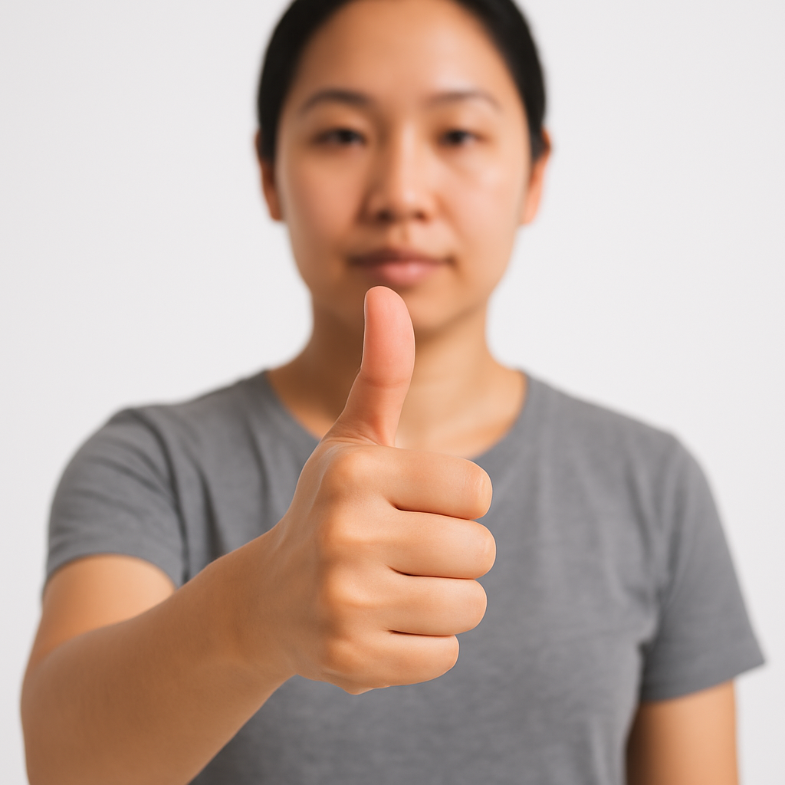

- **ID:** `affirm-01`
- **Physical Description:** Make a fist and extend the thumb straight upward; arm can be at waist or raised for visibility
- **Intent:** Signal approval, agreement, or that things are good
- **Emotional State:** positive | **Arousal:** low
- **Emotions:** approval, encouragement, satisfaction, confidence
- **Gesture Type:** emblem
- **Body Parts:** hand, thumb
- **People:** single | **Culture:** western

### 2. OK Sign

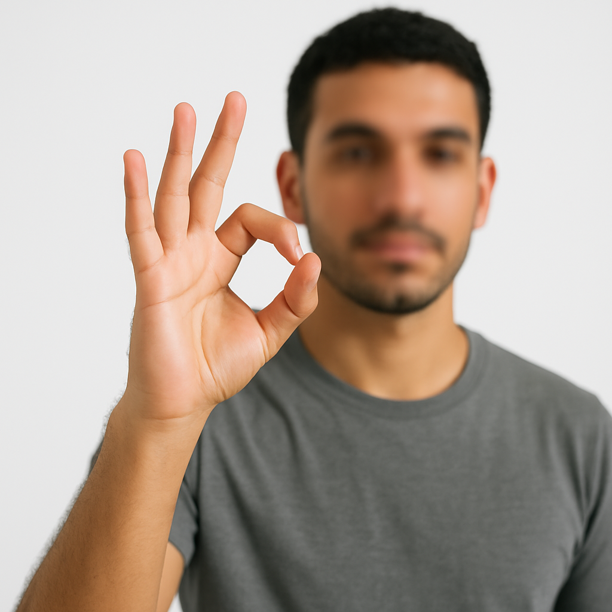

- **ID:** `affirm-02`
- **Physical Description:** Touch the tip of the index finger to the tip of the thumb forming a circle; remaining three fingers extend upward and slightly apart
- **Intent:** Confirm something is satisfactory or precise
- **Emotional State:** positive | **Arousal:** low
- **Emotions:** confidence, assurance, satisfaction, agreement
- **Gesture Type:** emblem
- **Body Parts:** hand, index finger, thumb
- **People:** single | **Culture:** western

### 3. Clapping

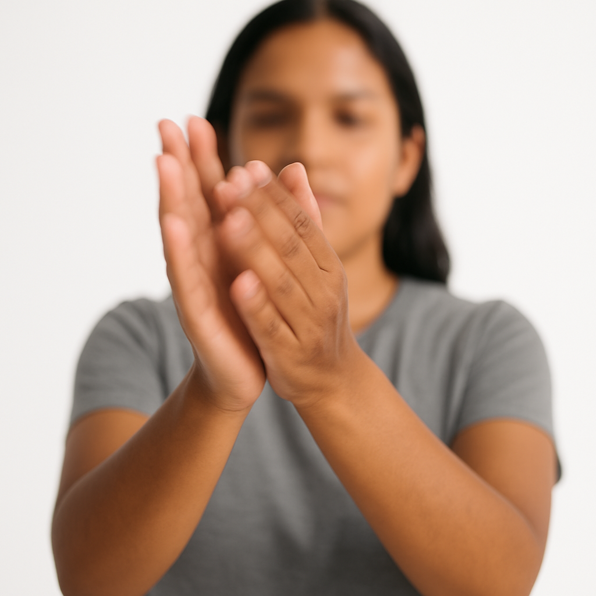

- **ID:** `affirm-03`
- **Physical Description:** Strike both open palms together repeatedly at chest height with fingers aligned; vary speed and force to match enthusiasm
- **Intent:** Applaud, congratulate, or celebrate an achievement
- **Emotional State:** positive | **Arousal:** high
- **Emotions:** joy, admiration, excitement, pride, appreciation
- **Gesture Type:** emblem
- **Body Parts:** hands, palms, arms
- **People:** single | **Culture:** universal

### 4. Double Thumbs Up

- **ID:** `affirm-04`
- **Physical Description:** Make fists with both hands and extend both thumbs straight upward simultaneously; hold at chest or shoulder height
- **Intent:** Express strong approval or enthusiastic agreement
- **Emotional State:** positive | **Arousal:** medium
- **Emotions:** enthusiasm, excitement, strong approval, encouragement
- **Gesture Type:** emblem
- **Body Parts:** hands, thumbs
- **People:** single | **Culture:** western

### 5. Raised Fist - Solidarity

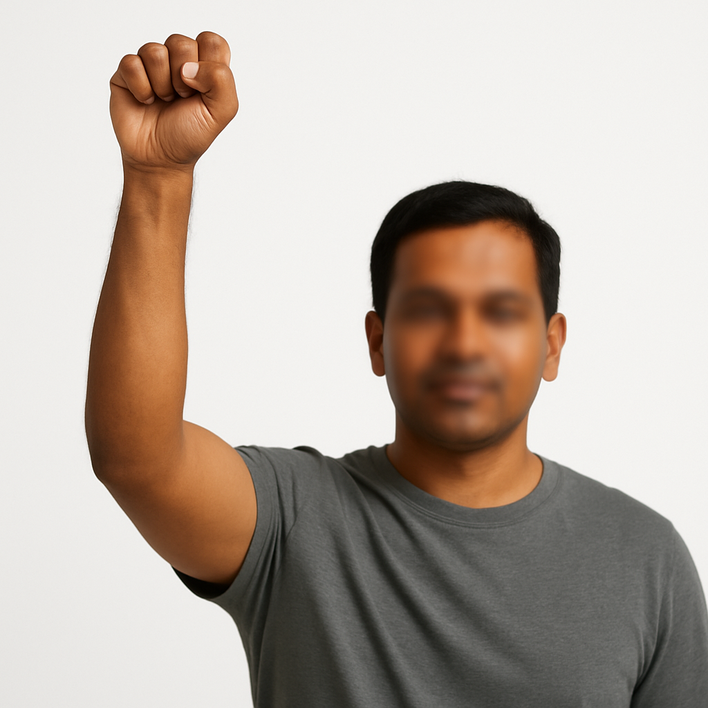

- **ID:** `affirm-06`
- **Physical Description:** Clench one hand into a tight fist and raise the arm straight overhead; body upright and chest open
- **Intent:** Show solidarity, unity, or empowerment
- **Emotional State:** positive | **Arousal:** high
- **Emotions:** solidarity, determination, empowerment, pride, strength
- **Gesture Type:** emblem
- **Body Parts:** hand, fist, arm, shoulder
- **People:** single | **Culture:** universal

### 6. Arms Raised in V - Victory

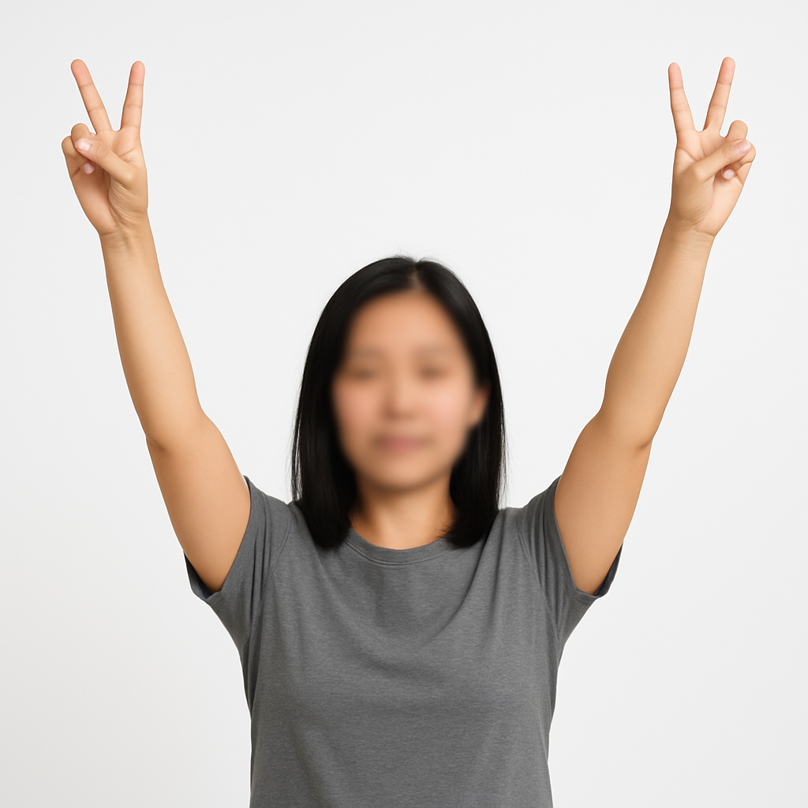

- **ID:** `affirm-07`
- **Physical Description:** Raise both arms above the head in a wide V-shape with hands open or in fists; head tilted back slightly
- **Intent:** Celebrate a triumph or express elation
- **Emotional State:** positive | **Arousal:** high
- **Emotions:** triumph, joy, elation, pride, exuberance
- **Gesture Type:** emblem
- **Body Parts:** arms, hands, shoulders, torso
- **People:** single | **Culture:** universal

### 7. Head Nod with Chin Lift

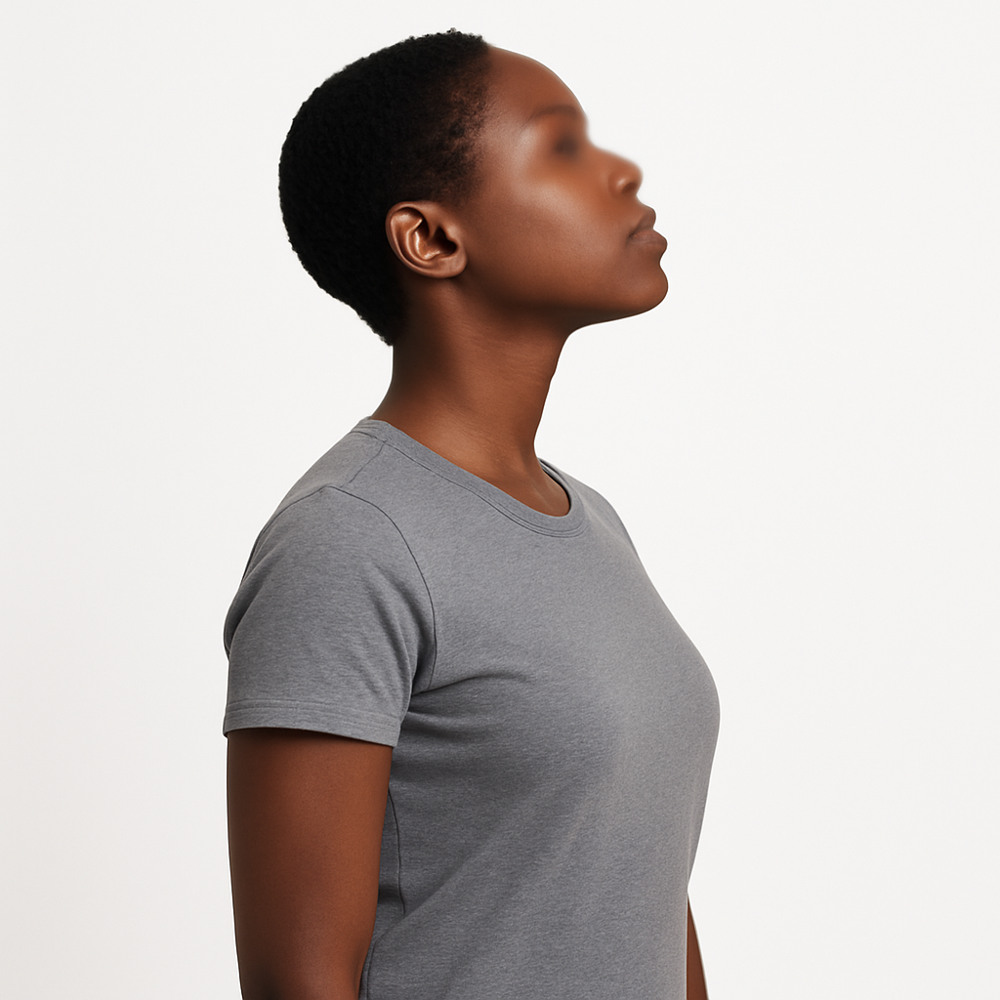

- **ID:** `affirm-08`
- **Physical Description:** Tilt the chin upward in a brief, single upward nod; maintain eye contact
- **Intent:** Casually acknowledge or affirm someone
- **Emotional State:** positive | **Arousal:** low
- **Emotions:** acknowledgment, confidence, agreement, respect
- **Gesture Type:** emblem
- **Body Parts:** head, neck, chin
- **People:** single | **Culture:** universal

---

## Bicycle Signals

### 8. Left Turn Signal (Bicycle)

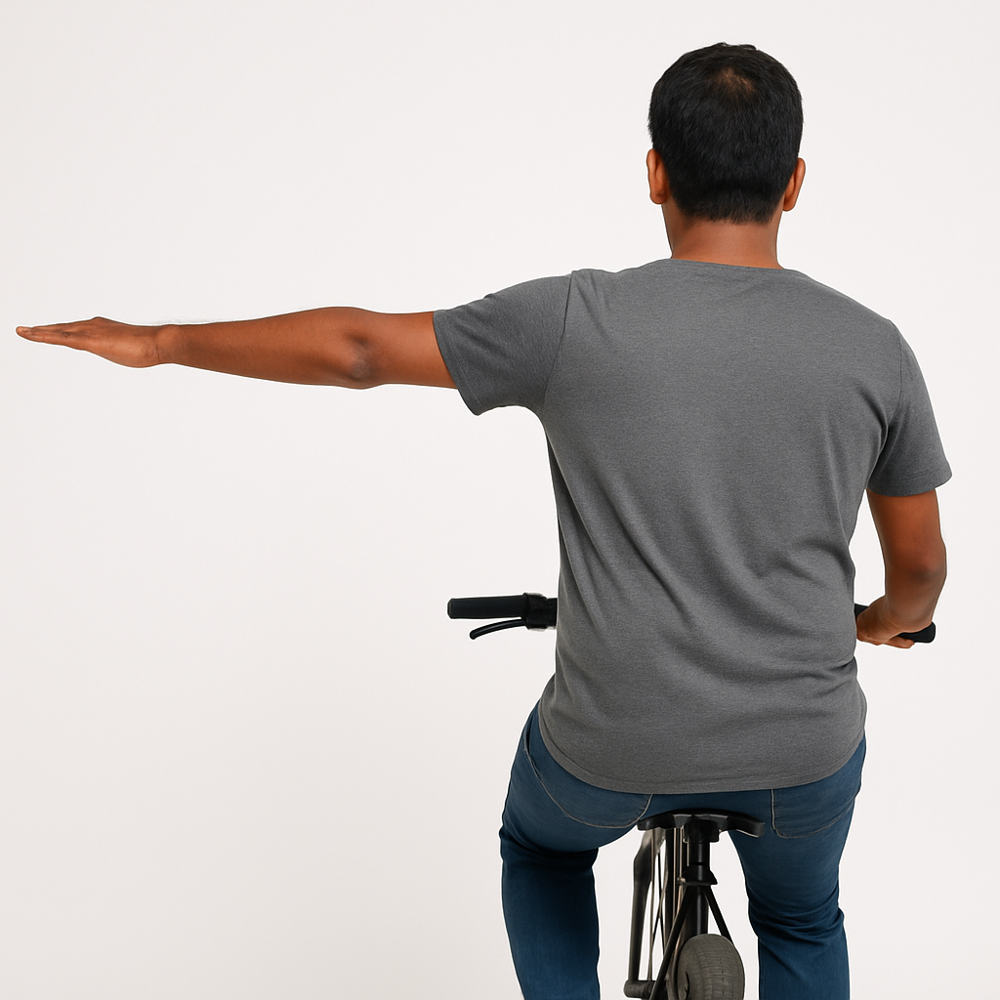

- **ID:** `bicycle-01`
- **Physical Description:** Extend the left arm straight out to the side at shoulder height with palm facing downward or forward; hold steady while riding
- **Intent:** Signal an upcoming left turn to other road users
- **Emotional State:** neutral | **Arousal:** low
- **Emotions:** alertness, responsibility, safety, focus
- **Gesture Type:** emblem
- **Body Parts:** arm, hand
- **People:** single | **Culture:** universal

### 9. Right Turn Signal (Bicycle)

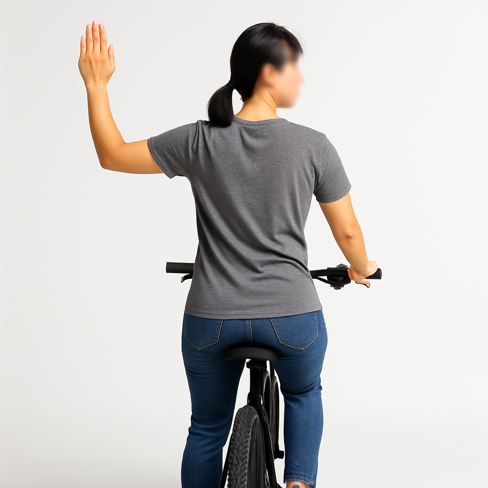

- **ID:** `bicycle-02`
- **Physical Description:** Extend the right arm straight out to the side at shoulder height, or bend the left arm upward at a 90-degree angle at the elbow
- **Intent:** Signal an upcoming right turn to other road users
- **Emotional State:** neutral | **Arousal:** low
- **Emotions:** alertness, responsibility, safety, focus
- **Gesture Type:** emblem
- **Body Parts:** arm, hand
- **People:** single | **Culture:** universal

### 10. Stop Signal (Bicycle)

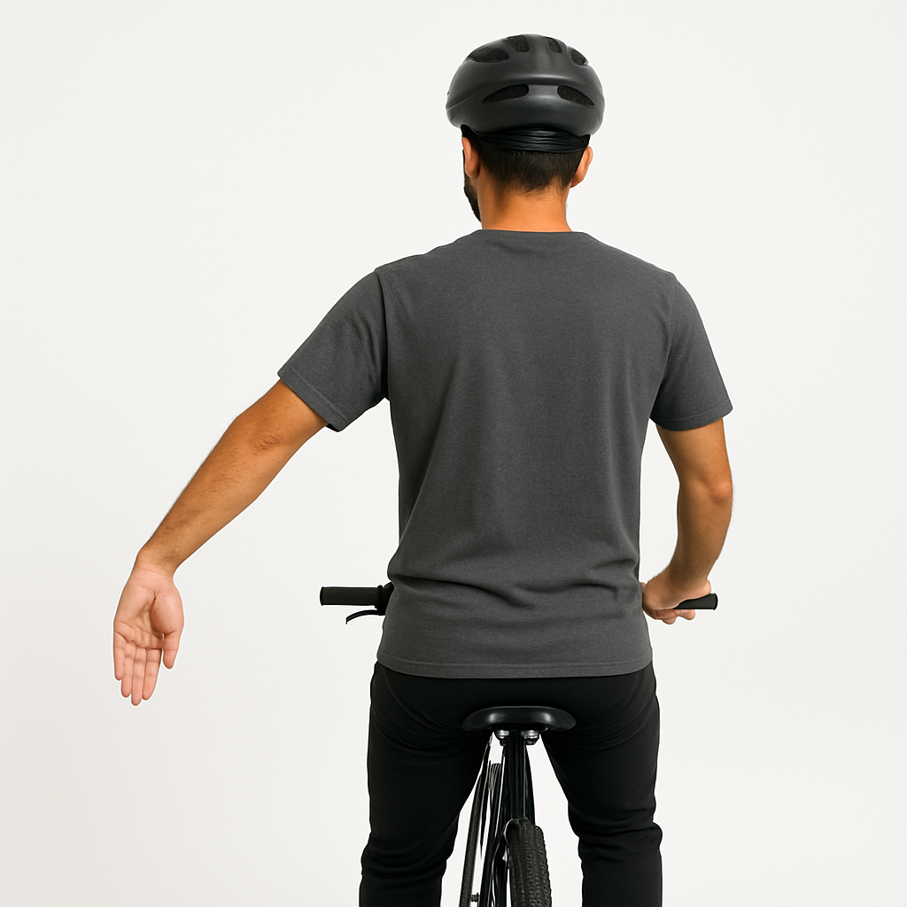

- **ID:** `bicycle-03`
- **Physical Description:** Extend the left arm downward and to the side at a 45-degree angle with the palm open and facing backward
- **Intent:** Signal an upcoming stop to other road users
- **Emotional State:** neutral | **Arousal:** low
- **Emotions:** alertness, caution, responsibility, safety
- **Gesture Type:** emblem
- **Body Parts:** arm, hand, palm
- **People:** single | **Culture:** universal

---

## Conversational Emphasis

### 11. Air Quotes

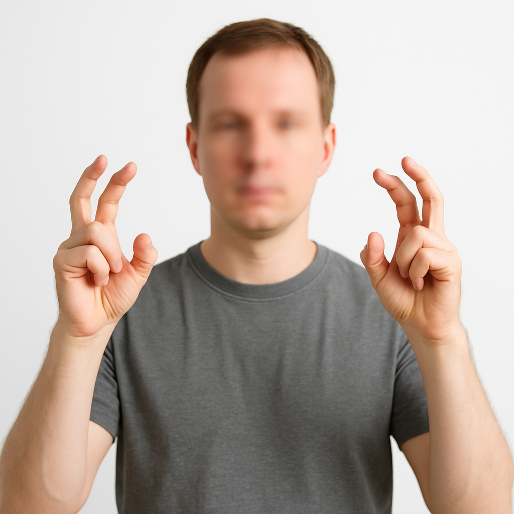

- **ID:** `conv-01`
- **Physical Description:** Raise both hands to head height and curl the index and middle fingers of each hand twice in a hooking motion, mimicking quotation marks
- **Intent:** Indicate sarcasm, irony, or skepticism about a term
- **Emotional State:** neutral | **Arousal:** low
- **Emotions:** skepticism, sarcasm, irony, amusement, playfulness
- **Gesture Type:** illustrator-metaphoric
- **Body Parts:** hands, index fingers, middle fingers
- **People:** single | **Culture:** western

### 12. Finger Wag - Scolding

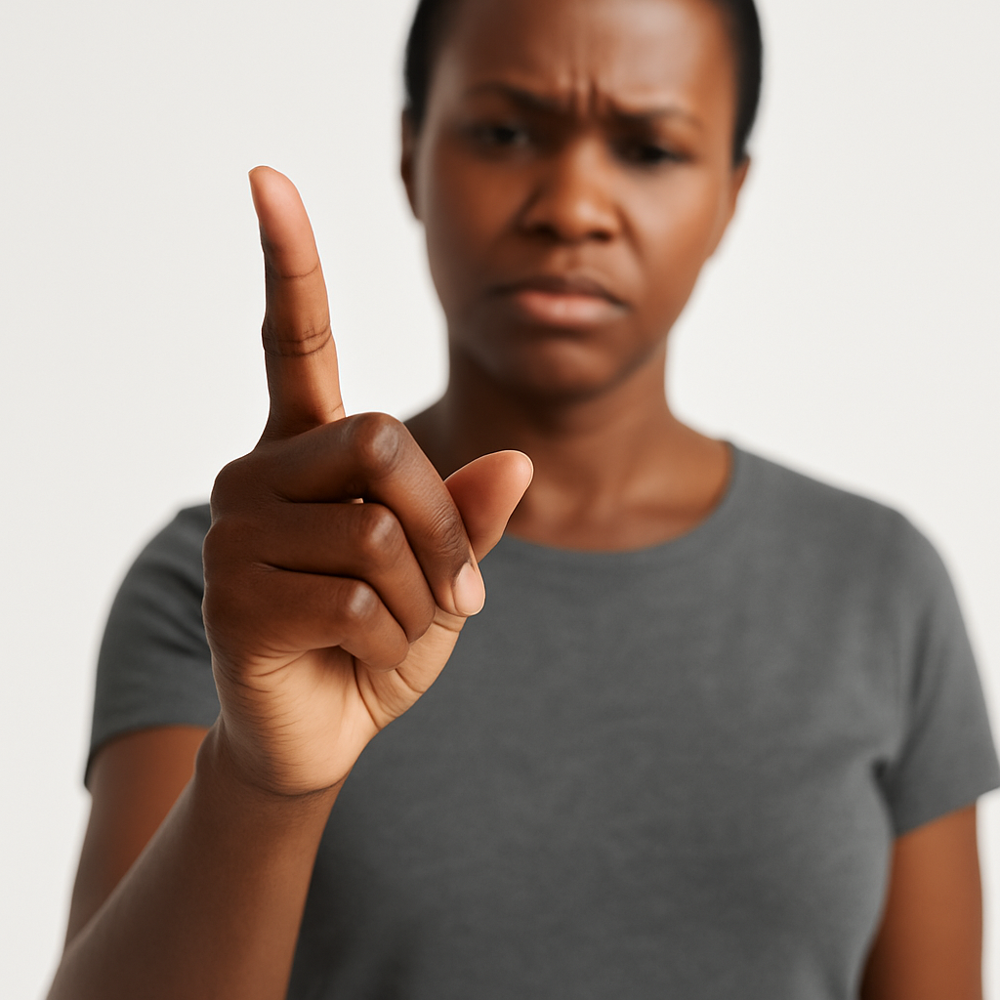

- **ID:** `conv-02`
- **Physical Description:** Extend the index finger upward and swing it side to side in a pendulum motion at face height; facial expression stern
- **Intent:** Scold or warn someone against a behavior
- **Emotional State:** negative | **Arousal:** medium
- **Emotions:** disapproval, authority, admonishment, frustration
- **Gesture Type:** emblem
- **Body Parts:** hand, index finger, wrist
- **People:** single | **Culture:** universal

### 13. Counting Off Points on Fingers

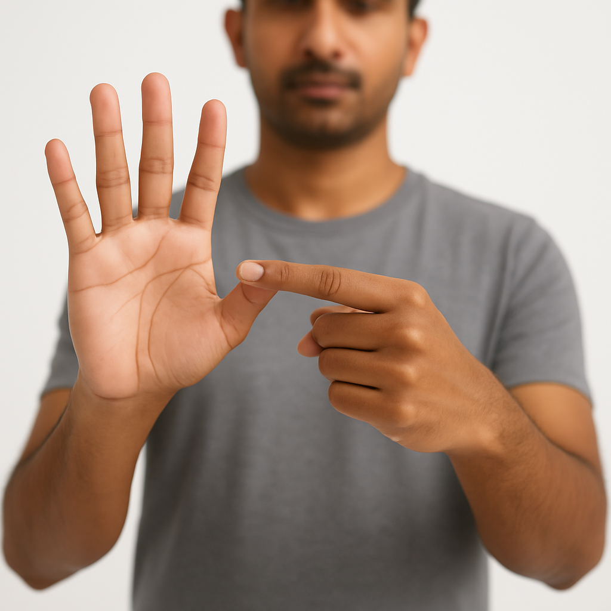

- **ID:** `conv-03`
- **Physical Description:** Hold one hand up and use the index finger of the other hand to tap or grasp each finger in sequence while listing items
- **Intent:** Enumerate key arguments or items in a discussion
- **Emotional State:** neutral | **Arousal:** medium
- **Emotions:** assertiveness, clarity, determination, confidence
- **Gesture Type:** illustrator-iconic
- **Body Parts:** hands, fingers
- **People:** single | **Culture:** universal

### 14. Hand Chop into Palm

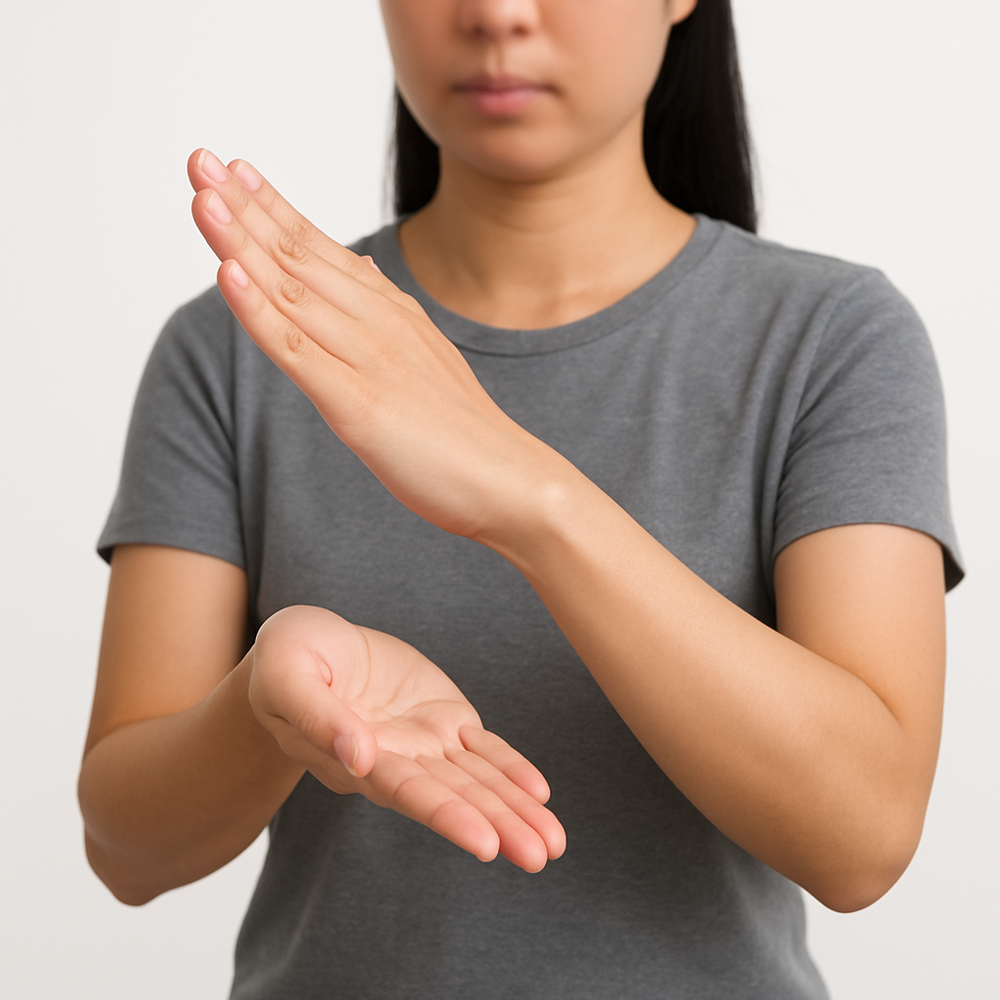

- **ID:** `conv-04`
- **Physical Description:** Strike the edge of one flattened hand into the open palm of the other in repeated downward chops, emphasizing each point
- **Intent:** Emphasize a critical point with force and conviction
- **Emotional State:** neutral | **Arousal:** high
- **Emotions:** assertiveness, conviction, determination, intensity
- **Gesture Type:** illustrator-beat
- **Body Parts:** hands, palms
- **People:** single | **Culture:** universal

### 15. Palms Together - Pleading

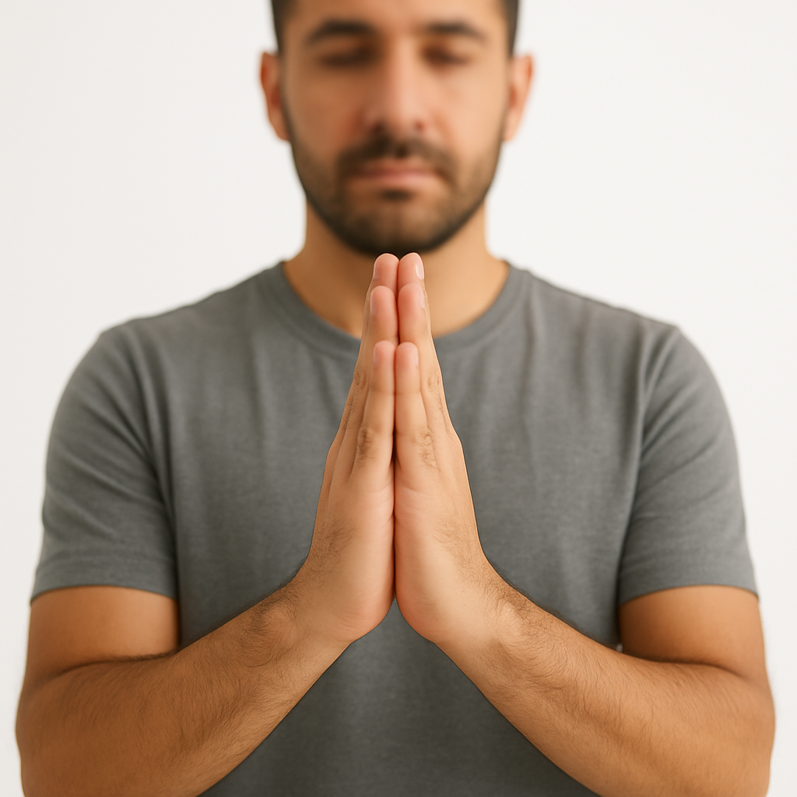

- **ID:** `conv-05`
- **Physical Description:** Press both palms flat together at chest height in a prayer-like position; lean the body slightly forward with earnest expression
- **Intent:** Earnestly beg, plead, or make a heartfelt request
- **Emotional State:** positive | **Arousal:** medium
- **Emotions:** desperation, hope, vulnerability, sincerity, earnestness
- **Gesture Type:** emblem
- **Body Parts:** hands, palms, torso
- **People:** single | **Culture:** universal

### 16. Mind-Blown Gesture

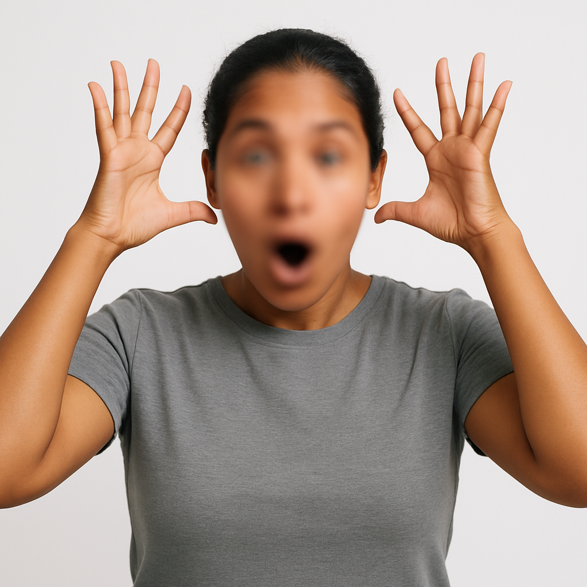

- **ID:** `conv-06`
- **Physical Description:** Place both hands on either side of the head with fingers together, then fling them outward while spreading fingers wide, mimicking an explosion
- **Intent:** Express that something is overwhelmingly amazing or shocking
- **Emotional State:** positive | **Arousal:** high
- **Emotions:** amazement, shock, awe, wonder, astonishment
- **Gesture Type:** illustrator-metaphoric
- **Body Parts:** hands, fingers, head
- **People:** single | **Culture:** western

### 17. Italian Pinched Fingers

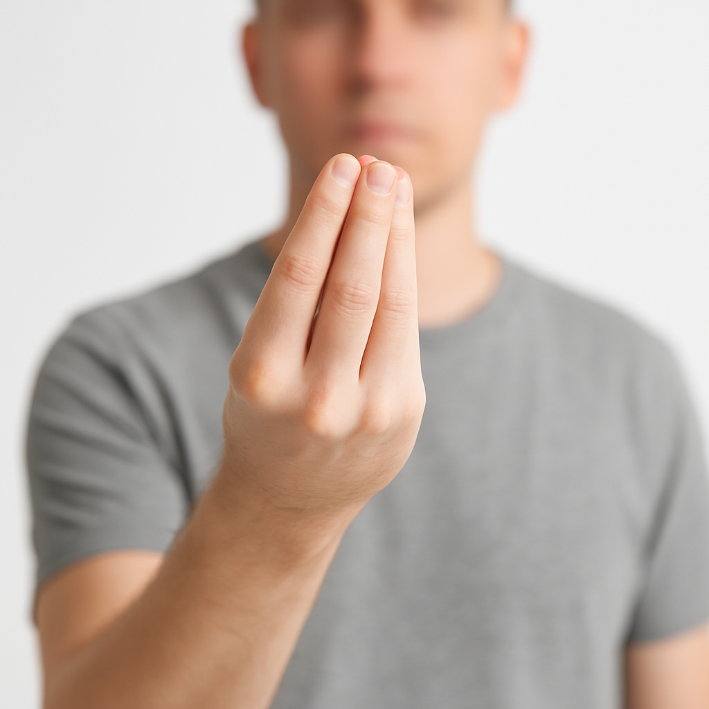

- **ID:** `conv-07`
- **Physical Description:** Bring all five fingertips together pointing upward, forming a tight cone shape; bob the hand up and down at the wrist
- **Intent:** Question, emphasize, or express disbelief about what was said
- **Emotional State:** neutral | **Arousal:** medium
- **Emotions:** incredulity, emphasis, expressiveness, curiosity
- **Gesture Type:** emblem
- **Body Parts:** hand, fingers, wrist
- **People:** single | **Culture:** southern-european

---

## Creative & Expressive

### 18. About Yea Big - Framing

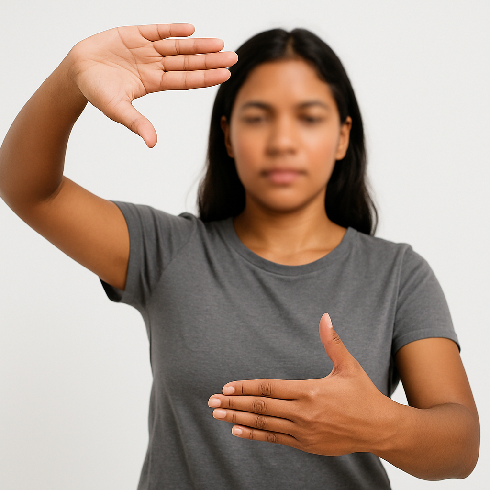

- **ID:** `creative-01`
- **Physical Description:** Hold both hands in front of the body with palms facing each other; adjust the distance between them to indicate approximate size
- **Intent:** Estimate or communicate the approximate size of an object
- **Emotional State:** neutral | **Arousal:** low
- **Emotions:** creativity, estimation, expressiveness, casualness
- **Gesture Type:** illustrator-iconic
- **Body Parts:** hands, palms, arms
- **People:** single | **Culture:** universal

---

## Directional & Wayfinding

### 19. Index Finger Point

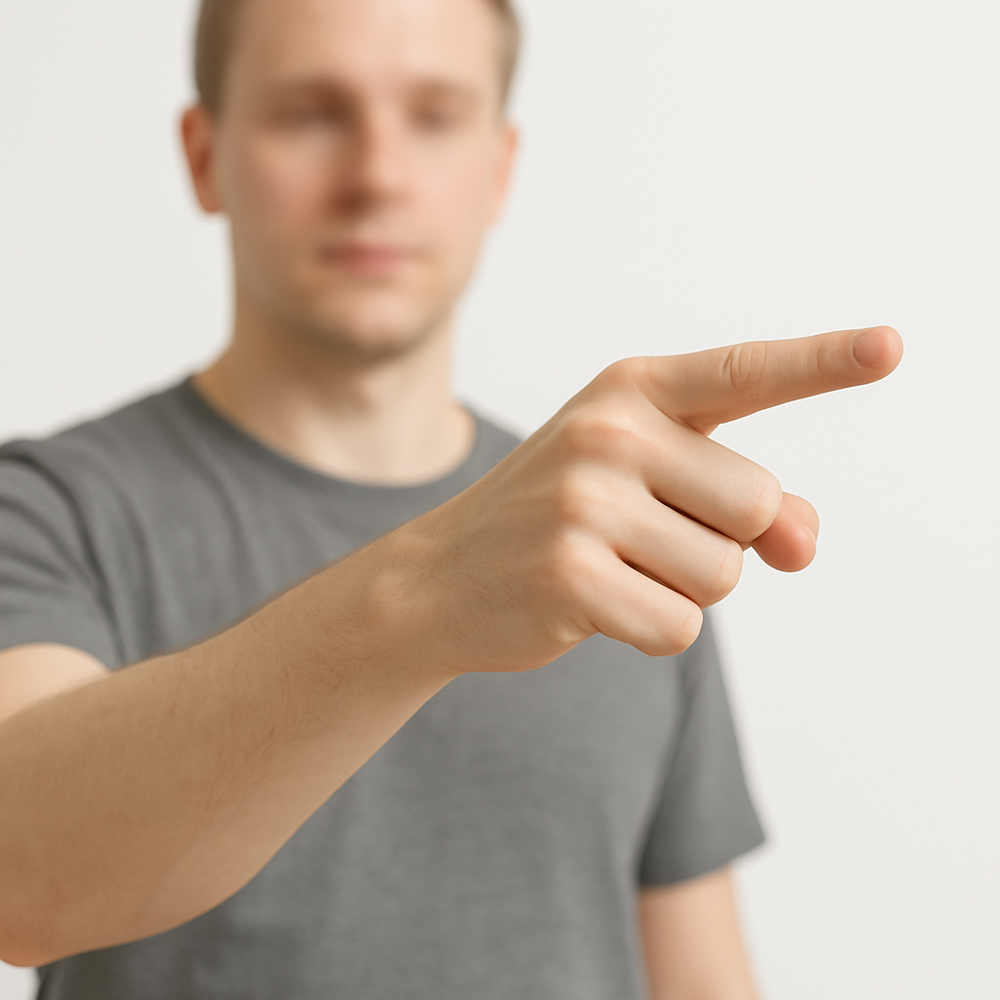

- **ID:** `dir-01`
- **Physical Description:** Extend the index finger straight out while curling the remaining fingers into the palm; arm extends toward the target with the wrist aligned
- **Intent:** Direct attention to a specific location, object, or person
- **Emotional State:** neutral | **Arousal:** low
- **Emotions:** focus, determination, assertiveness, clarity
- **Gesture Type:** illustrator-deictic
- **Body Parts:** hand, index finger, arm
- **People:** single | **Culture:** universal

### 20. Open Palm Point

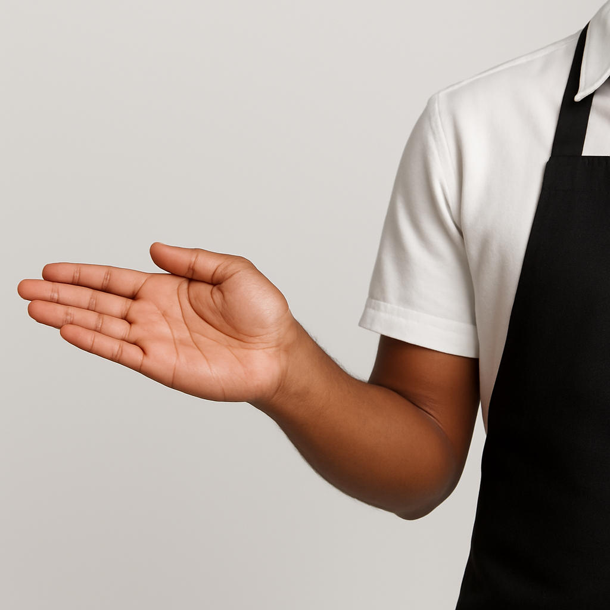

- **ID:** `dir-02`
- **Physical Description:** Extend the arm toward the target with all fingers together and palm facing upward or sideways; wrist relaxed and fingers straight
- **Intent:** Politely indicate a direction or draw attention to something
- **Emotional State:** neutral | **Arousal:** low
- **Emotions:** helpfulness, openness, courtesy, warmth
- **Gesture Type:** illustrator-deictic
- **Body Parts:** hand, palm, arm
- **People:** single | **Culture:** universal

### 21. Beckoning with Index Finger

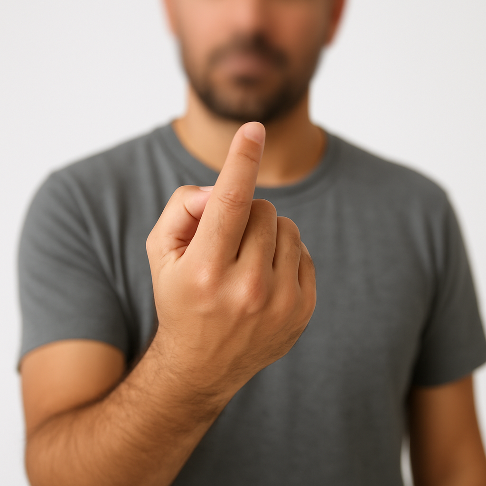

- **ID:** `dir-05`
- **Physical Description:** Curl the index finger repeatedly toward the body in a hooking motion while the hand is held at chest height, palm facing inward
- **Intent:** Summon someone to come closer
- **Emotional State:** neutral | **Arousal:** medium
- **Emotions:** curiosity, authority, anticipation, confidence
- **Gesture Type:** emblem
- **Body Parts:** hand, index finger
- **People:** single | **Culture:** western

### 22. Beckoning with Full Hand Palm Up

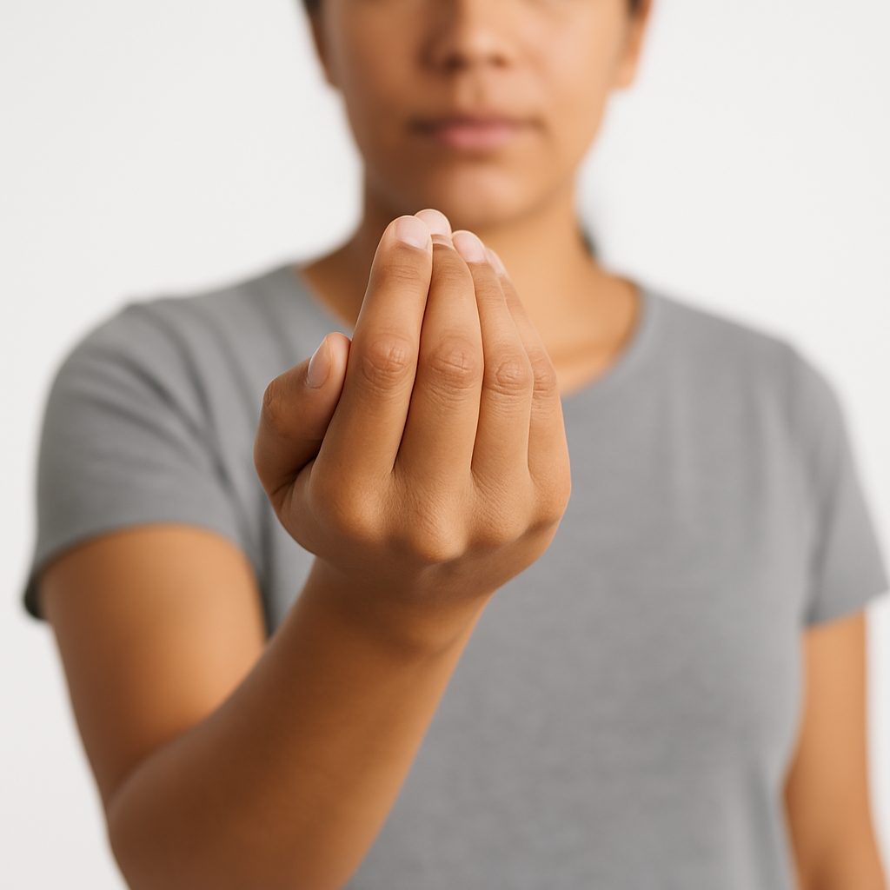

- **ID:** `dir-06`
- **Physical Description:** Hold the hand out with palm facing upward and repeatedly curl all four fingers toward the body in a scooping motion
- **Intent:** Warmly invite someone to approach
- **Emotional State:** positive | **Arousal:** medium
- **Emotions:** warmth, openness, hospitality, welcoming
- **Gesture Type:** emblem
- **Body Parts:** hand, fingers, arm
- **People:** single | **Culture:** universal

### 23. Waving Arm Overhead

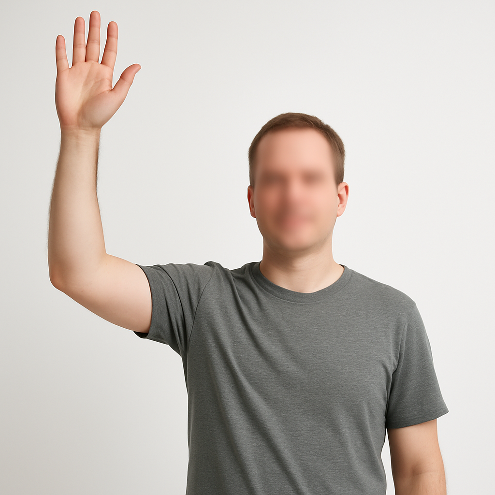

- **ID:** `dir-07`
- **Physical Description:** Raise one arm fully above the head and wave it side to side in broad sweeping arcs; hand open with fingers spread
- **Intent:** Signal your location or get attention from a distance
- **Emotional State:** positive | **Arousal:** high
- **Emotions:** excitement, urgency, enthusiasm, eagerness
- **Gesture Type:** emblem
- **Body Parts:** arm, hand, shoulder
- **People:** single | **Culture:** universal

### 24. Two-Handed Over Here Wave

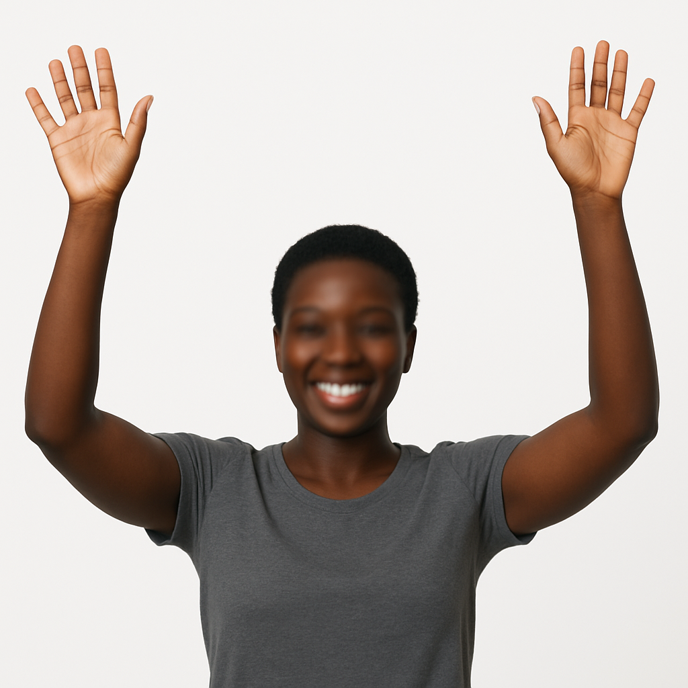

- **ID:** `dir-08`
- **Physical Description:** Raise both arms above shoulder height and wave them simultaneously toward the body in large inward-sweeping arcs
- **Intent:** Emphatically beckon someone to come over
- **Emotional State:** positive | **Arousal:** high
- **Emotions:** excitement, eagerness, welcoming, enthusiasm
- **Gesture Type:** emblem
- **Body Parts:** arms, hands, shoulders
- **People:** single | **Culture:** universal

### 25. Palm-Out Push Gesture

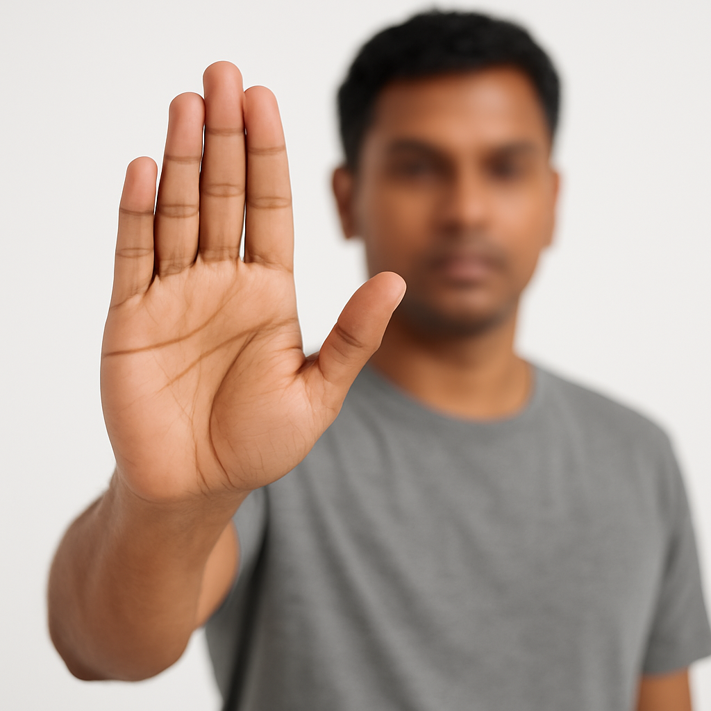

- **ID:** `dir-09`
- **Physical Description:** Extend one or both arms forward with palms facing outward and fingers together; push slightly away from the body
- **Intent:** Refuse entry or set a physical boundary
- **Emotional State:** negative | **Arousal:** medium
- **Emotions:** firmness, resistance, boundary-setting, assertiveness
- **Gesture Type:** emblem
- **Body Parts:** hand, palm, arm
- **People:** single | **Culture:** universal

### 26. After You Open Palm Sweep

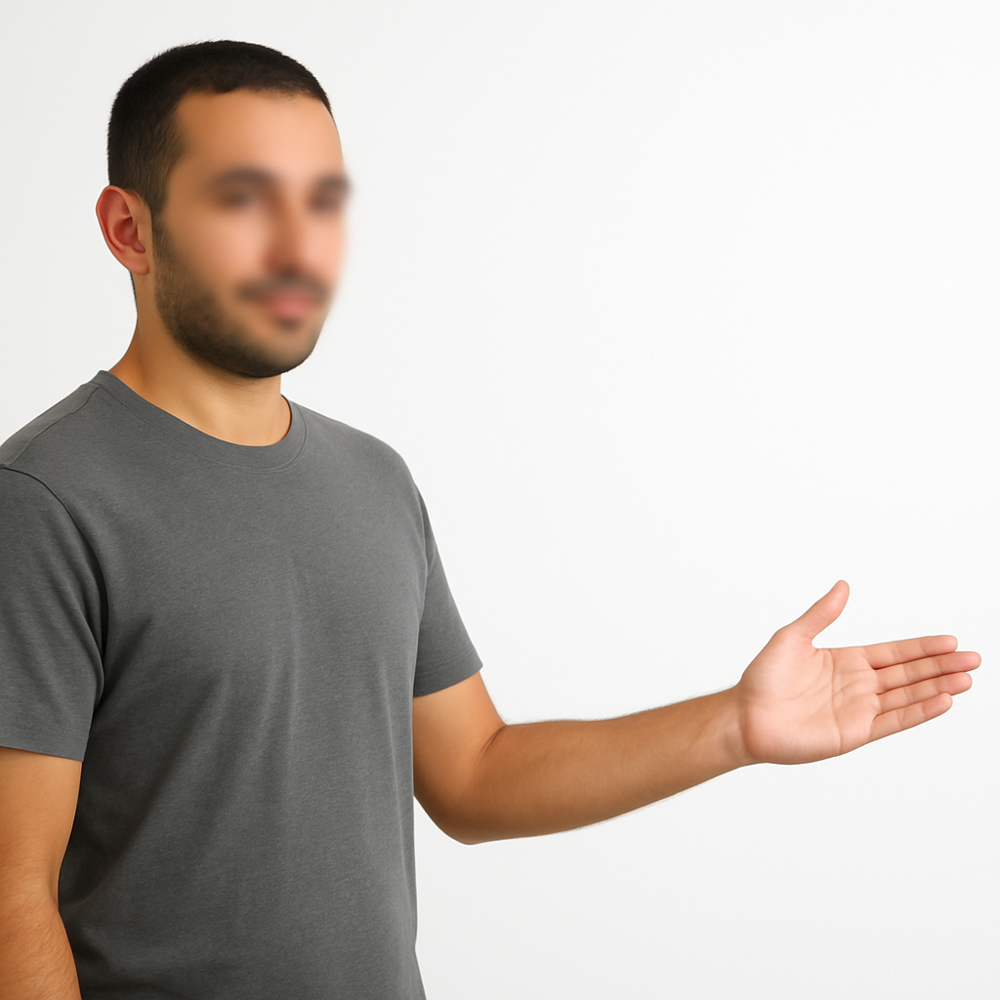

- **ID:** `dir-11`
- **Physical Description:** Extend one arm to the side with palm facing upward and sweep it forward in a smooth arc, gesturing toward the path ahead
- **Intent:** Offer someone to proceed ahead of you
- **Emotional State:** positive | **Arousal:** low
- **Emotions:** politeness, respect, courtesy, generosity
- **Gesture Type:** emblem
- **Body Parts:** arm, hand, palm, torso
- **People:** 2 person | **Culture:** universal

---

## Greetings & Farewells

### 27. Open Hand Wave

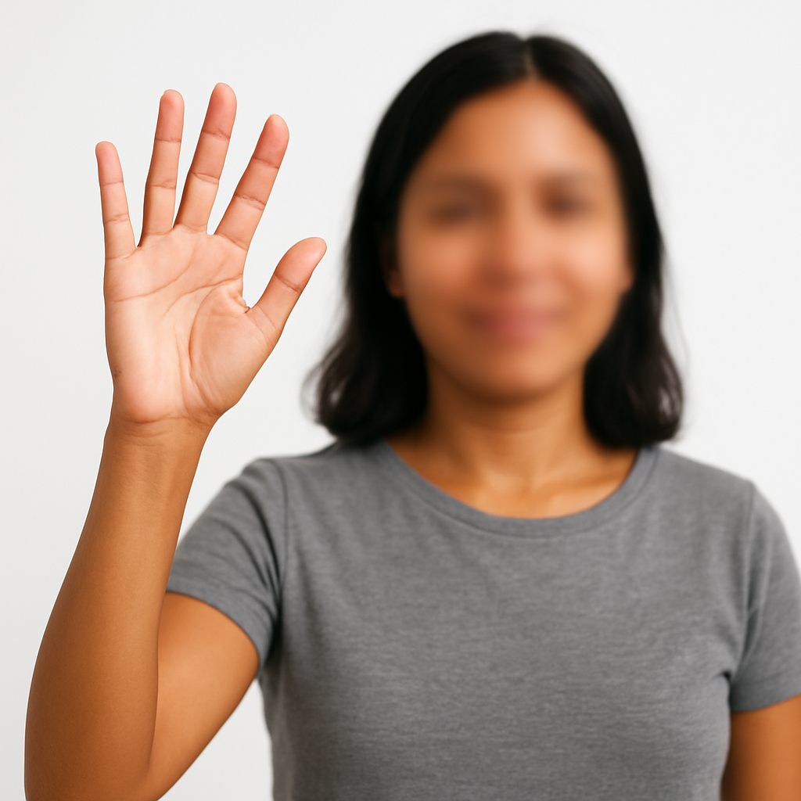

- **ID:** `greet-01`
- **Physical Description:** Raise one hand to head height with palm facing outward and pivot the hand side to side at the wrist, fingers together or slightly spread
- **Intent:** Greet or say goodbye to someone
- **Emotional State:** positive | **Arousal:** medium
- **Emotions:** friendliness, warmth, joy, openness
- **Gesture Type:** emblem
- **Body Parts:** hand, wrist, forearm
- **People:** single | **Culture:** universal

### 28. Single Raised Palm Greeting

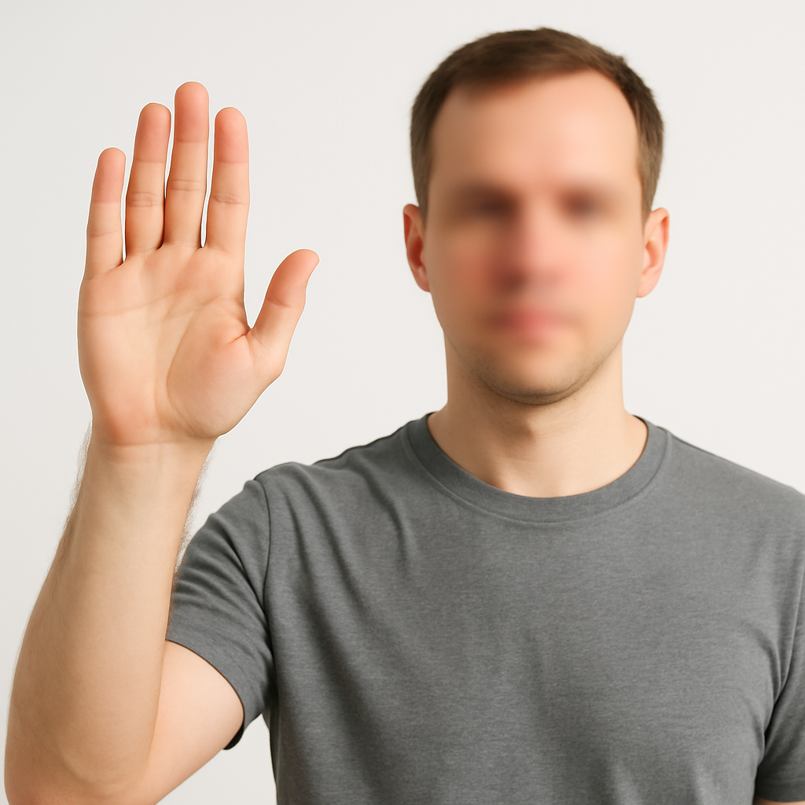

- **ID:** `greet-02`
- **Physical Description:** Raise one hand to head height with palm flat and facing outward; hold it still momentarily
- **Intent:** Acknowledge or formally greet someone
- **Emotional State:** positive | **Arousal:** low
- **Emotions:** respect, acknowledgment, friendliness, composure
- **Gesture Type:** emblem
- **Body Parts:** hand, palm, arm
- **People:** single | **Culture:** universal

### 29. High Five

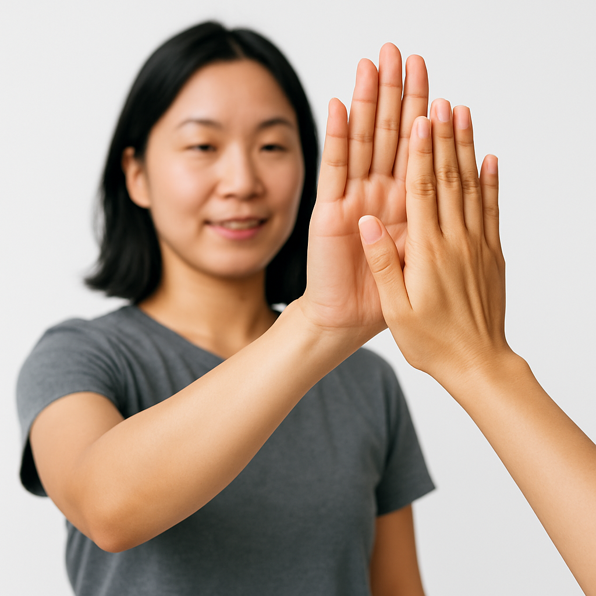

- **ID:** `greet-05`
- **Physical Description:** Raise one hand above head height with palm facing the other person; slap palms together with the partner at the peak of the reach
- **Intent:** Celebrate a shared success or connect enthusiastically
- **Emotional State:** positive | **Arousal:** high
- **Emotions:** joy, excitement, camaraderie, celebration
- **Gesture Type:** emblem
- **Body Parts:** hand, palm, arm, shoulder
- **People:** 2 person | **Culture:** western

### 30. Peace Sign on Departure

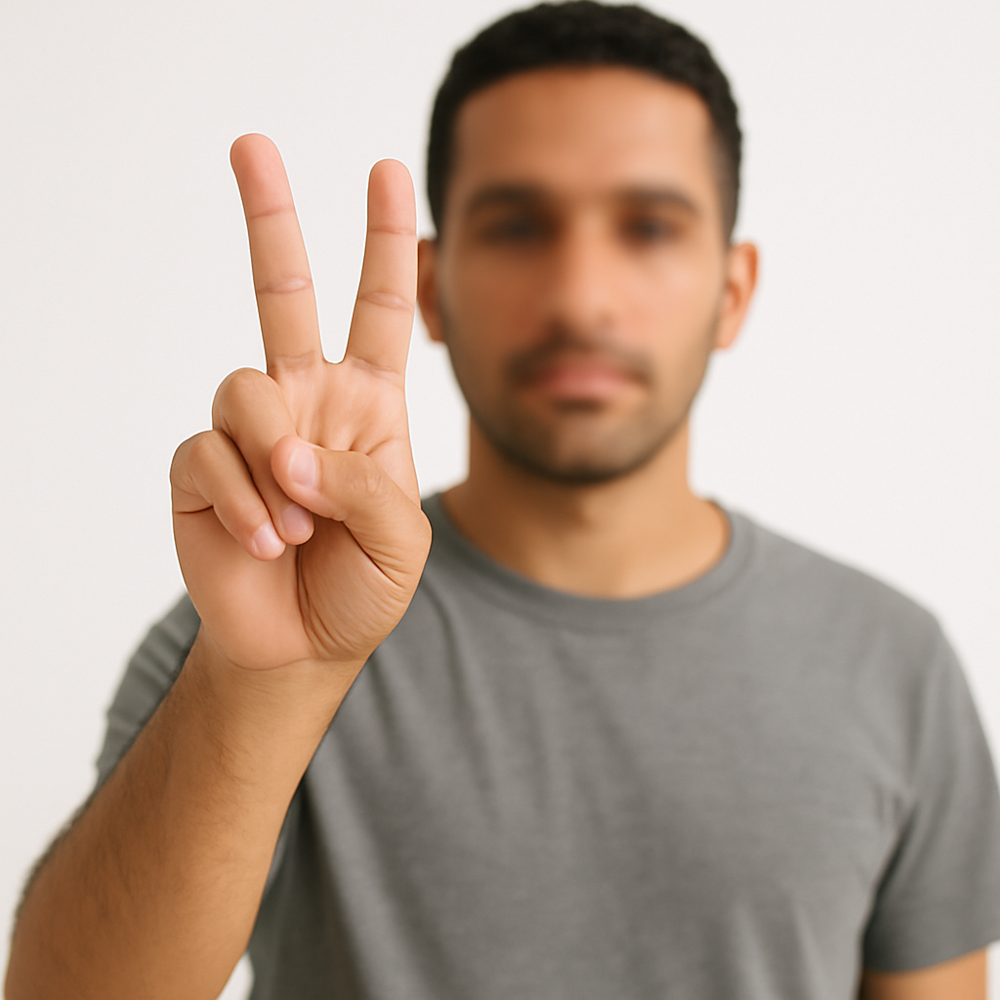

- **ID:** `greet-06`
- **Physical Description:** Raise the hand with index and middle fingers extended in a V-shape, palm facing outward; hold briefly while stepping away
- **Intent:** Bid a casual farewell with goodwill
- **Emotional State:** positive | **Arousal:** low
- **Emotions:** peace, contentment, goodwill, casualness
- **Gesture Type:** emblem
- **Body Parts:** hand, index finger, middle finger
- **People:** single | **Culture:** western

### 31. Salute

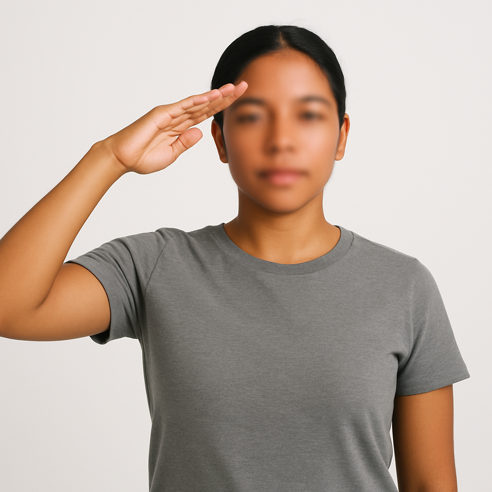

- **ID:** `greet-07`
- **Physical Description:** Bring the right hand sharply to the right brow with fingers together and palm tilted slightly downward; elbow raised to shoulder height
- **Intent:** Show formal respect or acknowledge authority
- **Emotional State:** neutral | **Arousal:** low
- **Emotions:** respect, honor, duty, discipline
- **Gesture Type:** emblem
- **Body Parts:** hand, arm, forehead
- **People:** single | **Culture:** universal

### 32. Finger Guns

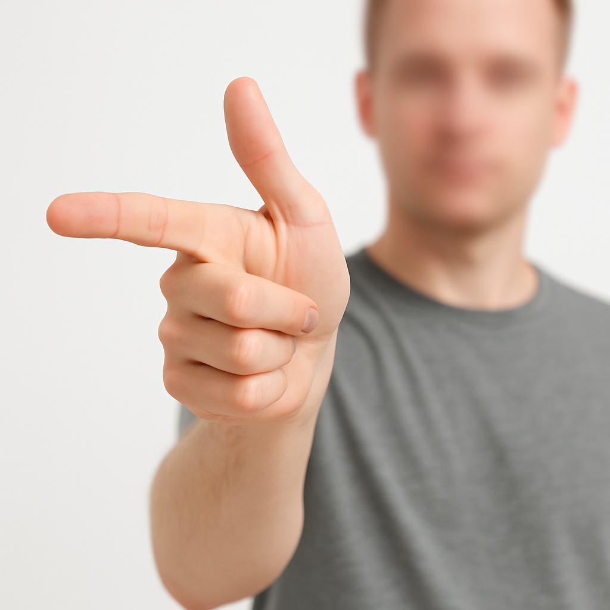

- **ID:** `greet-08`
- **Physical Description:** Point both index fingers forward with thumbs raised like pistol hammers; optionally flick the thumbs down as if firing while nodding
- **Intent:** Playfully acknowledge or greet someone with confidence
- **Emotional State:** positive | **Arousal:** medium
- **Emotions:** playfulness, confidence, amusement, charm
- **Gesture Type:** emblem
- **Body Parts:** hands, index fingers, thumbs
- **People:** single | **Culture:** western

### 33. Hat Tip Gesture

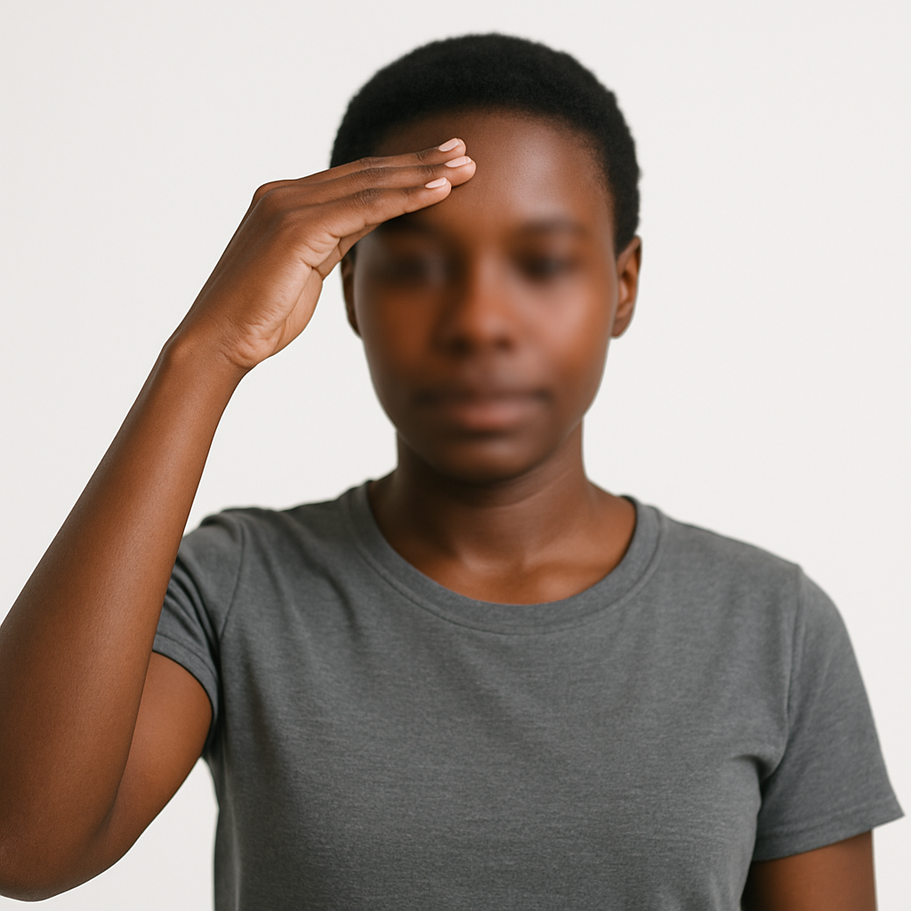

- **ID:** `greet-09`
- **Physical Description:** Reach up and pinch the brim of an imaginary hat between the thumb and index finger; tilt it slightly forward while nodding the head
- **Intent:** Acknowledge someone with polite charm
- **Emotional State:** positive | **Arousal:** low
- **Emotions:** respect, courtesy, charm, appreciation
- **Gesture Type:** emblem
- **Body Parts:** hand, fingers, head
- **People:** single | **Culture:** western

### 34. About to Hug

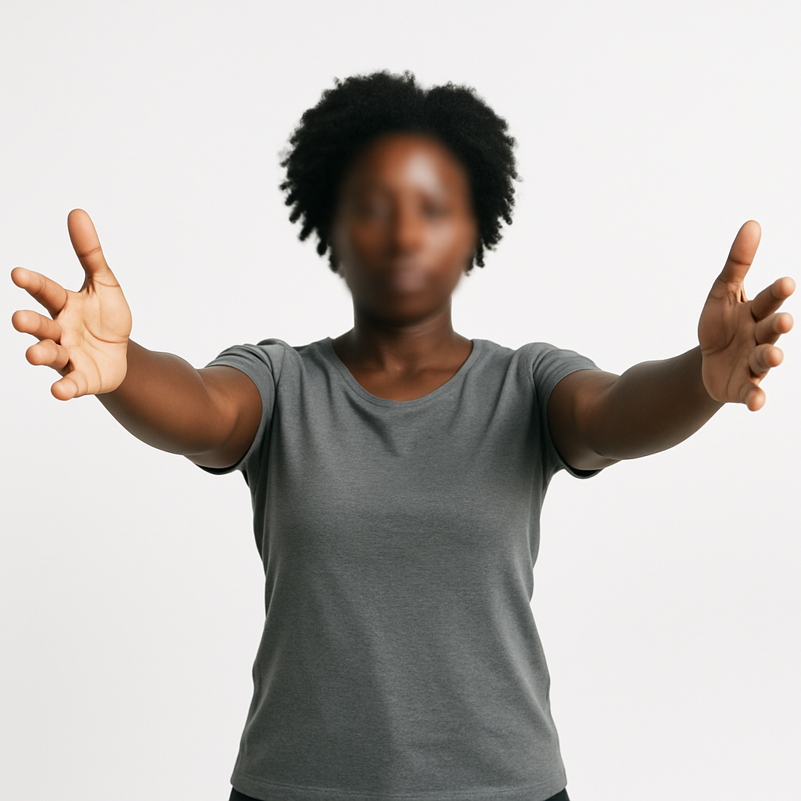

- **ID:** `greet-10`
- **Physical Description:** Open both arms wide at shoulder height with palms facing inward; step forward slightly with a warm facial expression
- **Intent:** Welcome someone with an embrace
- **Emotional State:** positive | **Arousal:** high
- **Emotions:** love, warmth, affection, joy, anticipation
- **Gesture Type:** emblem
- **Body Parts:** arms, hands, torso, shoulders
- **People:** 2 person | **Culture:** universal

---

## Love & Affection

### 35. Chef's Kiss

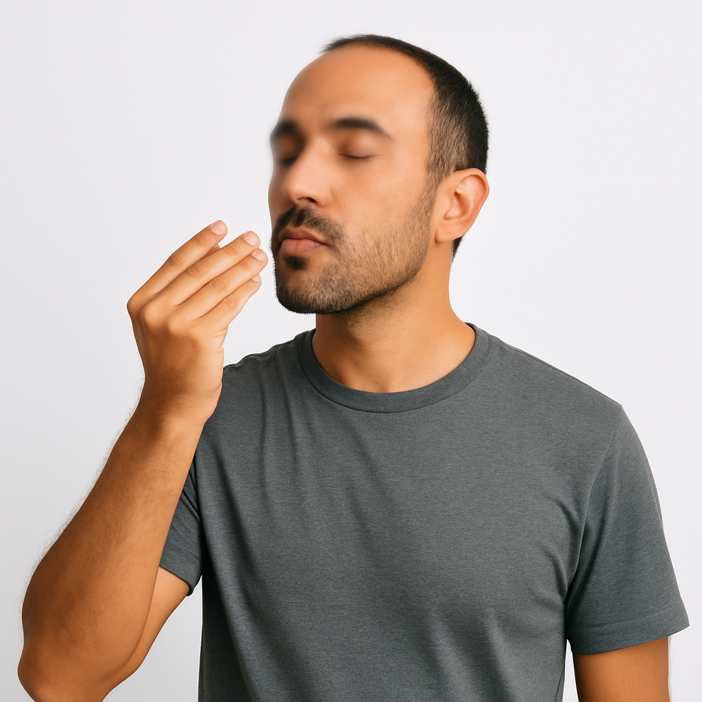

- **ID:** `love-01`
- **Physical Description:** Bring the fingertips of one hand together and touch them to the lips; pull the hand away while opening the fingers in a blossoming motion
- **Intent:** Express that something is perfect or exquisite
- **Emotional State:** positive | **Arousal:** medium
- **Emotions:** delight, admiration, satisfaction, appreciation, joy
- **Gesture Type:** emblem
- **Body Parts:** hand, fingers, lips
- **People:** single | **Culture:** western

### 36. Blowing a Kiss

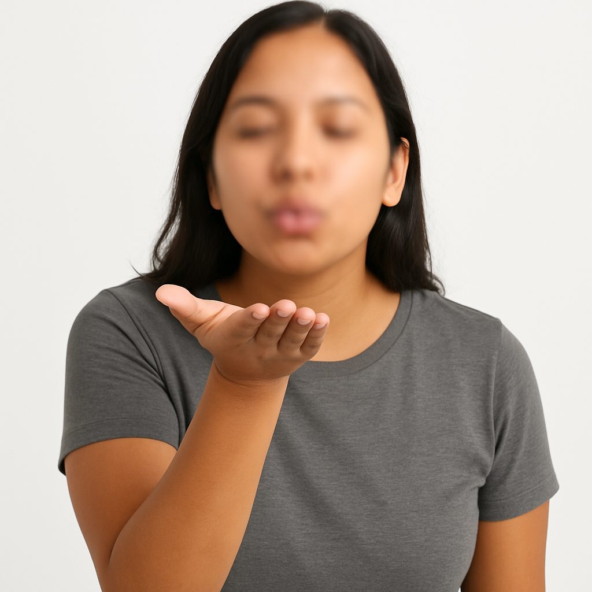

- **ID:** `love-02`
- **Physical Description:** Place the fingertips of one open hand against the lips; extend the arm outward while opening the palm as if releasing the kiss into the air
- **Intent:** Send love or affection to someone at a distance
- **Emotional State:** positive | **Arousal:** medium
- **Emotions:** love, affection, warmth, flirtation, tenderness
- **Gesture Type:** emblem
- **Body Parts:** hand, lips, arm
- **People:** single | **Culture:** universal

### 37. Two Hands Heart

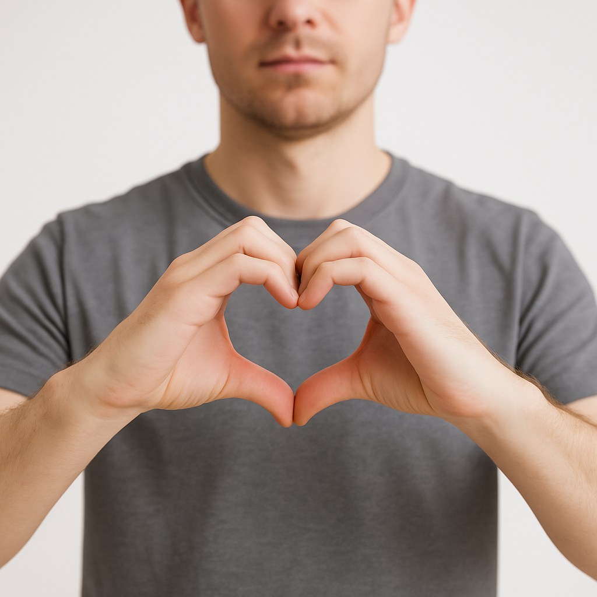

- **ID:** `love-03`
- **Physical Description:** Curve both hands symmetrically with fingertips touching at top and thumb-bases meeting at bottom to form a large heart shape; hold at chest level
- **Intent:** Express love, gratitude, or deep appreciation
- **Emotional State:** positive | **Arousal:** medium
- **Emotions:** love, compassion, gratitude, warmth, sincerity
- **Gesture Type:** emblem
- **Body Parts:** hands, fingers, thumbs
- **People:** single | **Culture:** universal

---

## Meme & Fantasy

### 38. Dab Pose

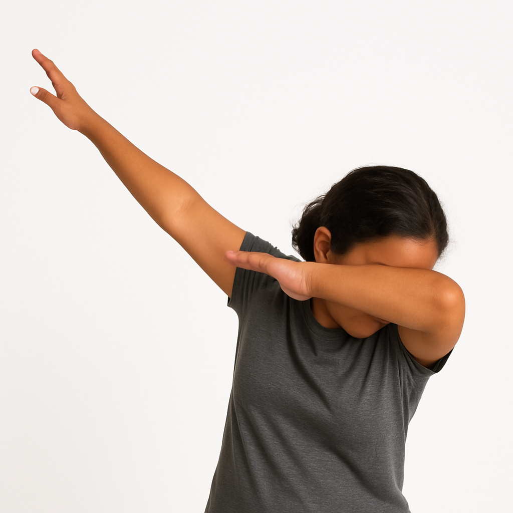

- **ID:** `meme-01`
- **Physical Description:** Drop the head into the crook of one bent arm while simultaneously extending the other arm out diagonally in the opposite direction
- **Intent:** Celebrate or show off with a viral pop-culture move
- **Emotional State:** positive | **Arousal:** high
- **Emotions:** playfulness, confidence, humor, exuberance, joy
- **Gesture Type:** emblem
- **Body Parts:** arms, head, torso
- **People:** single | **Culture:** western

### 39. Evil Horns (Rock On)

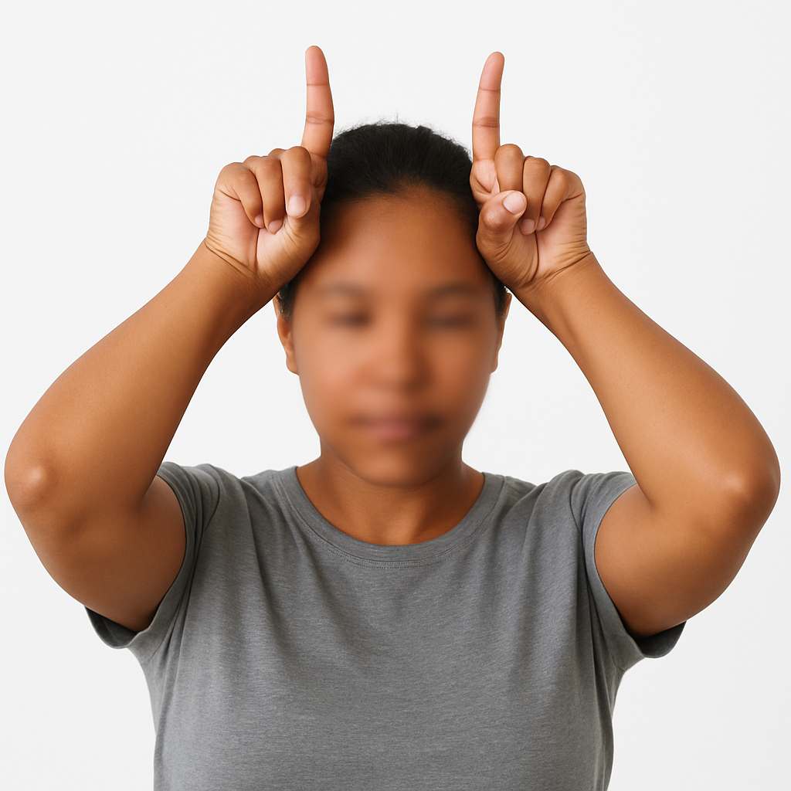

- **ID:** `meme-02`
- **Physical Description:** Extend the index and pinky fingers upward while curling the middle and ring fingers down with the thumb; hold the hand up
- **Intent:** Express rock spirit, rebellion, or intense excitement
- **Emotional State:** neutral | **Arousal:** medium
- **Emotions:** rebellion, excitement, defiance, playfulness, intensity
- **Gesture Type:** emblem
- **Body Parts:** hand, index finger, pinky finger
- **People:** single | **Culture:** western

### 40. Bang Bang (Finger Pistols)

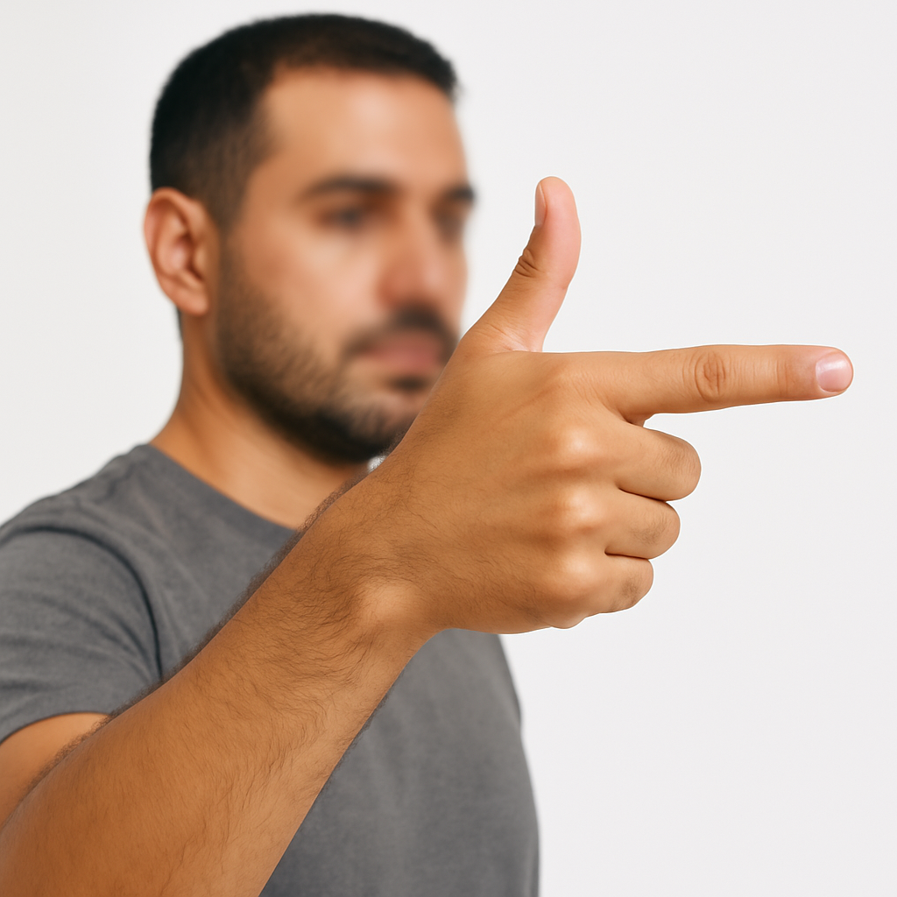

- **ID:** `meme-03`
- **Physical Description:** Form both hands into finger-gun shapes with index fingers extended and thumbs up; point and flick thumbs down as if shooting
- **Intent:** Playfully point at someone for fun or emphasis
- **Emotional State:** neutral | **Arousal:** low
- **Emotions:** playfulness, confidence, humor, bravado
- **Gesture Type:** emblem
- **Body Parts:** hands, index fingers, thumbs
- **People:** single | **Culture:** western

---

## Money & Transaction

### 41. Money Rubbing Gesture

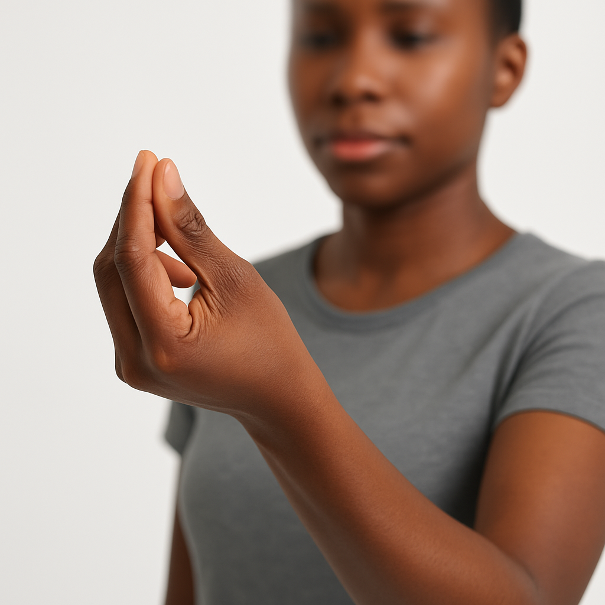

- **ID:** `money-01`
- **Physical Description:** Rub the thumb against the pads of the index and middle fingers in a repeated sliding motion, palm facing upward
- **Intent:** Refer to money, cost, or suggest something is expensive
- **Emotional State:** neutral | **Arousal:** low
- **Emotions:** pragmatism, anticipation, shrewdness, expectation
- **Gesture Type:** emblem
- **Body Parts:** hand, thumb, index finger, middle finger
- **People:** single | **Culture:** universal

### 42. Palm-Up Hand Extension

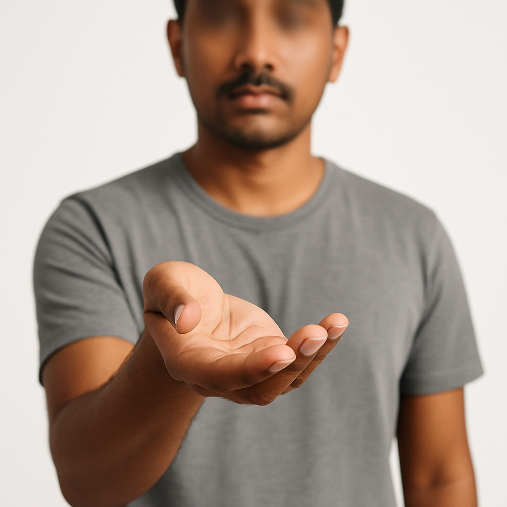

- **ID:** `money-02`
- **Physical Description:** Extend one arm forward with the hand open and palm facing upward; hold steady at waist height
- **Intent:** Request payment, a tip, or offer to receive something
- **Emotional State:** neutral | **Arousal:** low
- **Emotions:** expectation, openness, patience, directness
- **Gesture Type:** emblem
- **Body Parts:** hand, palm, arm
- **People:** single | **Culture:** universal

---

## Negative & Disapproval

### 43. Thumbs Down

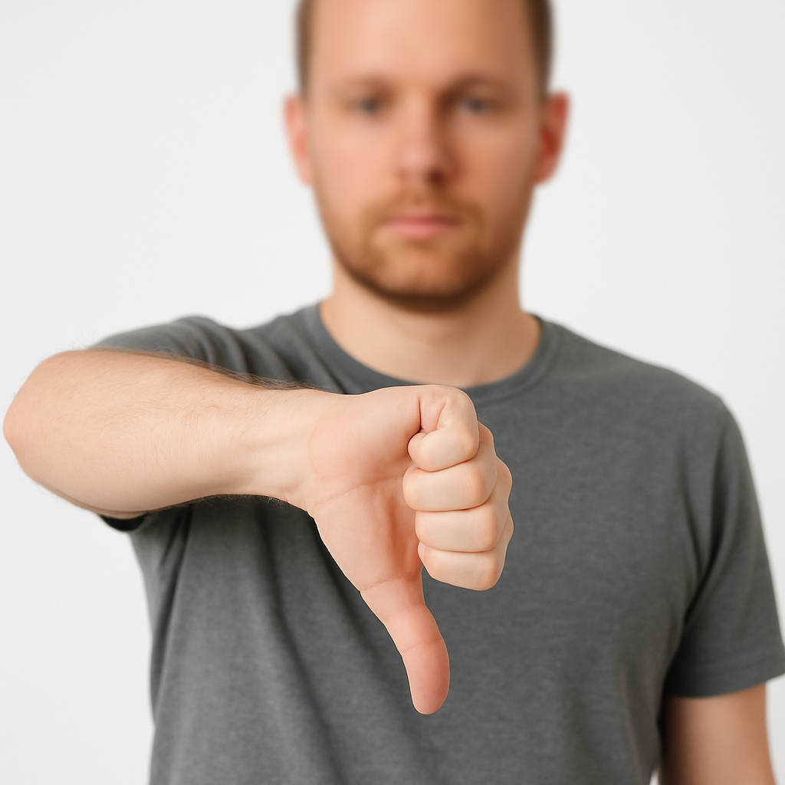

- **ID:** `neg-01`
- **Physical Description:** Make a fist and extend the thumb straight downward; arm held at chest height or lowered for emphasis
- **Intent:** Signal disapproval or rejection
- **Emotional State:** negative | **Arousal:** low
- **Emotions:** disapproval, dissatisfaction, rejection, disappointment
- **Gesture Type:** emblem
- **Body Parts:** hand, thumb
- **People:** single | **Culture:** western

### 44. Head Shake with Wagging Finger

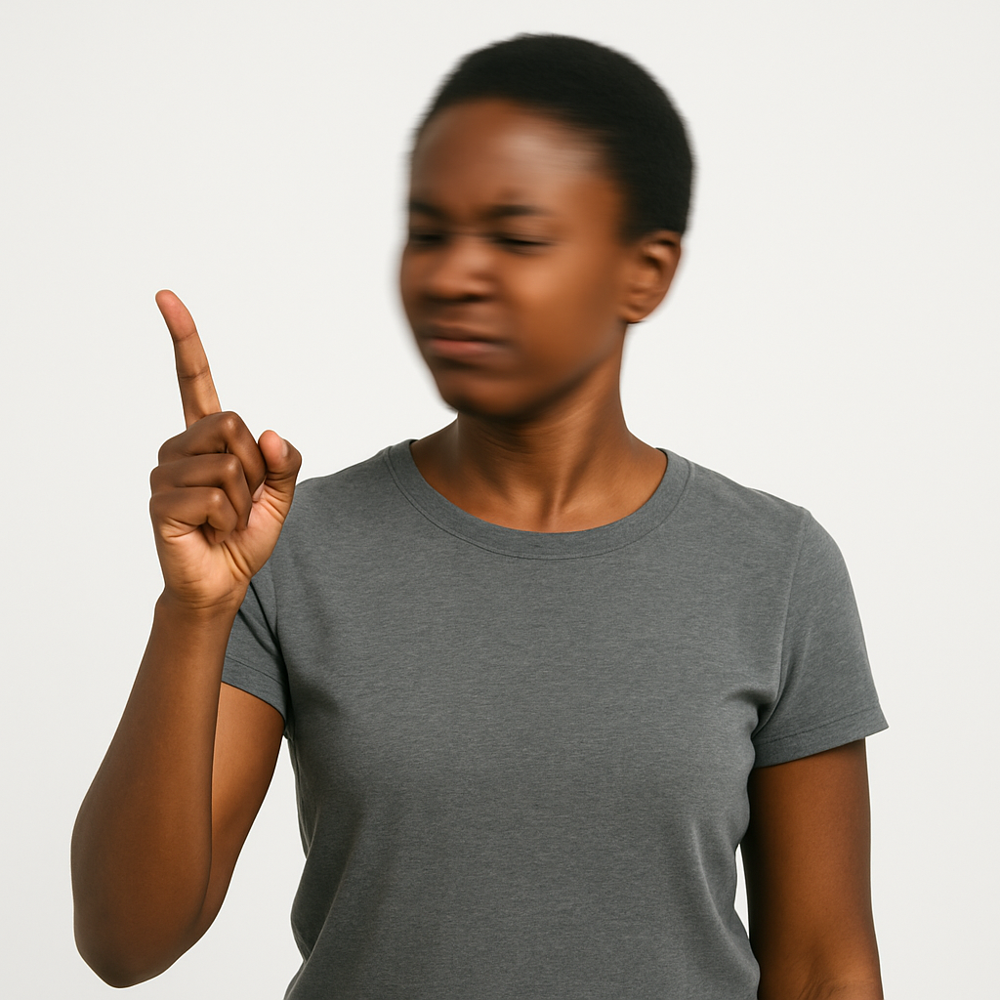

- **ID:** `neg-02`
- **Physical Description:** Extend the index finger upward and wag it side to side while simultaneously shaking the head left and right
- **Intent:** Scold or firmly refuse someone
- **Emotional State:** negative | **Arousal:** medium
- **Emotions:** disapproval, admonishment, frustration, authority
- **Gesture Type:** emblem
- **Body Parts:** head, neck, hand, index finger
- **People:** single | **Culture:** universal

### 45. X Formed with Forearms

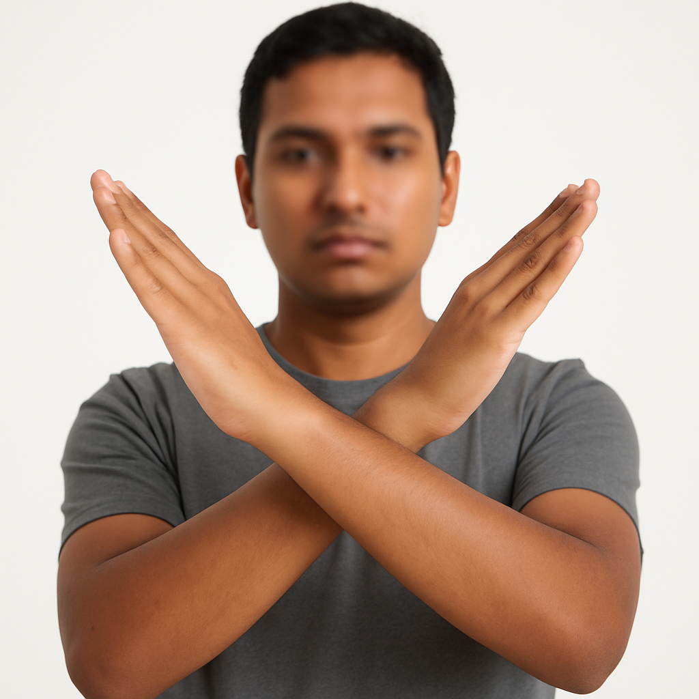

- **ID:** `neg-03`
- **Physical Description:** Cross both forearms in front of the chest forming an X-shape; hands flat or in fists, palms facing inward
- **Intent:** Strongly block or refuse something
- **Emotional State:** negative | **Arousal:** high
- **Emotions:** rejection, firmness, refusal, determination
- **Gesture Type:** emblem
- **Body Parts:** forearms, arms, hands
- **People:** single | **Culture:** universal

### 46. Palm-Out Stop Hand

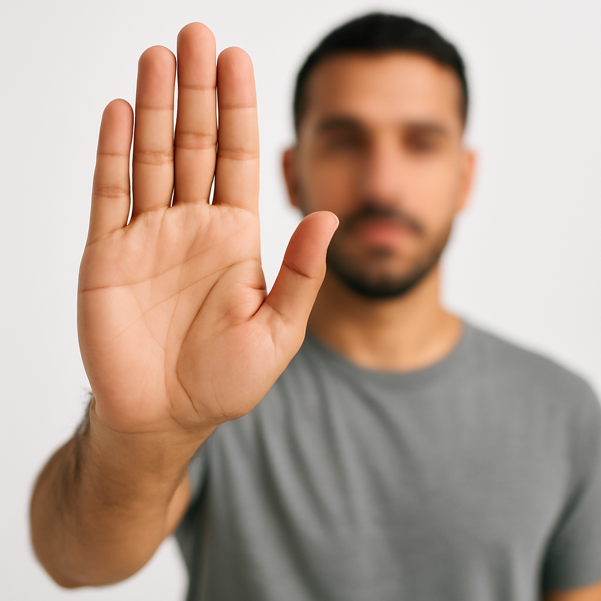

- **ID:** `neg-05`
- **Physical Description:** Raise one hand to head height with palm flat and facing outward; fingers together and arm fully extended
- **Intent:** Command someone to halt or cease an action
- **Emotional State:** negative | **Arousal:** medium
- **Emotions:** authority, firmness, boundary-setting, resistance
- **Gesture Type:** emblem
- **Body Parts:** hand, palm, arm
- **People:** single | **Culture:** universal

### 47. Both Palms Pushing Away

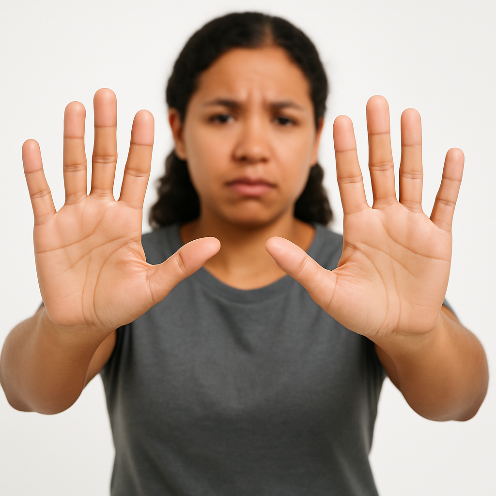

- **ID:** `neg-06`
- **Physical Description:** Extend both arms forward with palms facing outward and push repeatedly away from the body at chest height
- **Intent:** Reject or create distance from something unwanted
- **Emotional State:** negative | **Arousal:** high
- **Emotions:** rejection, aversion, overwhelm, distress
- **Gesture Type:** emblem
- **Body Parts:** hands, palms, arms
- **People:** single | **Culture:** universal

### 48. Facepalm

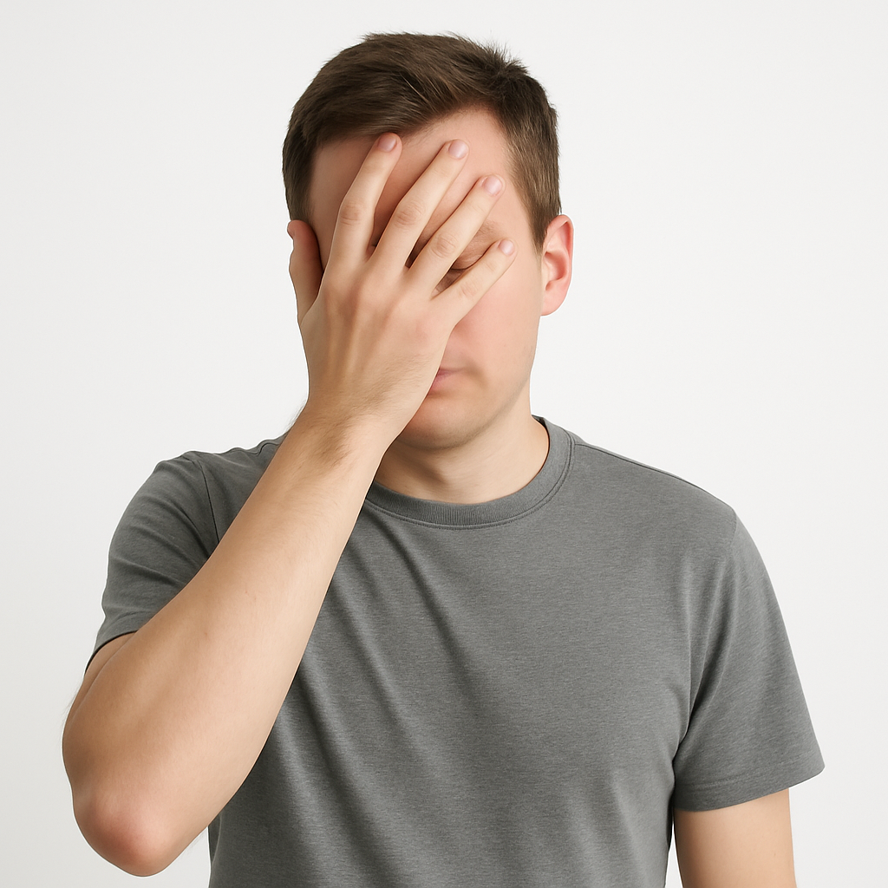

- **ID:** `neg-07`
- **Physical Description:** Raise one open hand and slap it flat against the forehead or upper face; hold briefly with eyes closed or looking down
- **Intent:** Express disbelief or frustration at a mistake or absurdity
- **Emotional State:** negative | **Arousal:** medium
- **Emotions:** frustration, embarrassment, exasperation, disbelief
- **Gesture Type:** adaptor
- **Body Parts:** hand, palm, face, forehead
- **People:** single | **Culture:** universal

### 49. Dismissive Backhand Wave

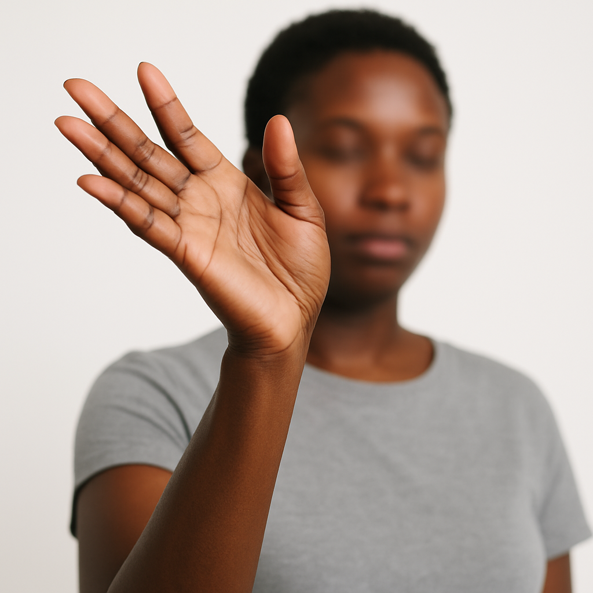

- **ID:** `neg-08`
- **Physical Description:** Flick the back of the hand outward and away from the body in a quick, careless sweeping motion at waist height
- **Intent:** Dismiss or show disregard for someone or something
- **Emotional State:** negative | **Arousal:** low
- **Emotions:** contempt, dismissiveness, indifference, annoyance
- **Gesture Type:** emblem
- **Body Parts:** hand, wrist, forearm
- **People:** single | **Culture:** universal

### 50. Exasperated Shrug with Hands Raised

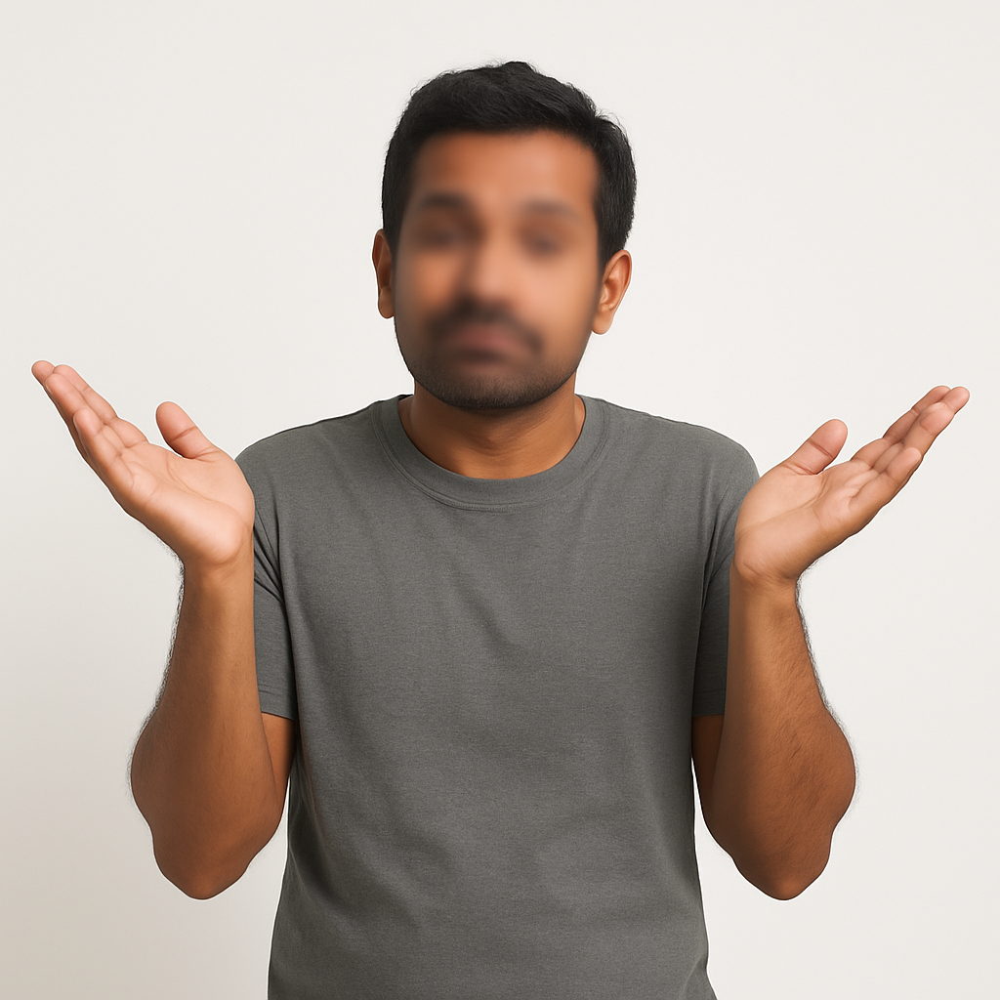

- **ID:** `neg-09`
- **Physical Description:** Raise both shoulders toward the ears while lifting both palms upward to shoulder height; head tilts slightly to one side with mouth open
- **Intent:** Express helpless frustration or disbelief
- **Emotional State:** negative | **Arousal:** medium
- **Emotions:** frustration, exasperation, helplessness, confusion
- **Gesture Type:** emblem
- **Body Parts:** shoulders, hands, palms, head
- **People:** single | **Culture:** universal

### 51. D'oh Facepalm

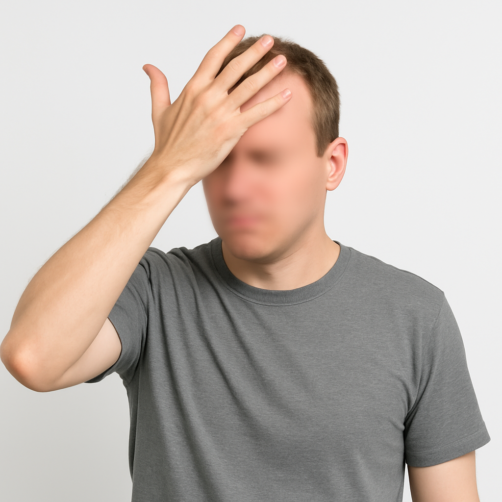

- **ID:** `neg-10`
- **Physical Description:** Slap the forehead with the heel of the palm while wincing and tilting the head back slightly; hand slides down the face
- **Intent:** Express self-directed frustration over one's own blunder
- **Emotional State:** negative | **Arousal:** medium
- **Emotions:** self-frustration, embarrassment, regret, exasperation
- **Gesture Type:** adaptor
- **Body Parts:** hand, palm, forehead, face
- **People:** single | **Culture:** universal

### 52. Tensed Fingers

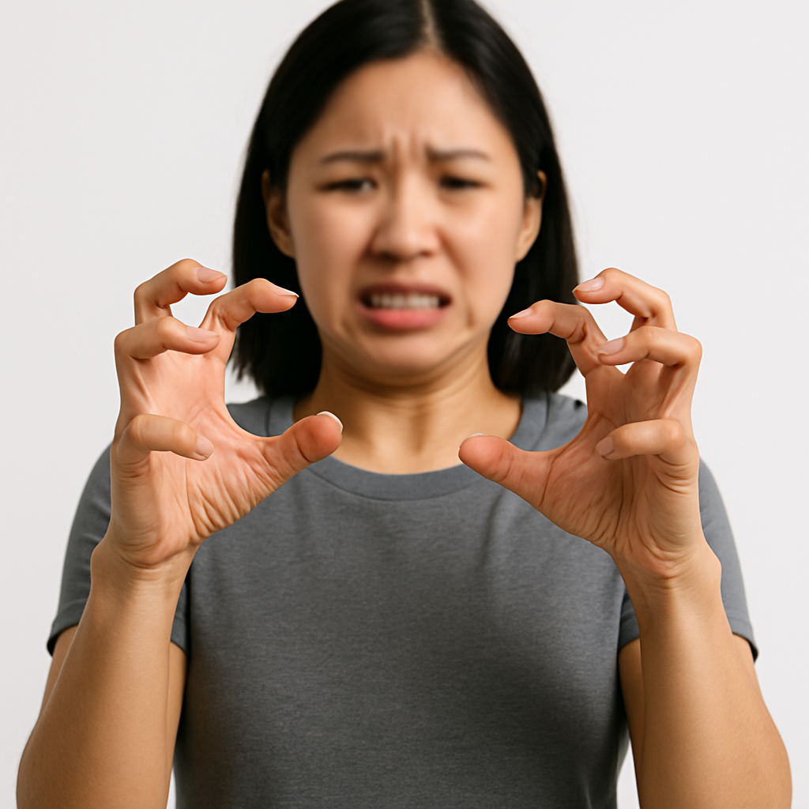

- **ID:** `neg-11`
- **Physical Description:** Hold both hands in front of the torso with fingers spread wide and curled like claws; muscles visibly tensed and body rigid
- **Intent:** Express barely contained anger or intense stress
- **Emotional State:** negative | **Arousal:** high
- **Emotions:** anger, frustration, tension, irritation, anxiety
- **Gesture Type:** adaptor
- **Body Parts:** hands, fingers, arms, torso
- **People:** single | **Culture:** universal

---

## Numbers

### 53. Number One

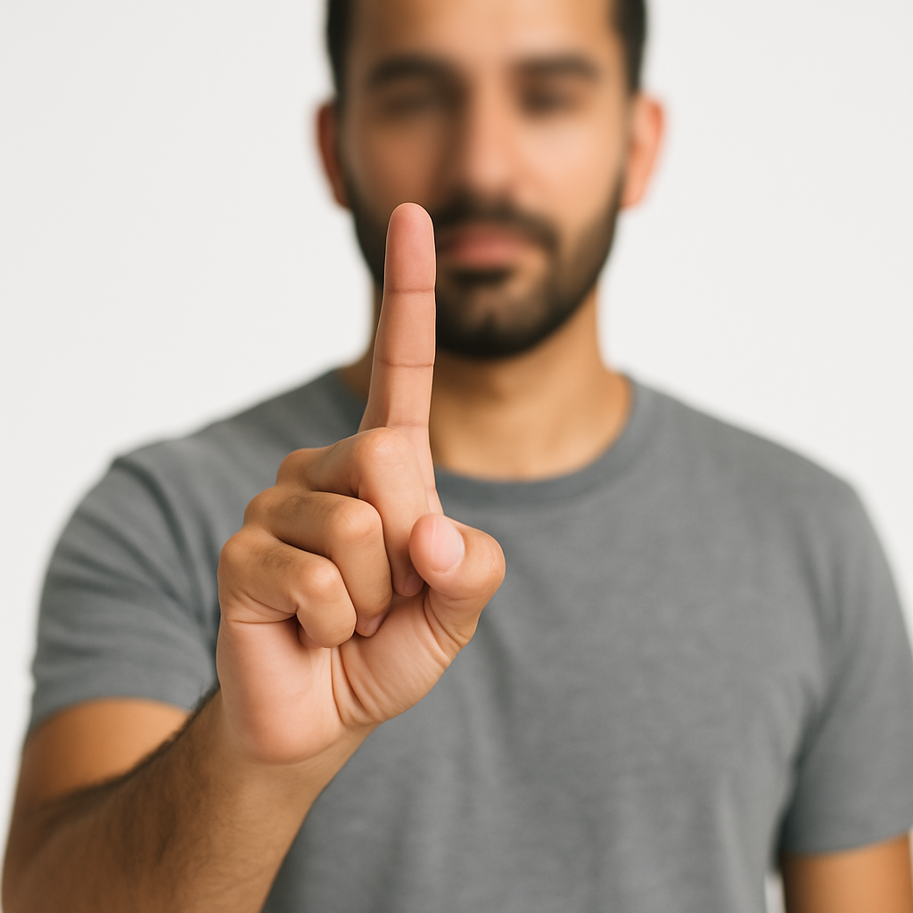

- **ID:** `number-01`
- **Physical Description:** Raise the index finger straight up from a closed fist; hold at face or chest height
- **Intent:** Indicate the number one or signal 'first'
- **Emotional State:** neutral | **Arousal:** low
- **Emotions:** clarity, precision, communication, focus
- **Gesture Type:** illustrator-iconic
- **Body Parts:** hand, index finger
- **People:** single | **Culture:** universal

### 54. Number Two

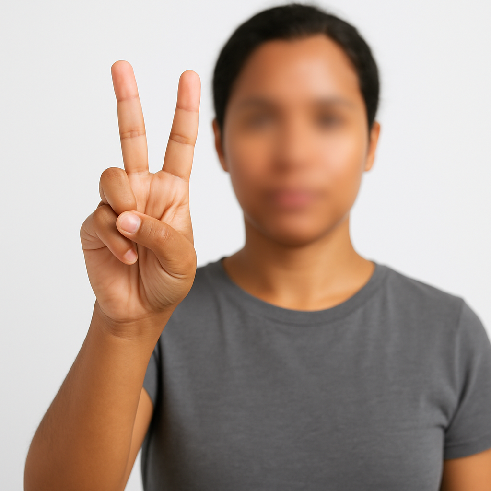

- **ID:** `number-02`
- **Physical Description:** Extend the index and middle fingers upward in a V-shape from a closed fist; palm facing outward
- **Intent:** Indicate the number two or signal 'second'
- **Emotional State:** neutral | **Arousal:** low
- **Emotions:** clarity, precision, communication, focus
- **Gesture Type:** illustrator-iconic
- **Body Parts:** hand, index finger, middle finger
- **People:** single | **Culture:** universal

### 55. Number Three

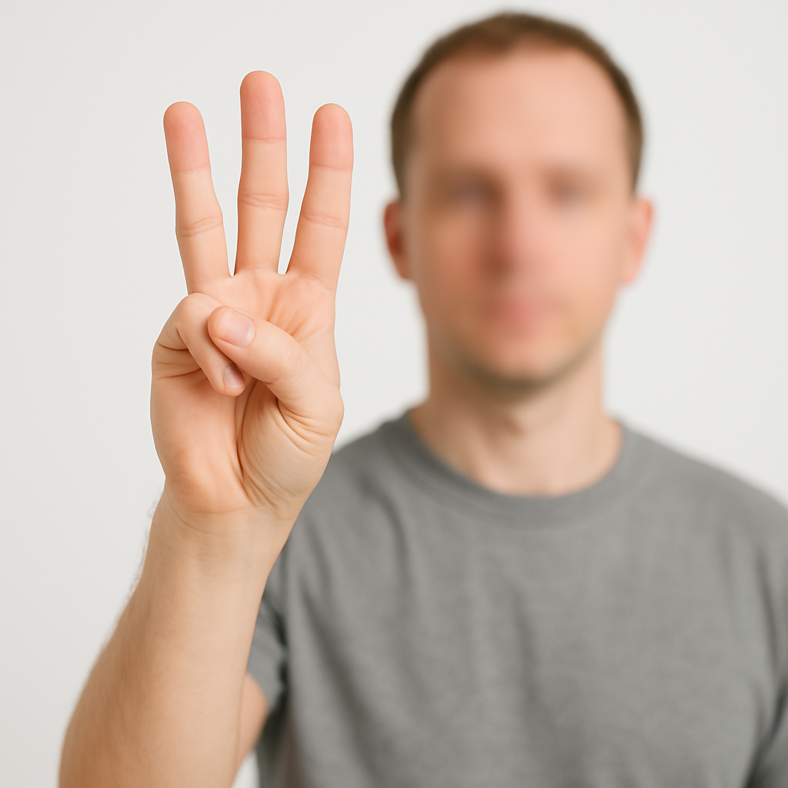

- **ID:** `number-03`
- **Physical Description:** Extend the index, middle, and ring fingers upward from a closed fist; thumb holds the pinky down
- **Intent:** Indicate the number three
- **Emotional State:** neutral | **Arousal:** low
- **Emotions:** clarity, precision, communication, focus
- **Gesture Type:** illustrator-iconic
- **Body Parts:** hand, index finger, middle finger, ring finger
- **People:** single | **Culture:** universal

### 56. Number Four

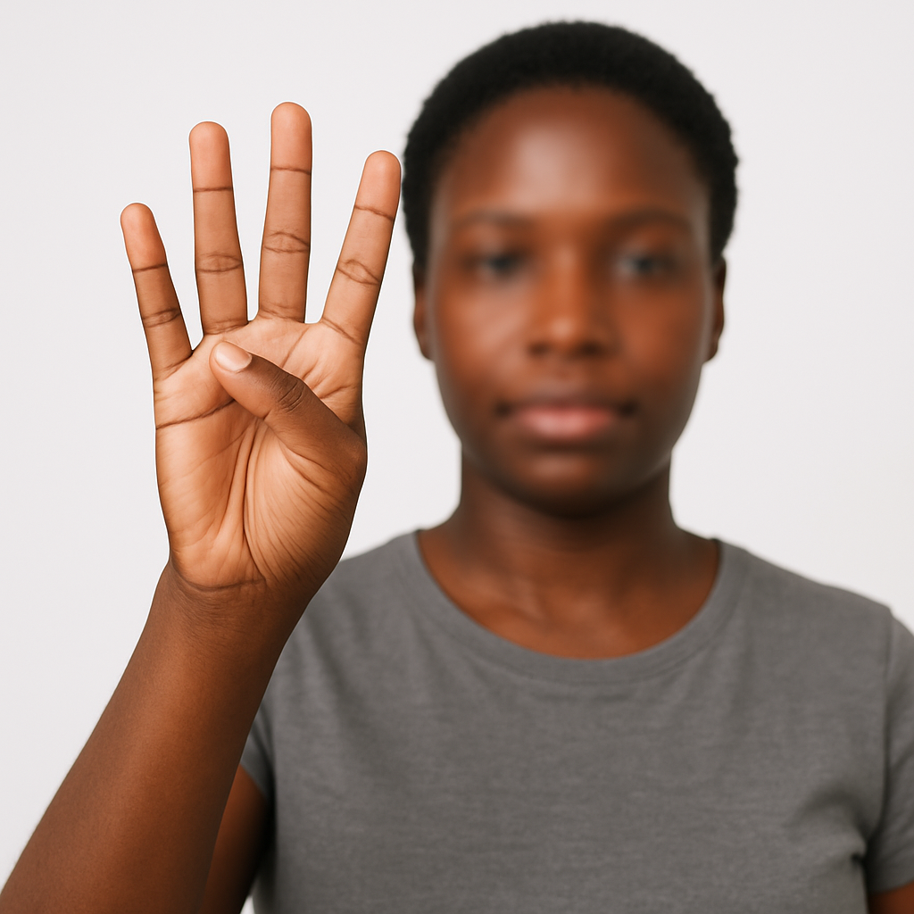

- **ID:** `number-04`
- **Physical Description:** Extend all four fingers upward with the thumb folded across the palm; fingers together or slightly spread
- **Intent:** Indicate the number four
- **Emotional State:** neutral | **Arousal:** low
- **Emotions:** clarity, precision, communication, focus
- **Gesture Type:** illustrator-iconic
- **Body Parts:** hand, fingers
- **People:** single | **Culture:** universal

### 57. Number Five

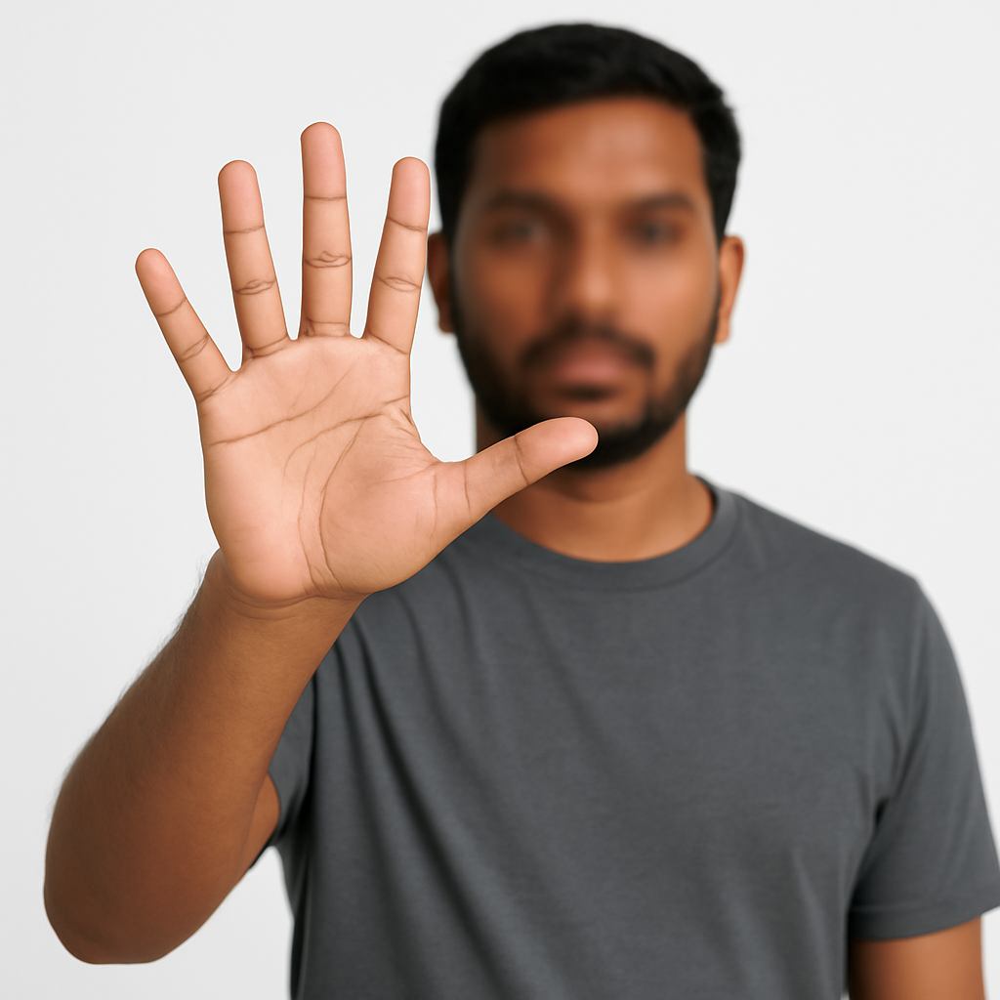

- **ID:** `number-05`
- **Physical Description:** Open the hand fully with all five fingers spread apart and palm facing outward; hold at face height
- **Intent:** Indicate the number five
- **Emotional State:** neutral | **Arousal:** low
- **Emotions:** clarity, precision, communication, focus
- **Gesture Type:** illustrator-iconic
- **Body Parts:** hand, fingers, palm
- **People:** single | **Culture:** universal

### 58. Number Six

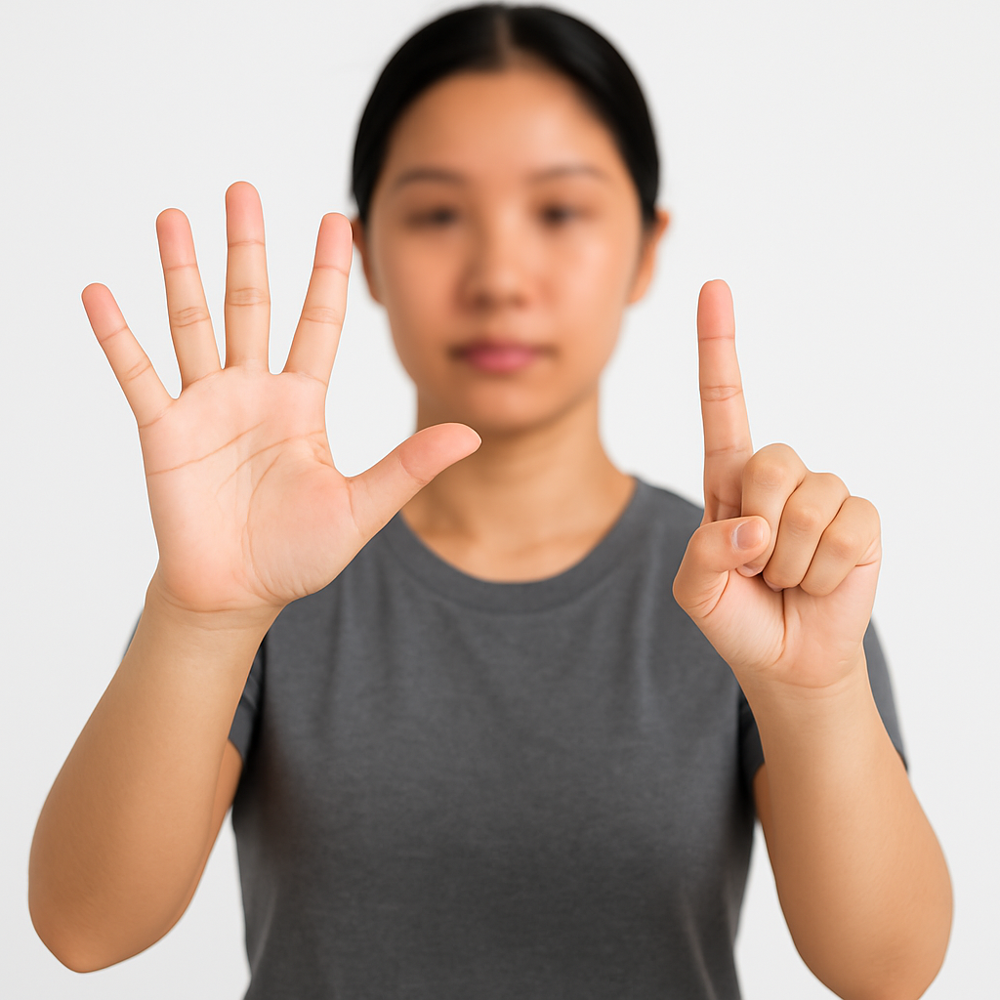

- **ID:** `number-06`
- **Physical Description:** Show five fingers on one hand and extend the index finger on the other; or fold the pinky and ring finger showing thumb, index, and middle
- **Intent:** Indicate the number six
- **Emotional State:** neutral | **Arousal:** low
- **Emotions:** clarity, precision, communication, focus
- **Gesture Type:** illustrator-iconic
- **Body Parts:** hands, fingers
- **People:** single | **Culture:** western

### 59. Number Seven

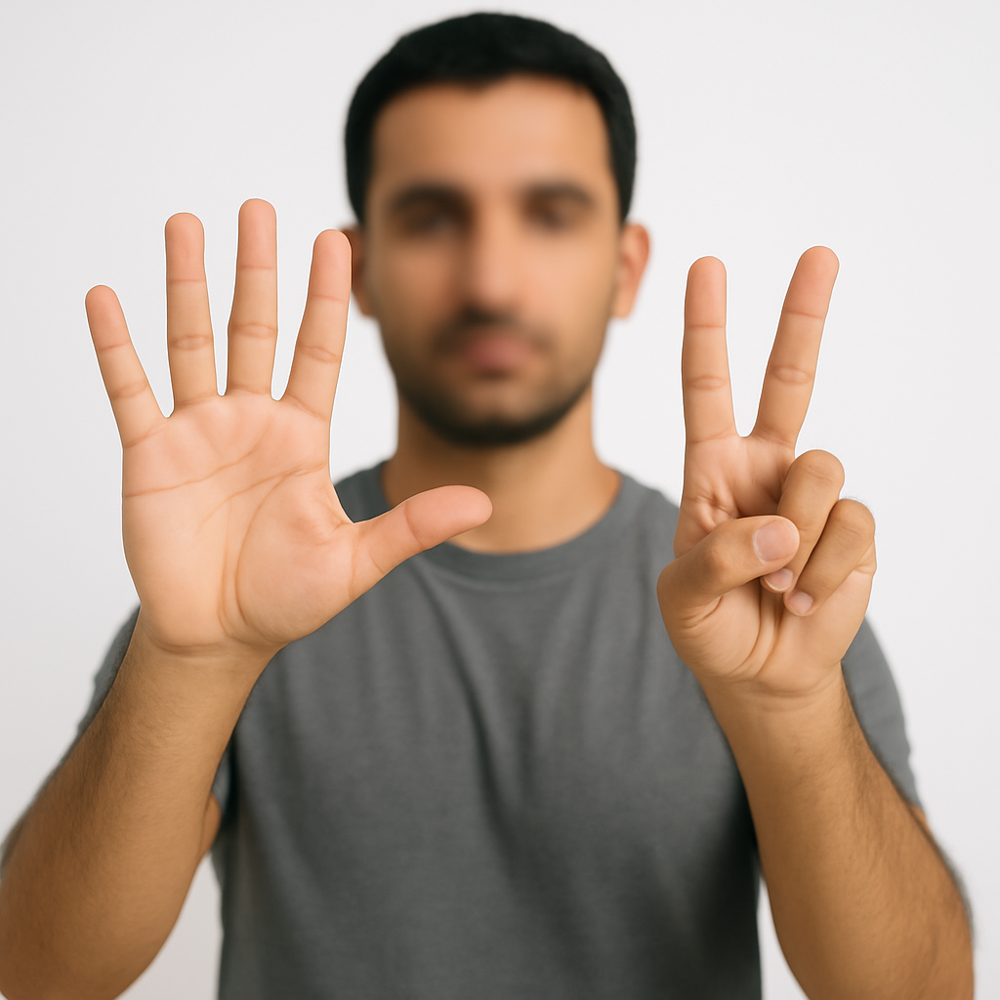

- **ID:** `number-07`
- **Physical Description:** Show five fingers on one hand and extend the index and middle fingers on the other hand
- **Intent:** Indicate the number seven
- **Emotional State:** neutral | **Arousal:** low
- **Emotions:** clarity, precision, communication, focus
- **Gesture Type:** illustrator-iconic
- **Body Parts:** hands, fingers
- **People:** single | **Culture:** western

### 60. Number Eight

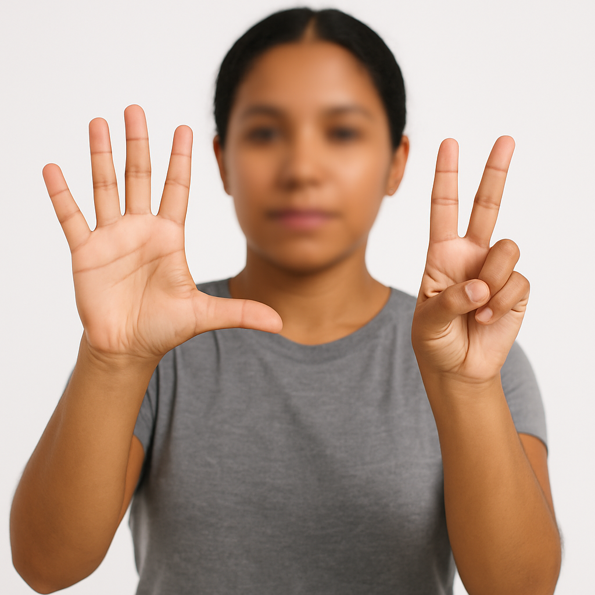

- **ID:** `number-08`
- **Physical Description:** Show five fingers on one hand and extend three fingers on the other hand
- **Intent:** Indicate the number eight
- **Emotional State:** neutral | **Arousal:** low
- **Emotions:** clarity, precision, communication, focus
- **Gesture Type:** illustrator-iconic
- **Body Parts:** hands, fingers
- **People:** single | **Culture:** western

### 61. Number Nine

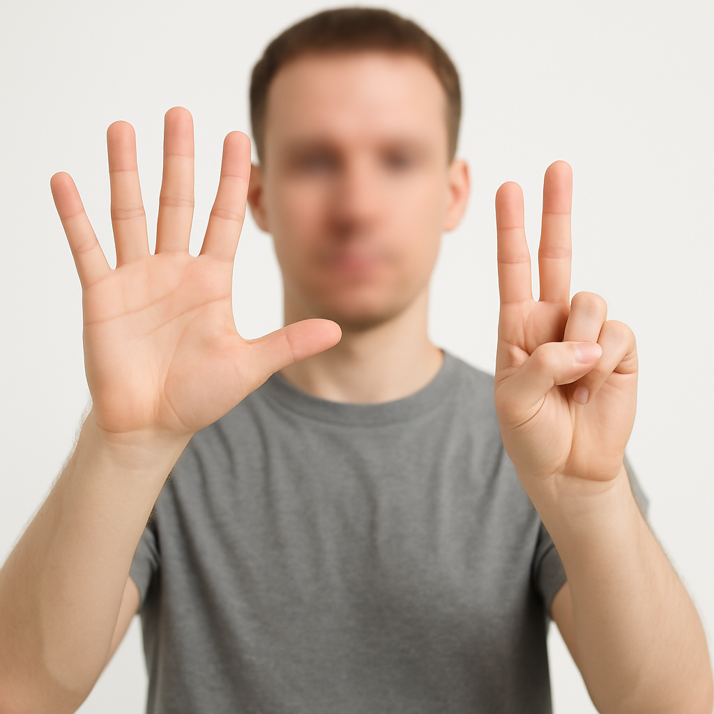

- **ID:** `number-09`
- **Physical Description:** Show five fingers on one hand and extend four fingers on the other hand
- **Intent:** Indicate the number nine
- **Emotional State:** neutral | **Arousal:** low
- **Emotions:** clarity, precision, communication, focus
- **Gesture Type:** illustrator-iconic
- **Body Parts:** hands, fingers
- **People:** single | **Culture:** western

### 62. Number Ten

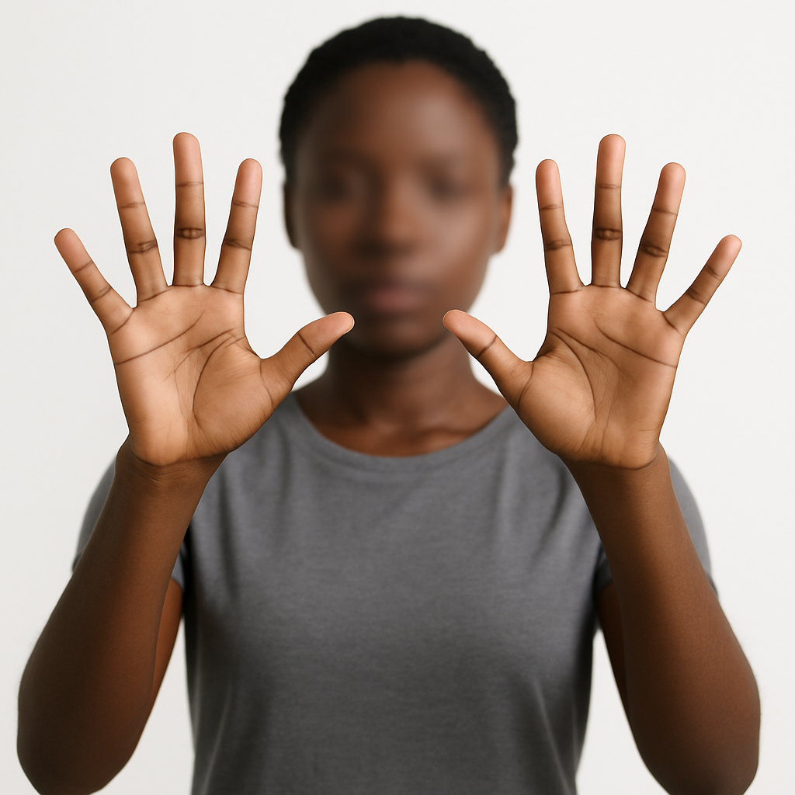

- **ID:** `number-10`
- **Physical Description:** Open both hands fully with all ten fingers spread and palms facing outward
- **Intent:** Indicate the number ten
- **Emotional State:** neutral | **Arousal:** low
- **Emotions:** clarity, precision, communication, focus
- **Gesture Type:** illustrator-iconic
- **Body Parts:** hands, fingers, palms
- **People:** single | **Culture:** universal

---

## Practical & Functional

### 63. Hitchhiker's Thumb

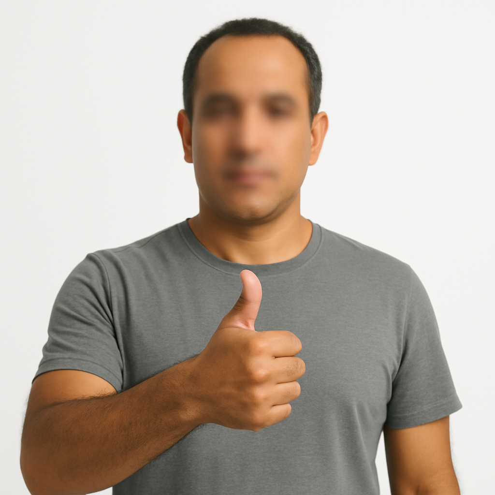

- **ID:** `prac-01`
- **Physical Description:** Make a loose fist and extend the thumb outward, jerking it over the shoulder or pointing it in the direction of travel
- **Intent:** Request a ride or casually indicate a direction behind you
- **Emotional State:** neutral | **Arousal:** low
- **Emotions:** adventurousness, hope, independence, casualness
- **Gesture Type:** emblem
- **Body Parts:** hand, thumb
- **People:** single | **Culture:** western

### 64. Hand-as-Phone Gesture

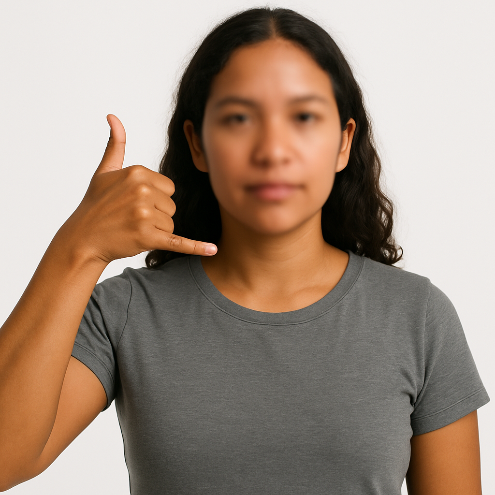

- **ID:** `prac-02`
- **Physical Description:** Extend the thumb and pinky finger while curling the middle three fingers; hold the thumb to the ear and the pinky near the mouth
- **Intent:** Suggest making or receiving a phone call
- **Emotional State:** neutral | **Arousal:** low
- **Emotions:** pragmatism, urgency, communication, directness
- **Gesture Type:** illustrator-iconic
- **Body Parts:** hand, thumb, pinky finger
- **People:** single | **Culture:** universal

### 65. Hand-as-Camera Framing

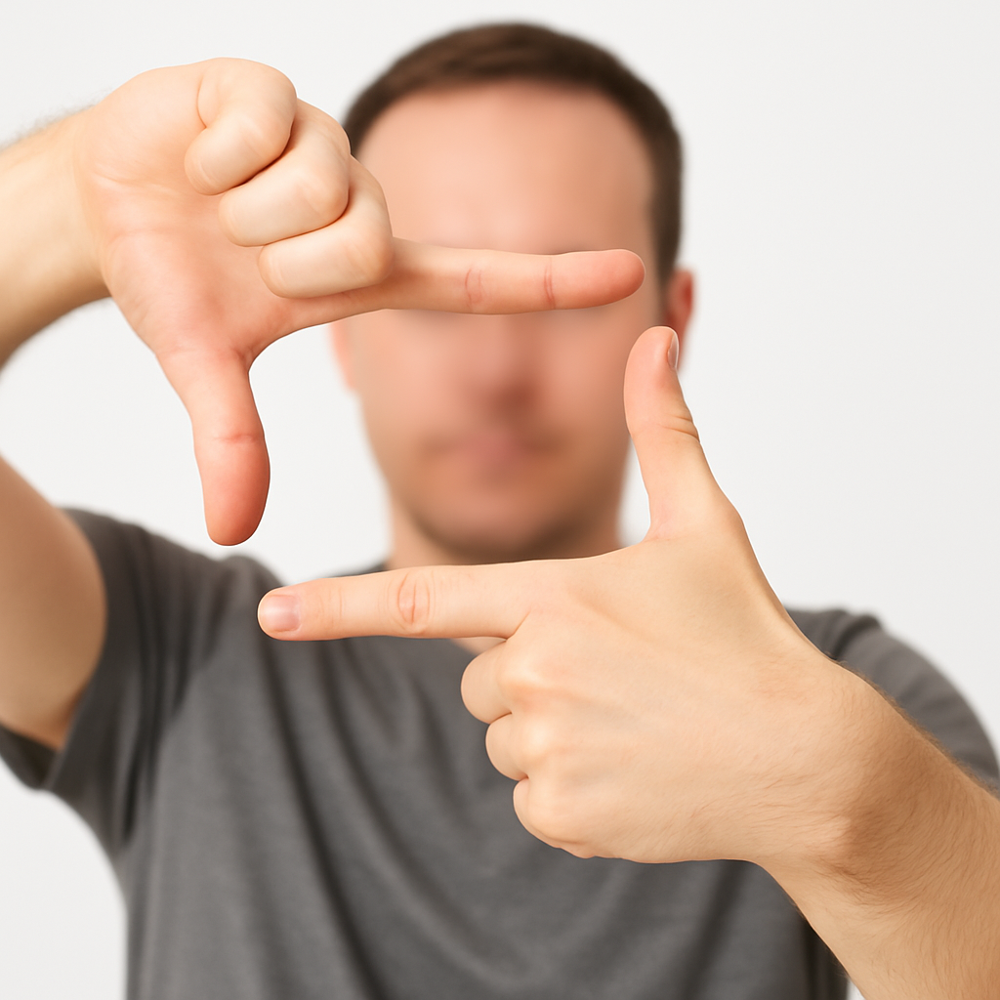

- **ID:** `prac-03`
- **Physical Description:** Form an L-shape with each hand using the thumb and index finger; hold them together to create a rectangular frame and look through it
- **Intent:** Frame a scene or composition as if viewing through a lens
- **Emotional State:** neutral | **Arousal:** low
- **Emotions:** creativity, focus, attention-to-detail, curiosity
- **Gesture Type:** illustrator-iconic
- **Body Parts:** hands, thumbs, index fingers
- **People:** single | **Culture:** universal

### 66. Hand Visor - Shading Eyes

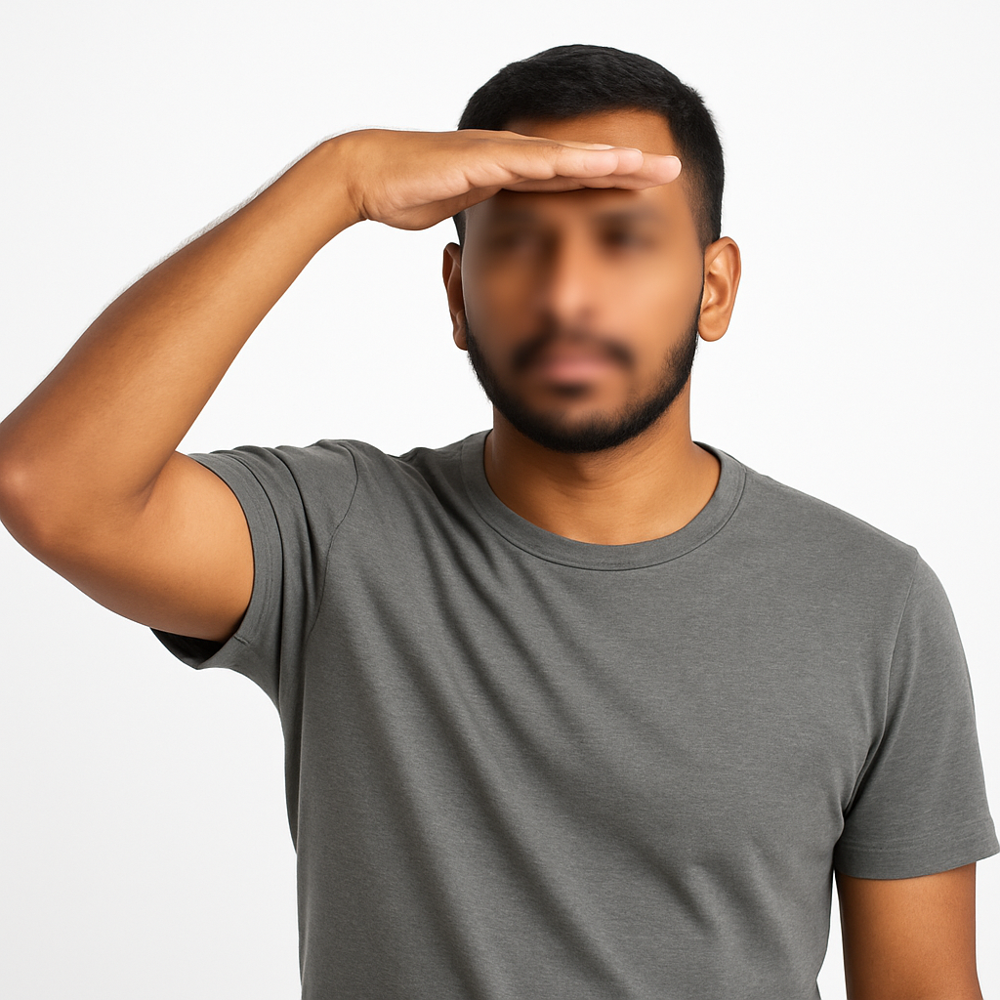

- **ID:** `prac-05`
- **Physical Description:** Place one flat hand horizontally above the eyebrows with palm facing downward; squint and look into the distance
- **Intent:** Shield eyes from light or search for something far away
- **Emotional State:** neutral | **Arousal:** low
- **Emotions:** curiosity, attentiveness, searching, alertness
- **Gesture Type:** adaptor
- **Body Parts:** hand, forehead, eyes
- **People:** single | **Culture:** universal

### 67. Shoulder Shrug Palms Up

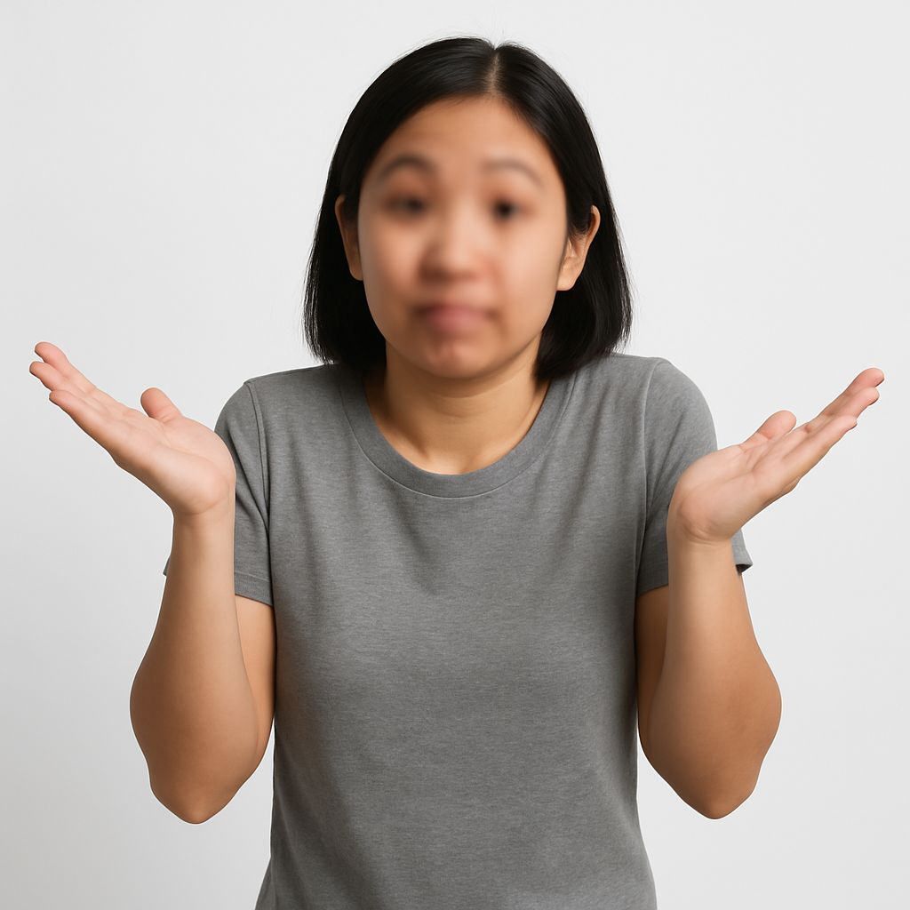

- **ID:** `prac-06`
- **Physical Description:** Raise both shoulders toward the ears while turning both palms upward at waist height; eyebrows lifted and mouth slightly downturned
- **Intent:** Express uncertainty, ignorance, or indifference
- **Emotional State:** neutral | **Arousal:** low
- **Emotions:** confusion, helplessness, indifference, acceptance
- **Gesture Type:** emblem
- **Body Parts:** shoulders, hands, palms, head
- **People:** single | **Culture:** universal

### 68. Call Me Hand

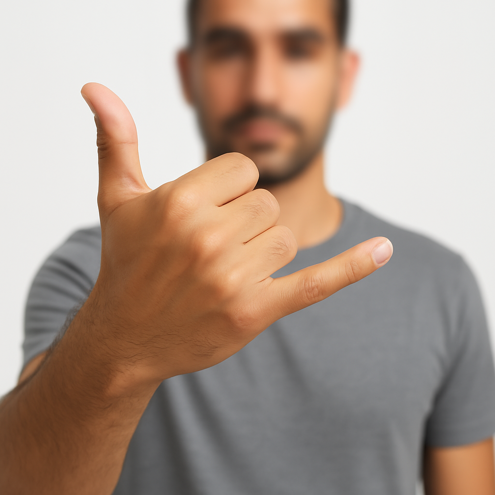

- **ID:** `prac-07`
- **Physical Description:** Extend the thumb and pinky finger with middle fingers curled; hold near the ear or wave casually with a nod
- **Intent:** Suggest that someone should call you or stay in touch
- **Emotional State:** positive | **Arousal:** low
- **Emotions:** friendliness, flirtation, casualness, confidence
- **Gesture Type:** emblem
- **Body Parts:** hand, thumb, pinky finger
- **People:** single | **Culture:** western

### 69. Typing on Air Keyboard

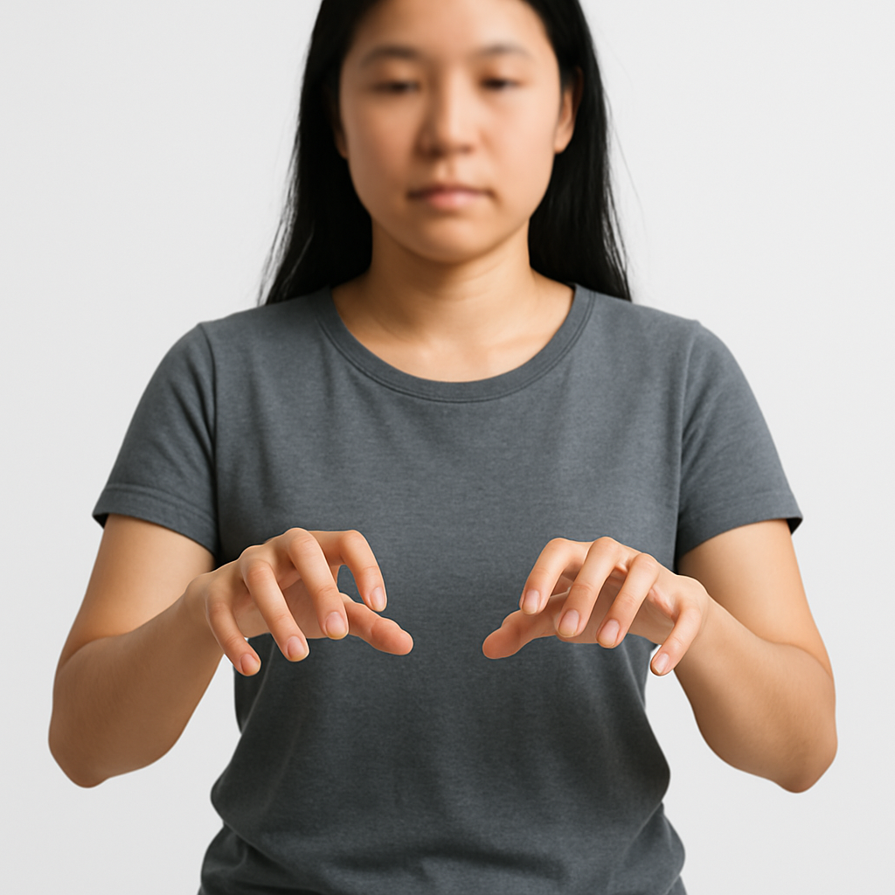

- **ID:** `prac-08`
- **Physical Description:** Hold both hands in front of the body at waist height with fingers curved and rapidly tap the fingers up and down as if typing on an invisible keyboard
- **Intent:** Indicate working on a computer, writing, or data entry
- **Emotional State:** neutral | **Arousal:** low
- **Emotions:** focus, productivity, communication, attentiveness
- **Gesture Type:** illustrator-iconic
- **Body Parts:** hands, fingers
- **People:** single | **Culture:** universal

### 70. Washing Hands

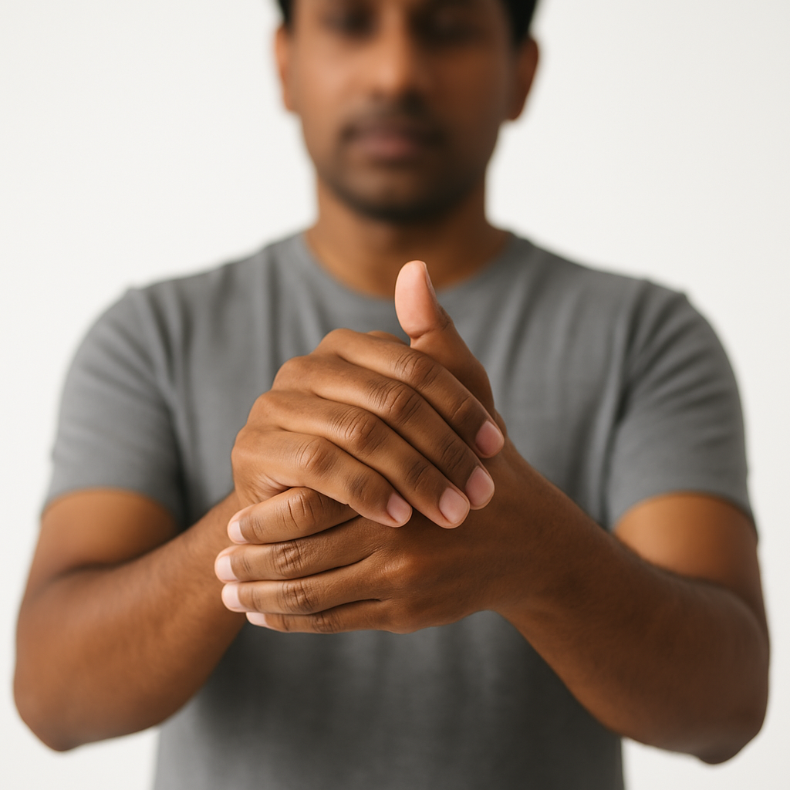

- **ID:** `prac-09`
- **Physical Description:** Rub both hands together in circular motions, palms sliding over the backs of the hands alternately, mimicking lathering with soap
- **Intent:** Demonstrate hand hygiene or indicate cleanliness
- **Emotional State:** neutral | **Arousal:** low
- **Emotions:** cleanliness, caution, conscientiousness, responsibility
- **Gesture Type:** illustrator-iconic
- **Body Parts:** hands, palms, fingers
- **People:** single | **Culture:** universal

---

## Quantity & Counting

### 71. Counting One Through Five

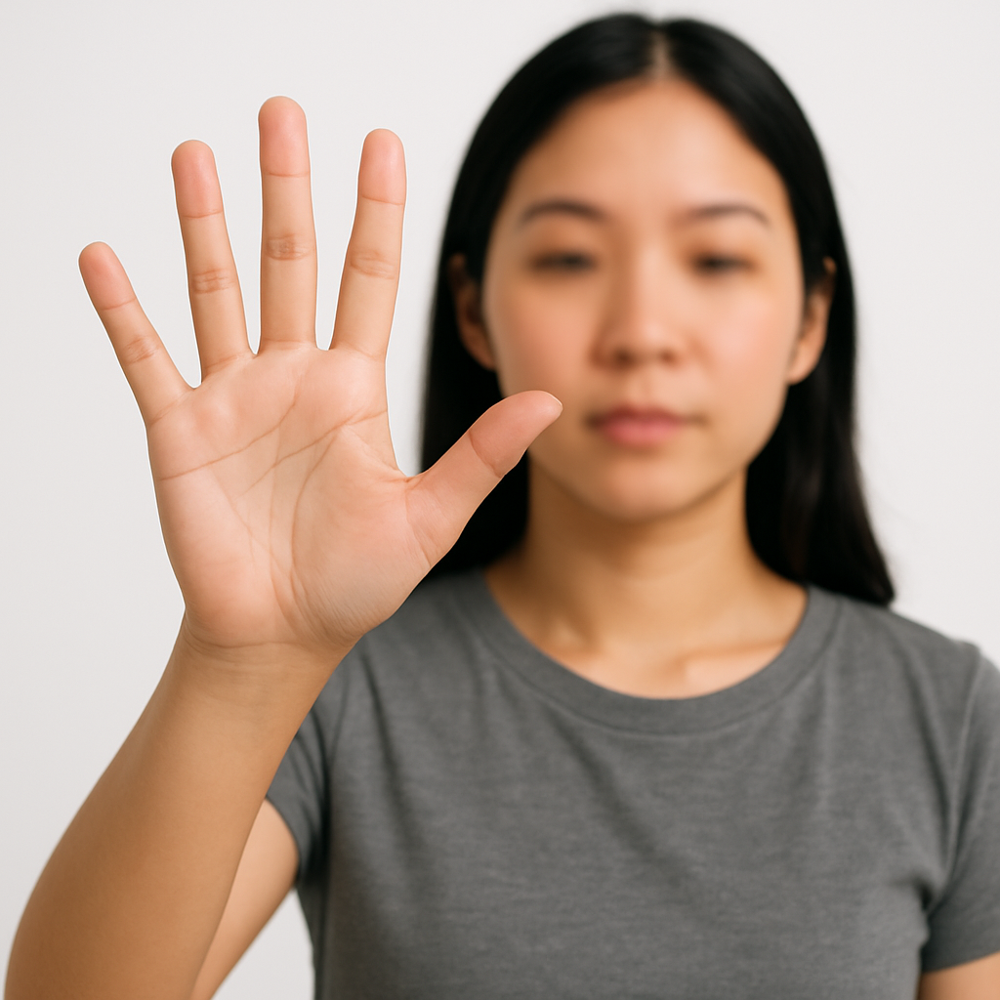

- **ID:** `quant-01`
- **Physical Description:** Sequentially extend fingers starting from the index finger, adding one finger at a time until all five are shown on one hand
- **Intent:** Enumerate items or count from one to five
- **Emotional State:** neutral | **Arousal:** low
- **Emotions:** focus, clarity, precision, attentiveness
- **Gesture Type:** illustrator-iconic
- **Body Parts:** hand, fingers
- **People:** single | **Culture:** western

### 72. Counting Six Through Ten

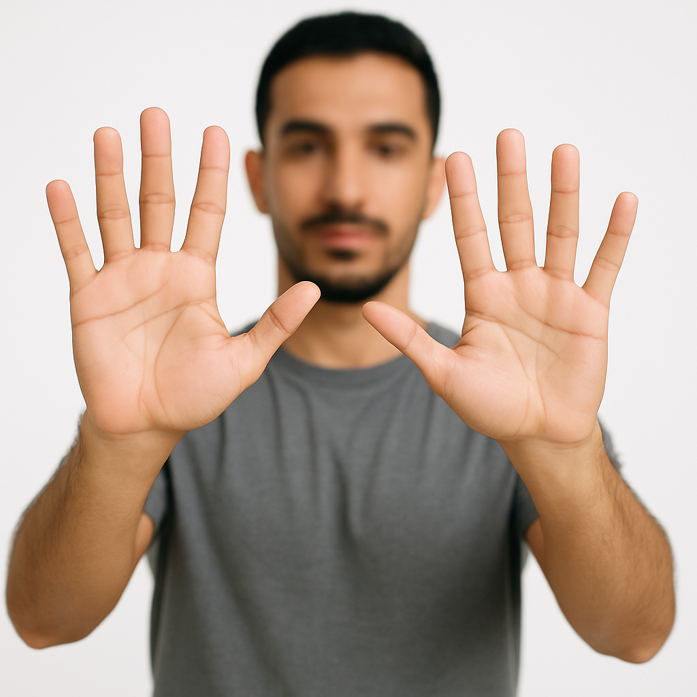

- **ID:** `quant-02`
- **Physical Description:** Use both hands, starting with five fingers on one hand and extending fingers on the second hand from one to five
- **Intent:** Continue counting from six to ten
- **Emotional State:** neutral | **Arousal:** low
- **Emotions:** focus, clarity, precision, attentiveness
- **Gesture Type:** illustrator-iconic
- **Body Parts:** hands, fingers
- **People:** single | **Culture:** western

### 73. Just a Little Bit Gesture

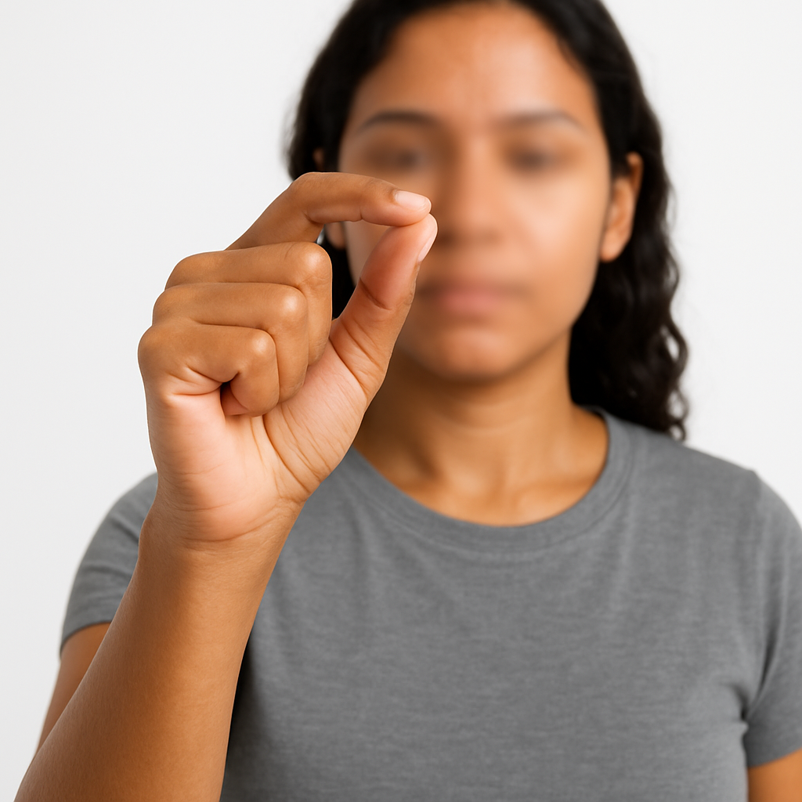

- **ID:** `quant-03`
- **Physical Description:** Hold the thumb and index finger close together with a tiny gap between them; remaining fingers curled into the palm
- **Intent:** Indicate a very small amount or degree
- **Emotional State:** neutral | **Arousal:** low
- **Emotions:** modesty, precision, restraint, casualness
- **Gesture Type:** illustrator-iconic
- **Body Parts:** hand, thumb, index finger
- **People:** single | **Culture:** universal

---

## Respect & Religious

### 74. Praying Hands

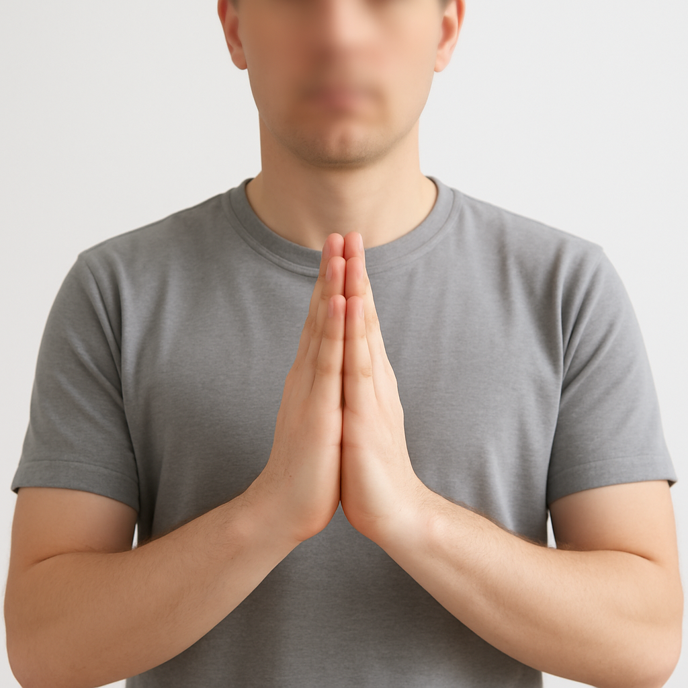

- **ID:** `resp-02`
- **Physical Description:** Press both palms flat together with fingers pointing upward at chest or chin height; eyes may close and head may bow
- **Intent:** Pray, express deep gratitude, or show spiritual reverence
- **Emotional State:** positive | **Arousal:** low
- **Emotions:** reverence, gratitude, hope, serenity, devotion, humility
- **Gesture Type:** emblem
- **Body Parts:** hands, palms, fingers
- **People:** single | **Culture:** universal

---

## Rude & Offensive

### 75. Middle Finger

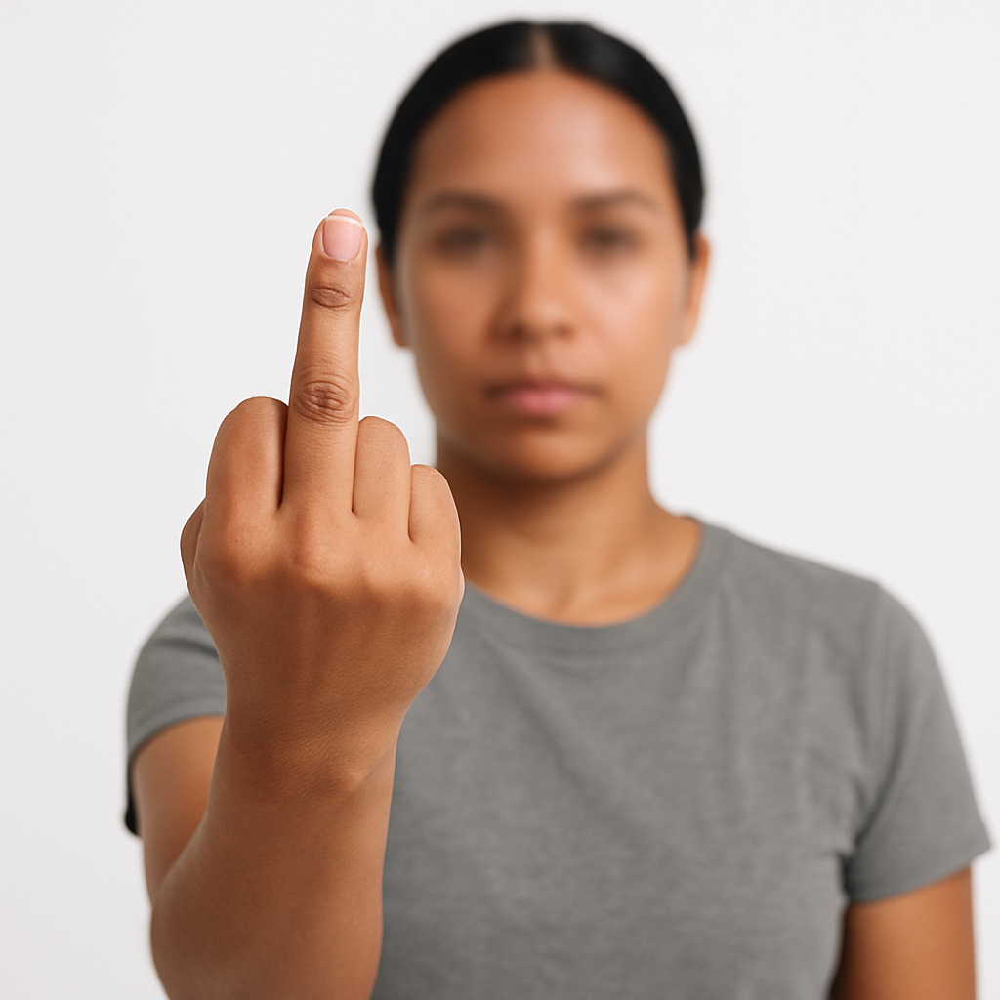

- **ID:** `rude-01`
- **Physical Description:** Extend the middle finger straight up from a closed fist with the back of the hand facing the recipient
- **Intent:** Express extreme contempt or hostility toward someone
- **Emotional State:** negative | **Arousal:** high
- **Emotions:** anger, contempt, hostility, defiance, rage
- **Gesture Type:** emblem
- **Body Parts:** hand, middle finger
- **People:** single | **Culture:** western

### 76. Talk to the Hand

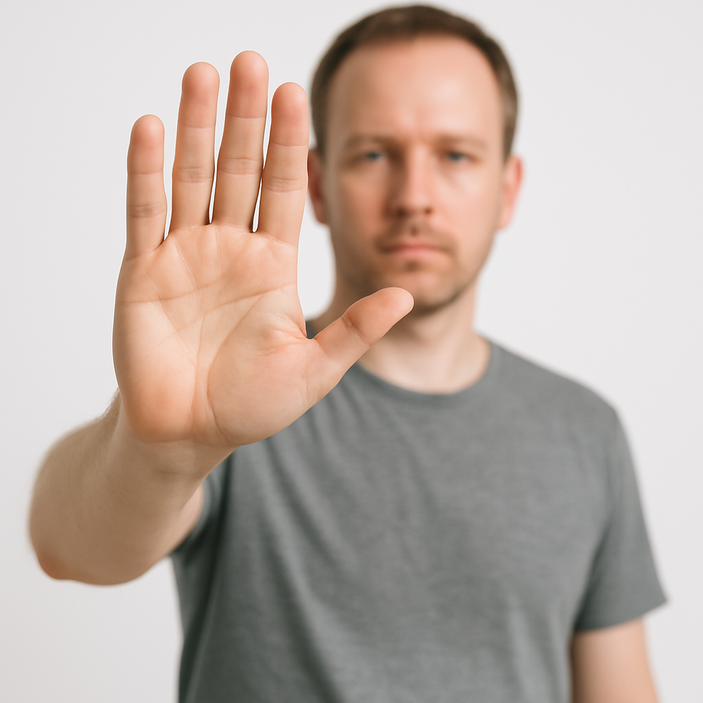

- **ID:** `rude-02`
- **Physical Description:** Thrust one arm forward with the palm flat and facing the other person; fingers together, head turned away dismissively
- **Intent:** Dismiss someone with exaggerated disregard
- **Emotional State:** negative | **Arousal:** medium
- **Emotions:** contempt, dismissiveness, arrogance, rejection
- **Gesture Type:** emblem
- **Body Parts:** hand, palm, arm, head
- **People:** single | **Culture:** western

### 77. Loser L on Forehead

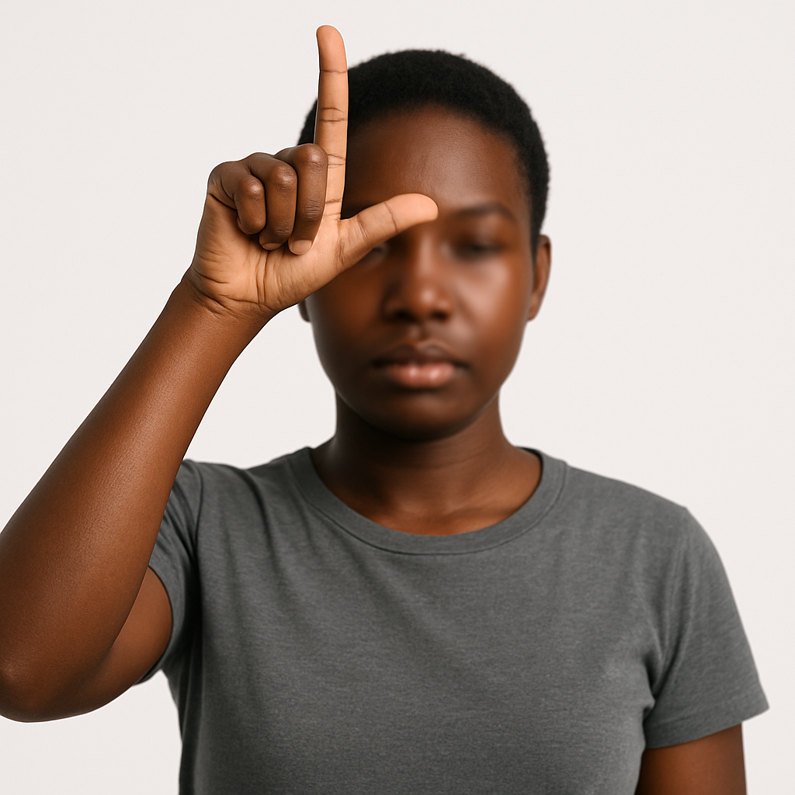

- **ID:** `rude-03`
- **Physical Description:** Form an L-shape with the thumb and index finger and press it against the forehead with the L facing outward
- **Intent:** Mock someone by branding them a loser
- **Emotional State:** negative | **Arousal:** medium
- **Emotions:** contempt, mockery, superiority, cruelty, scorn
- **Gesture Type:** emblem
- **Body Parts:** hand, thumb, index finger, forehead
- **People:** single | **Culture:** western

### 78. Cuckoo Sign

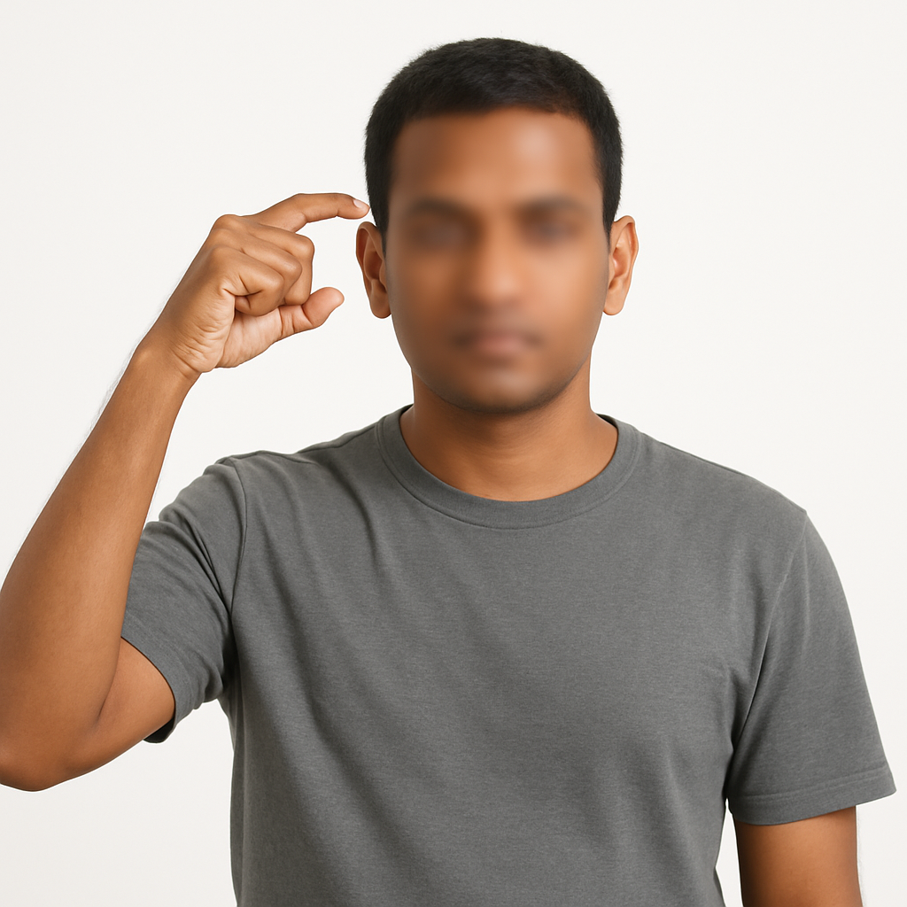

- **ID:** `rude-04`
- **Physical Description:** Extend the index finger and rotate it in small circles next to the temple; eyebrows raised with a knowing look
- **Intent:** Imply that someone is irrational or out of their mind
- **Emotional State:** negative | **Arousal:** low
- **Emotions:** mockery, dismissiveness, contempt, ridicule
- **Gesture Type:** emblem
- **Body Parts:** hand, index finger, head, temple
- **People:** single | **Culture:** western

### 79. Nose Thumb

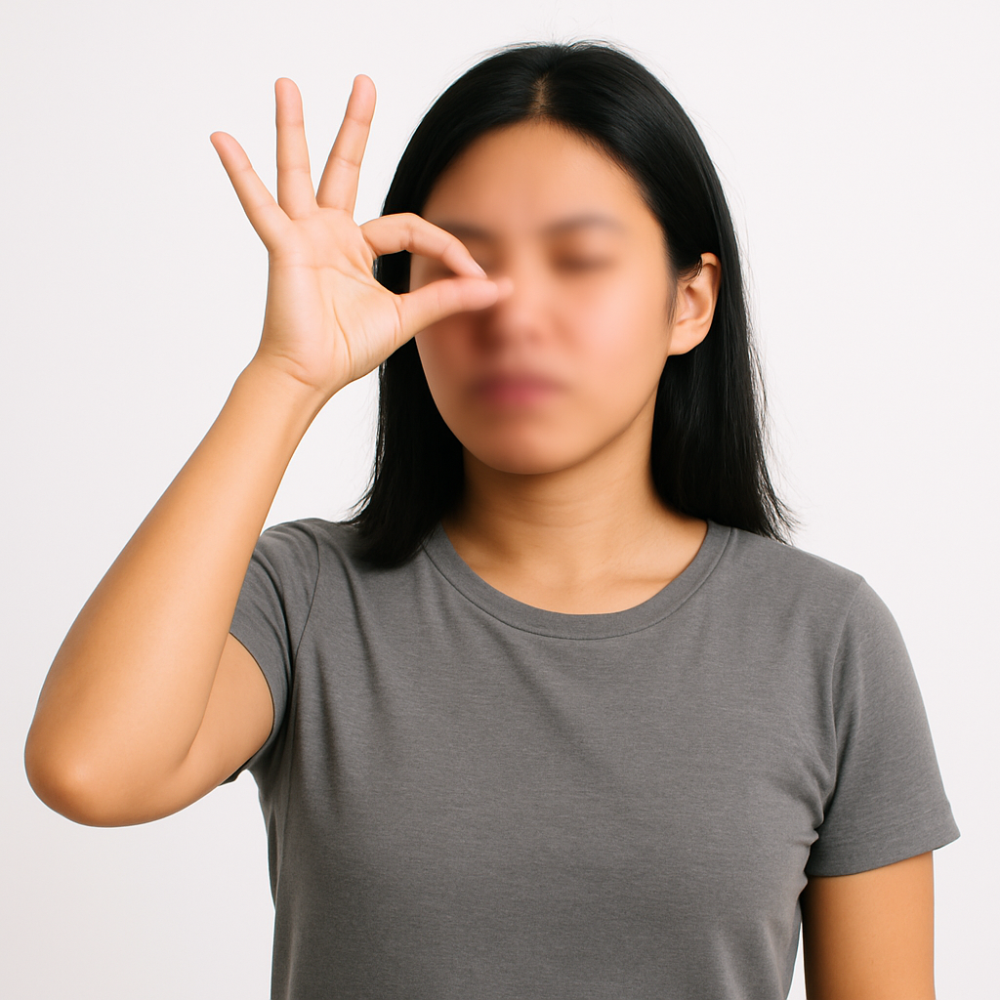

- **ID:** `rude-05`
- **Physical Description:** Place the thumb on the tip of the nose with fingers spread wide and wiggle the fingers; optionally stack the second hand on top
- **Intent:** Taunt or mock someone in a childish, defiant way
- **Emotional State:** negative | **Arousal:** low
- **Emotions:** mockery, defiance, contempt, childishness, scorn
- **Gesture Type:** emblem
- **Body Parts:** hand, thumb, fingers, nose
- **People:** single | **Culture:** western

---

## Silence & Secrecy

### 80. Finger to Lips - Shh

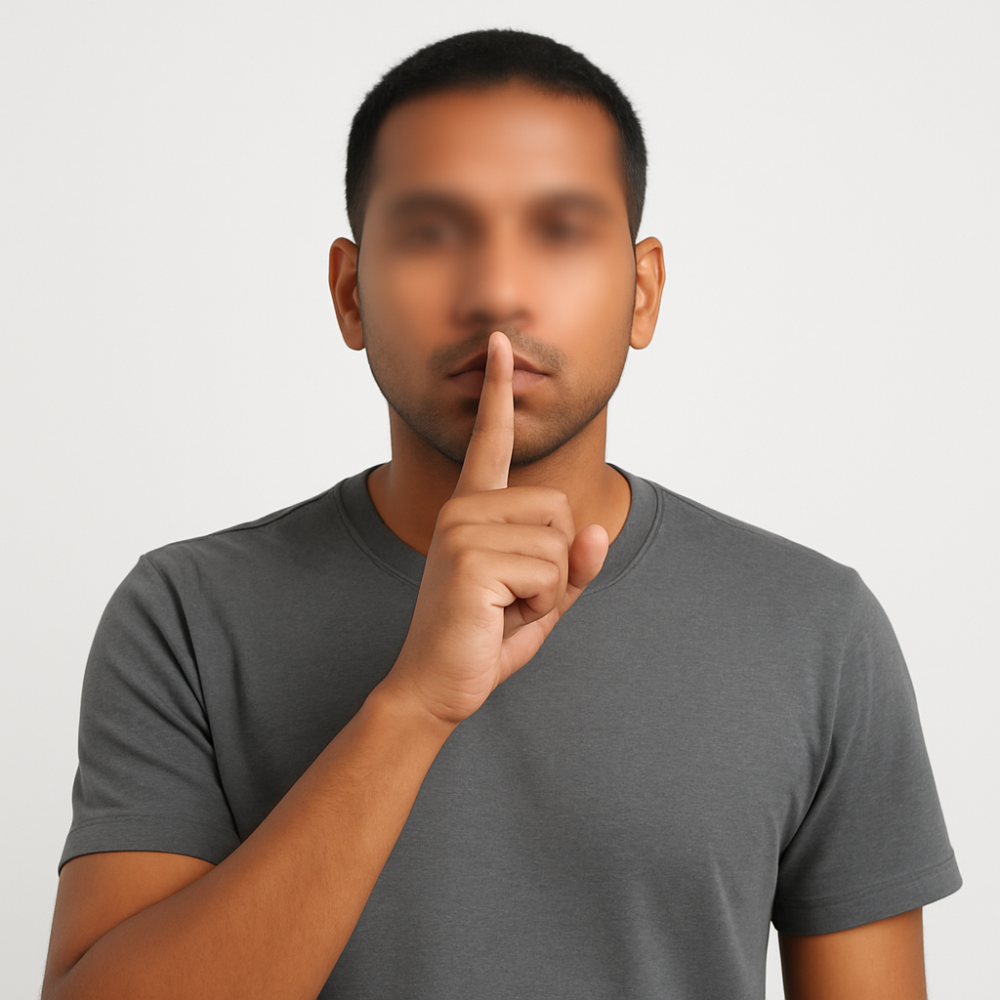

- **ID:** `sil-01`
- **Physical Description:** Place the extended index finger vertically against closed lips; other fingers curled into the palm, eyes widened slightly
- **Intent:** Request silence or signal that a secret should be kept
- **Emotional State:** neutral | **Arousal:** low
- **Emotions:** secrecy, trust, caution, discretion
- **Gesture Type:** emblem
- **Body Parts:** hand, index finger, lips
- **People:** single | **Culture:** universal

### 81. Zipped Lips Gesture

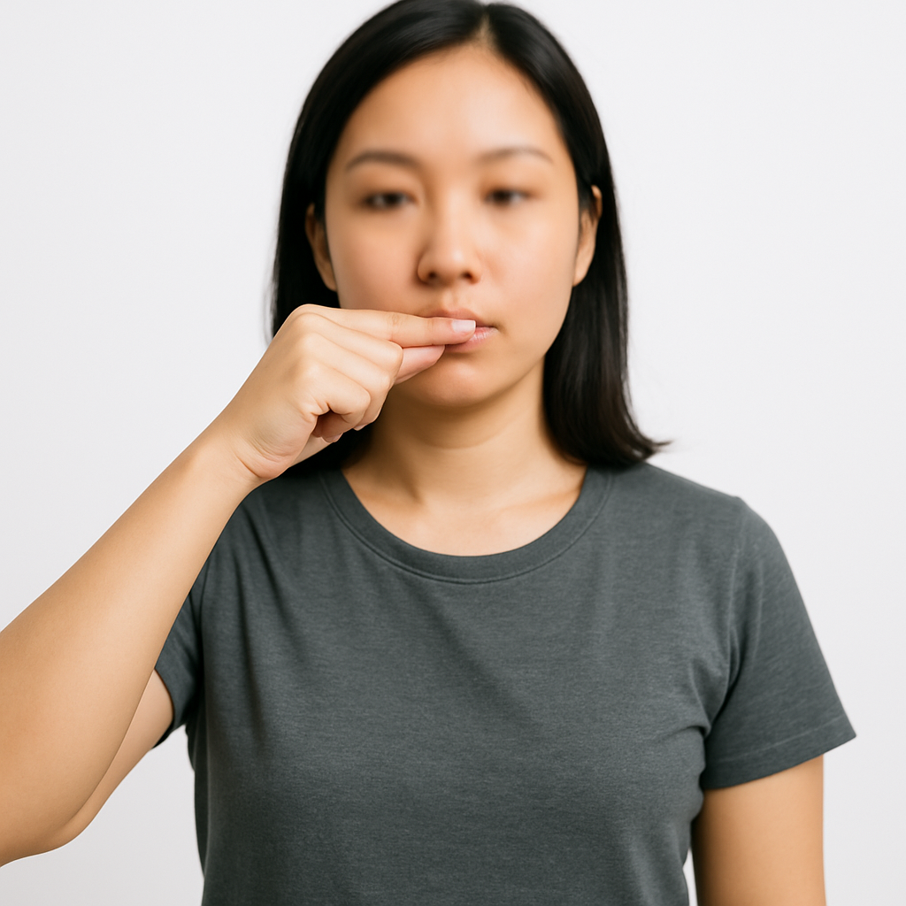

- **ID:** `sil-02`
- **Physical Description:** Pinch the thumb and index finger together and drag them across the closed lips from one corner to the other, mimicking a zipper
- **Intent:** Promise to keep quiet or that a secret is sealed
- **Emotional State:** neutral | **Arousal:** low
- **Emotions:** discretion, loyalty, secrecy, trustworthiness
- **Gesture Type:** illustrator-metaphoric
- **Body Parts:** hand, thumb, index finger, lips
- **People:** single | **Culture:** western

### 82. Hand Cupped Behind Ear

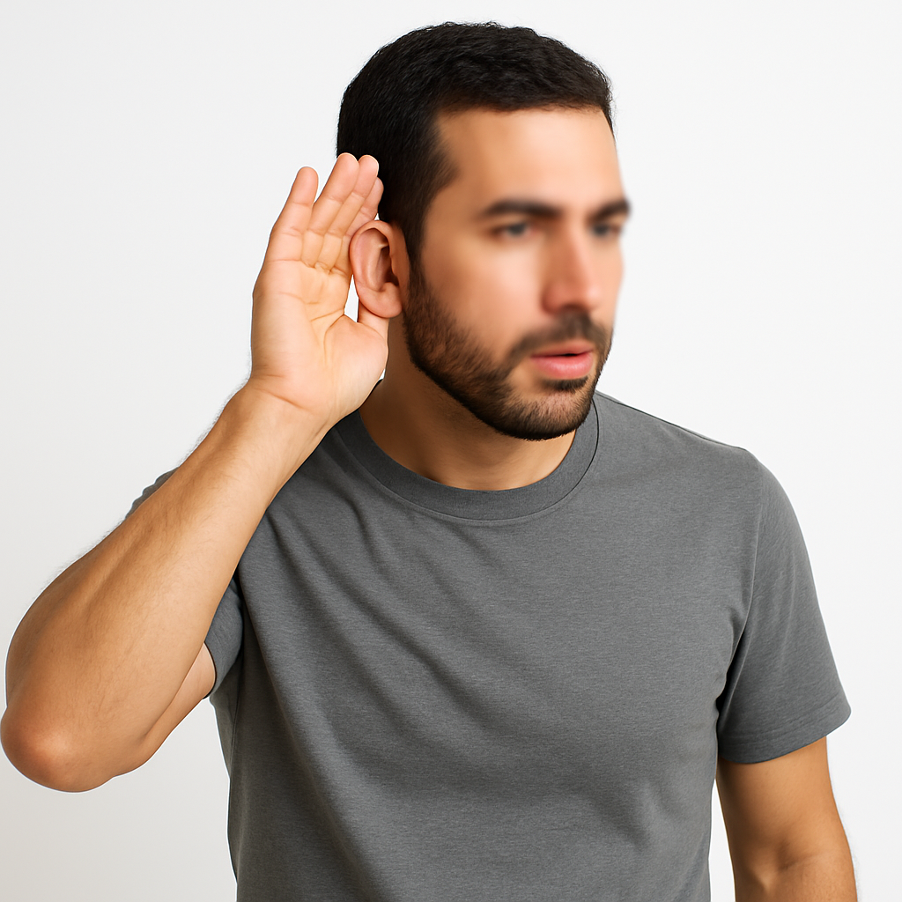

- **ID:** `sil-03`
- **Physical Description:** Cup one hand and place it behind the ear, tilting the head toward the speaker; lean the body slightly forward
- **Intent:** Ask someone to speak louder or repeat themselves
- **Emotional State:** neutral | **Arousal:** low
- **Emotions:** curiosity, attentiveness, confusion, interest
- **Gesture Type:** emblem
- **Body Parts:** hand, ear, head
- **People:** single | **Culture:** universal

### 83. Hands Over Mouth - Surprise

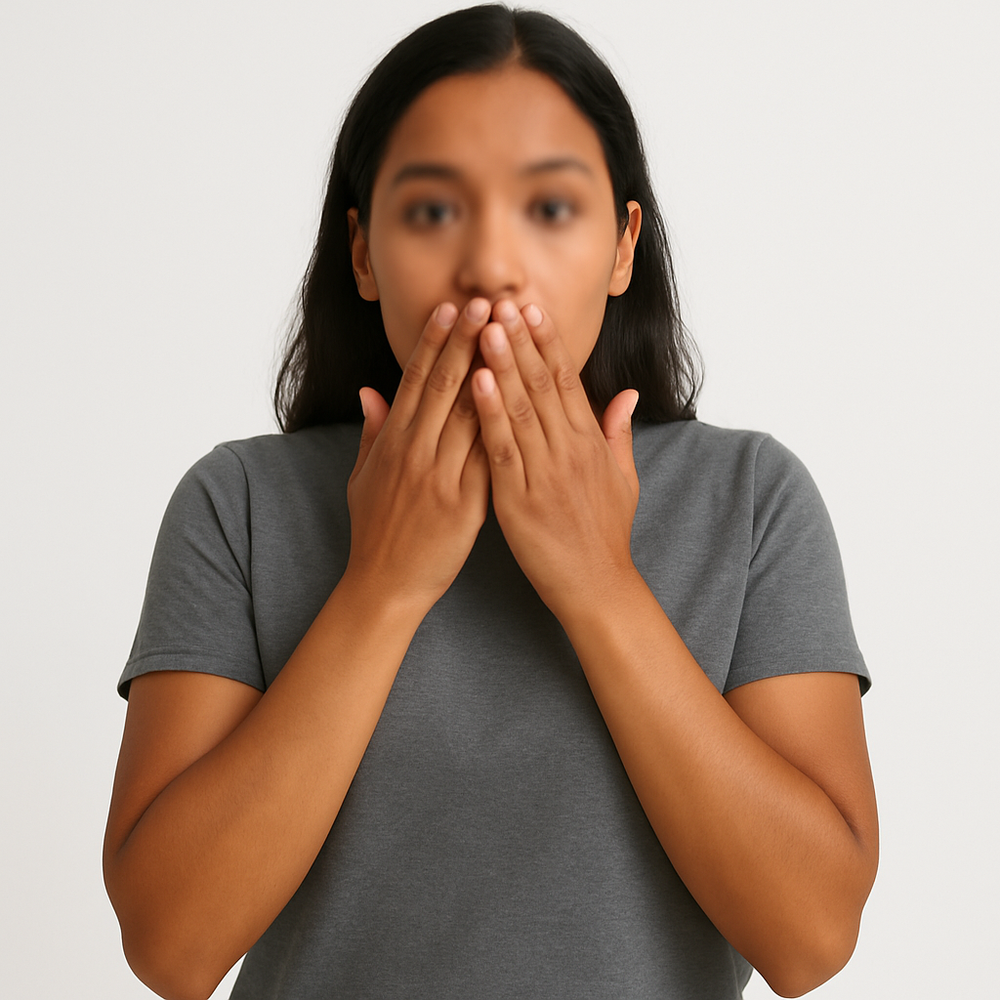

- **ID:** `sil-04`
- **Physical Description:** Raise both hands and press them flat over the open mouth; eyes widen and body recoils slightly backward
- **Intent:** React to something shocking or unexpectedly delightful
- **Emotional State:** positive | **Arousal:** high
- **Emotions:** surprise, shock, disbelief, amazement, wonder
- **Gesture Type:** adaptor
- **Body Parts:** hands, mouth, face
- **People:** single | **Culture:** universal

---

## Size & Degree

### 84. Pinch Gesture for Tiny

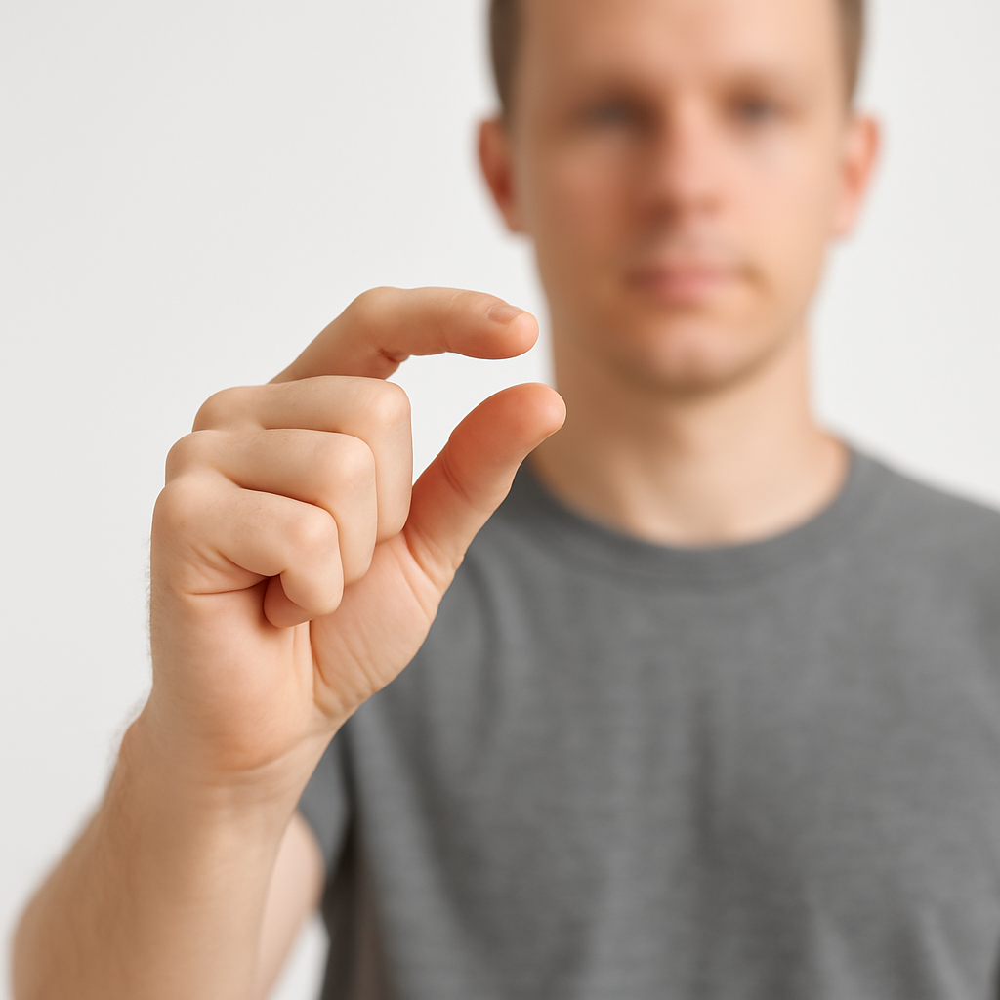

- **ID:** `size-01`
- **Physical Description:** Press the pads of thumb and index finger nearly together, leaving an almost invisible gap; hold at eye level and squint slightly
- **Intent:** Indicate something is extremely small
- **Emotional State:** neutral | **Arousal:** low
- **Emotions:** precision, focus, amusement, clarity
- **Gesture Type:** illustrator-iconic
- **Body Parts:** hand, thumb, index finger
- **People:** single | **Culture:** universal

### 85. Hands Apart for Height

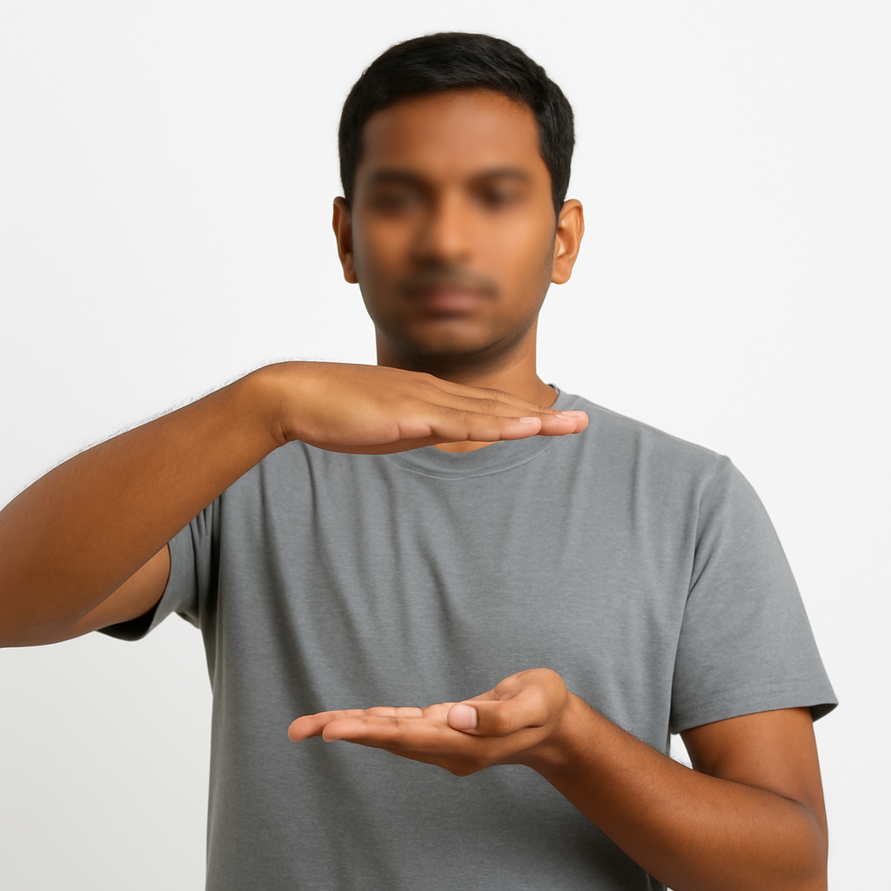

- **ID:** `size-03`
- **Physical Description:** Hold one hand flat and horizontal at a lower position and the other at a higher position; palms face downward to mark vertical distance
- **Intent:** Indicate the height or vertical dimension of something
- **Emotional State:** neutral | **Arousal:** low
- **Emotions:** clarity, estimation, focus, expressiveness
- **Gesture Type:** illustrator-iconic
- **Body Parts:** hands, palms, arms
- **People:** single | **Culture:** universal

---

## Sports & Taunting

### 86. Timeout T-Shape (Sports)

- **ID:** `sport-01`
- **Physical Description:** Form a T-shape by placing one flat hand horizontally on top of the fingertips of the other vertical hand; raise above head for referee visibility
- **Intent:** Call an official timeout during a sporting event
- **Emotional State:** neutral | **Arousal:** medium
- **Emotions:** composure, strategy, authority, focus
- **Gesture Type:** emblem
- **Body Parts:** hands, fingers, arms
- **People:** single | **Culture:** western

### 87. Muscle Flex

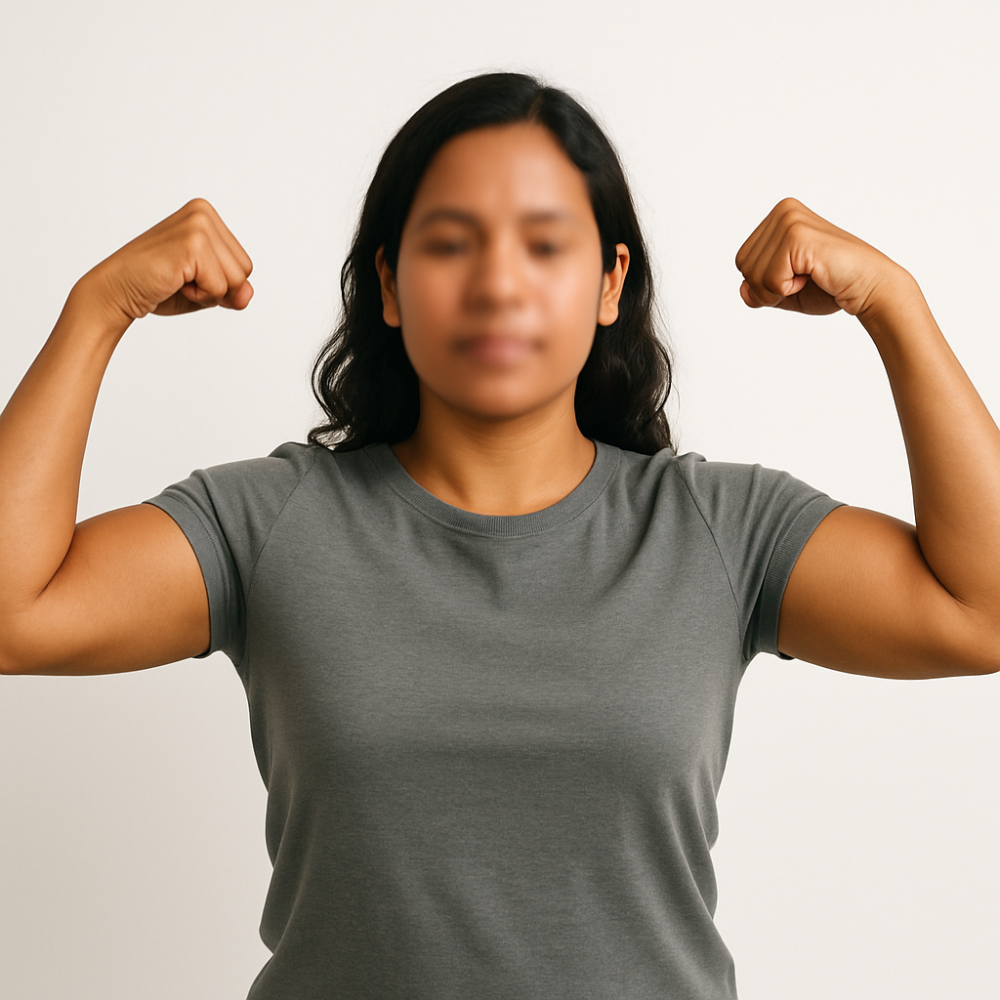

- **ID:** `sport-02`
- **Physical Description:** Bend one or both arms at the elbow and contract the biceps; fists clenched, arms pulled tight to the body
- **Intent:** Display strength or celebrate a physical achievement
- **Emotional State:** positive | **Arousal:** high
- **Emotions:** pride, confidence, power, determination, bravado
- **Gesture Type:** emblem
- **Body Parts:** arms, biceps, fists, shoulders
- **People:** single | **Culture:** universal

---

## Team Building

### 88. Team Chant Hands

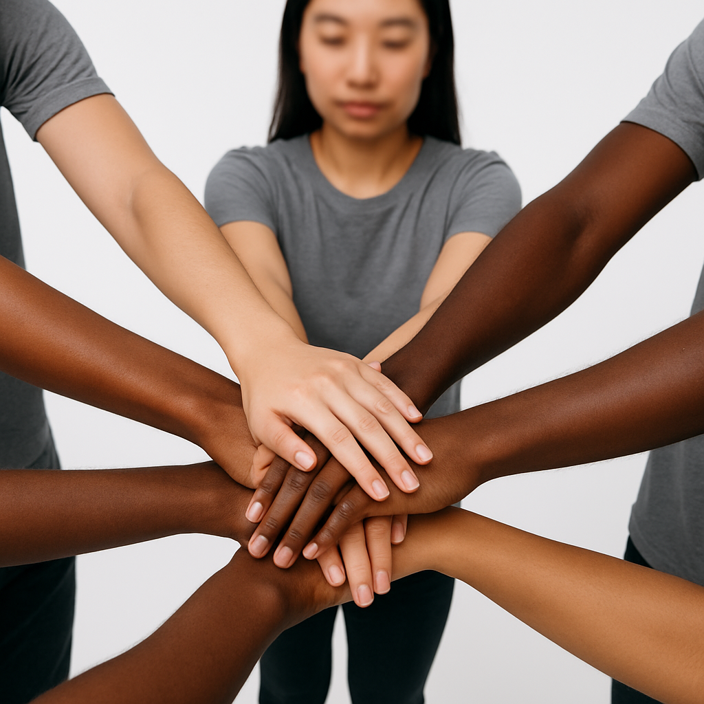

- **ID:** `team-01`
- **Physical Description:** All members extend one hand into the center of a circle, stacking hands on top of each other; raise and release together on a chant
- **Intent:** Build team unity and shared commitment before an activity
- **Emotional State:** positive | **Arousal:** high
- **Emotions:** camaraderie, excitement, solidarity, belonging, unity
- **Gesture Type:** emblem
- **Body Parts:** hands, arms
- **People:** 3 or more | **Culture:** universal

### 89. Timeout T-Shape

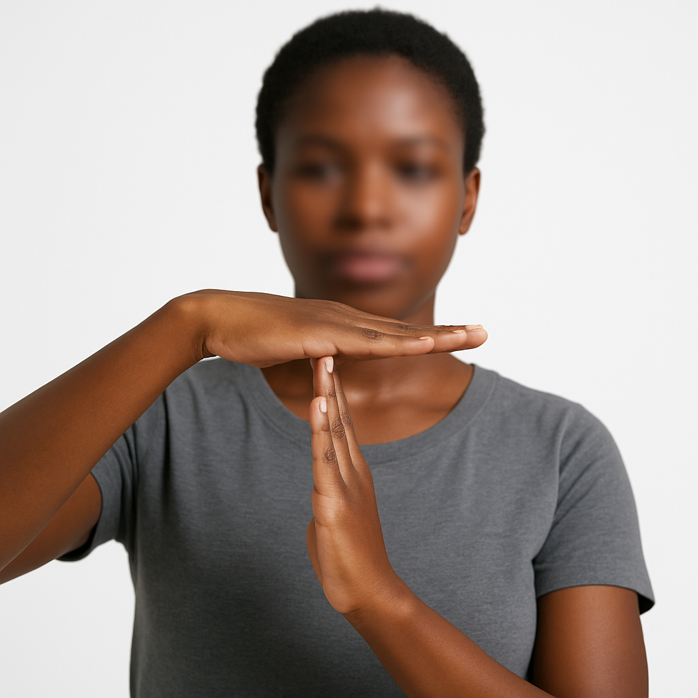

- **ID:** `team-02`
- **Physical Description:** Form a T-shape by placing one flat hand horizontally on top of the fingertips of the other vertical hand at chest height
- **Intent:** Request a pause or timeout during group activity
- **Emotional State:** neutral | **Arousal:** medium
- **Emotions:** composure, authority, need-for-rest, patience
- **Gesture Type:** emblem
- **Body Parts:** hands, fingers
- **People:** single | **Culture:** western

---

## Urgency & Attention

### 90. Snapping Fingers

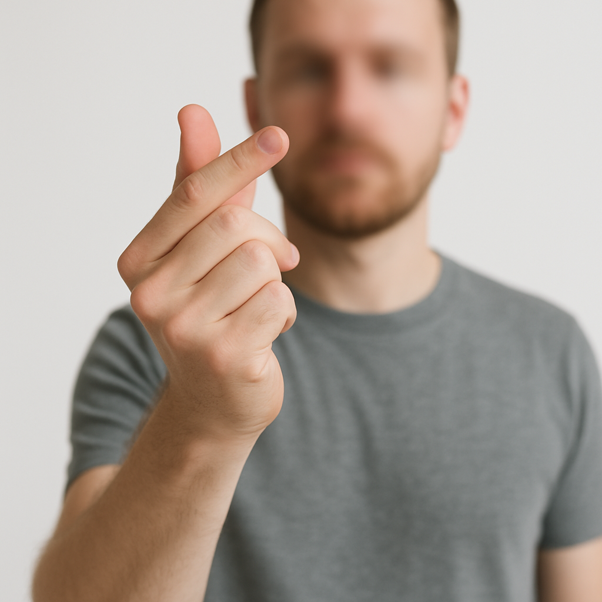

- **ID:** `urg-01`
- **Physical Description:** Press the middle finger against the thumb pad and flick it down to strike the base of the thumb, producing a sharp snap sound
- **Intent:** Demand immediate attention or signal recall of an idea
- **Emotional State:** neutral | **Arousal:** medium
- **Emotions:** urgency, authority, impatience, alertness
- **Gesture Type:** emblem
- **Body Parts:** hand, thumb, middle finger
- **People:** single | **Culture:** western

### 91. Hand Clap for Attention

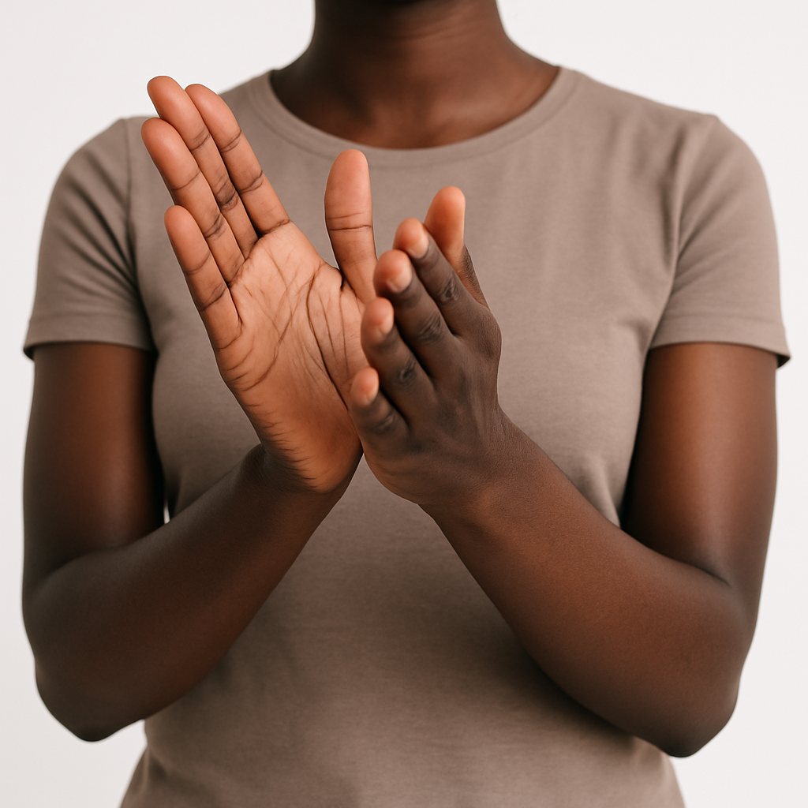

- **ID:** `urg-02`
- **Physical Description:** Clap both open palms together in one or two sharp, loud strikes at chest height; body oriented toward the group
- **Intent:** Command a group's attention with an auditory cue
- **Emotional State:** neutral | **Arousal:** high
- **Emotions:** authority, urgency, assertiveness, leadership
- **Gesture Type:** emblem
- **Body Parts:** hands, palms
- **People:** single | **Culture:** universal

### 92. Raised Hand - Classroom Style

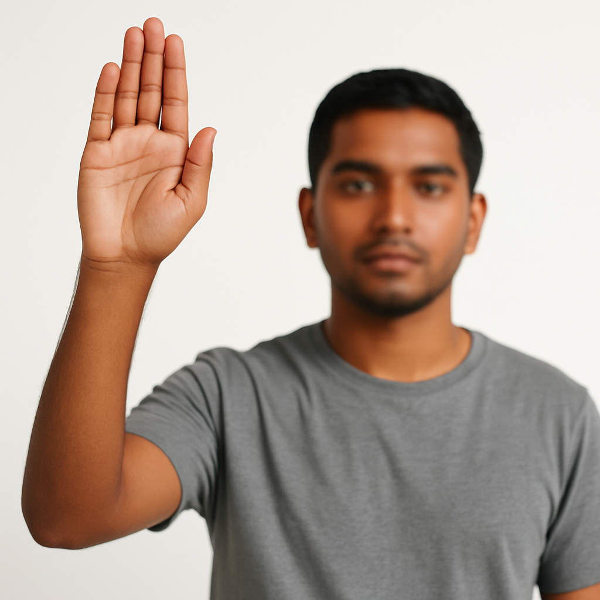

- **ID:** `urg-03`
- **Physical Description:** Raise one arm straight up with the palm open and fingers together; hold it steady above the head
- **Intent:** Request a turn to speak or ask a question
- **Emotional State:** neutral | **Arousal:** low
- **Emotions:** eagerness, respect, curiosity, patience
- **Gesture Type:** emblem
- **Body Parts:** arm, hand, shoulder
- **People:** single | **Culture:** universal

### 93. Tapping Wrist - Hurry Up

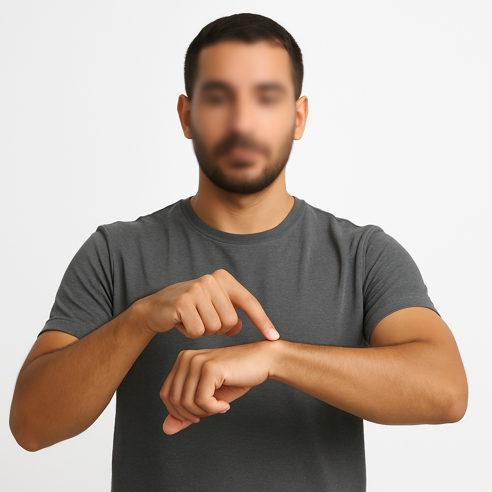

- **ID:** `urg-05`
- **Physical Description:** Tap the index finger of one hand repeatedly on the inside of the opposite wrist where a watch would be; eyebrows raised
- **Intent:** Urge someone to hurry or signal that time is running out
- **Emotional State:** negative | **Arousal:** medium
- **Emotions:** impatience, urgency, anxiety, frustration
- **Gesture Type:** emblem
- **Body Parts:** hand, index finger, wrist
- **People:** single | **Culture:** western

### 94. Rapid Come-On Beckoning

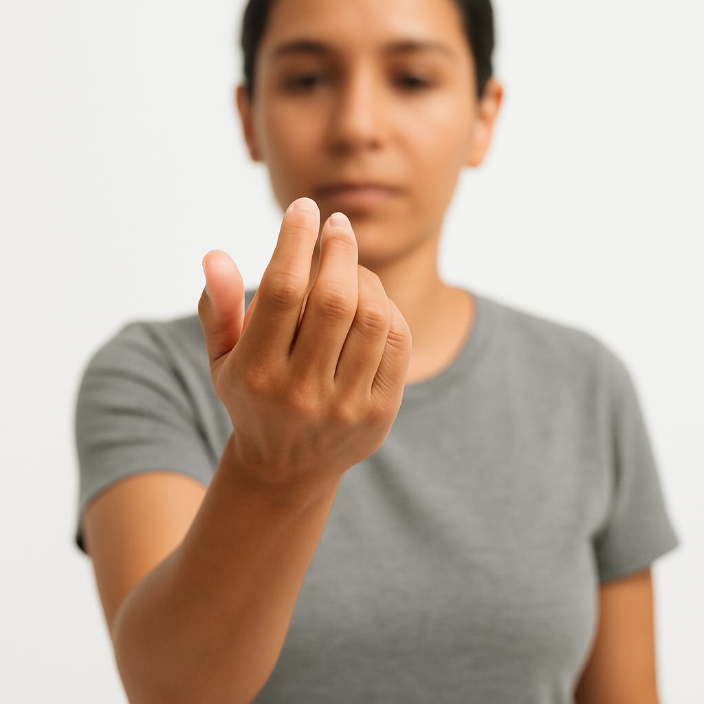

- **ID:** `urg-06`
- **Physical Description:** Extend one hand forward and rapidly curl all fingers toward the palm in quick, repeated beckoning motions
- **Intent:** Urgently beckon someone to follow or hurry over
- **Emotional State:** neutral | **Arousal:** high
- **Emotions:** urgency, impatience, anticipation, assertiveness
- **Gesture Type:** emblem
- **Body Parts:** hand, fingers, arm
- **People:** single | **Culture:** universal

### 95. Two Hands Complete Stop

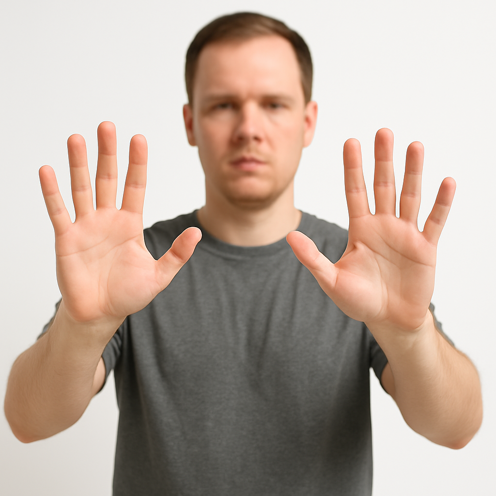

- **ID:** `urg-07`
- **Physical Description:** Thrust both arms forward with palms flat and facing outward at shoulder height; fingers together and body braced
- **Intent:** Command an immediate and total stop
- **Emotional State:** negative | **Arousal:** high
- **Emotions:** authority, alarm, firmness, urgency, concern
- **Gesture Type:** emblem
- **Body Parts:** arms, hands, palms, torso
- **People:** single | **Culture:** universal

### 96. Timeout Crossed Hands

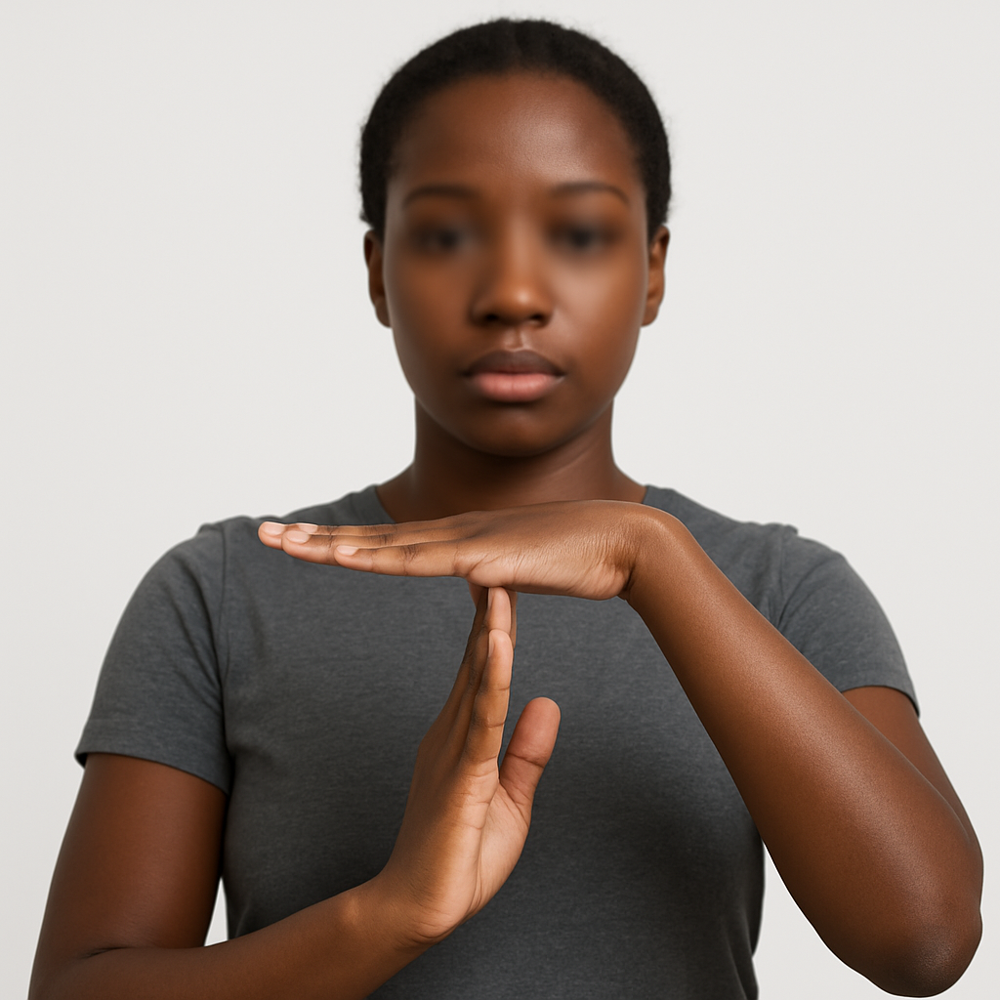

- **ID:** `urg-08`
- **Physical Description:** Form a T-shape by placing one flat hand horizontally on top of the fingertips of the other vertical hand at chest height
- **Intent:** Request a pause or break in activity
- **Emotional State:** neutral | **Arousal:** medium
- **Emotions:** composure, authority, need-for-rest, assertiveness
- **Gesture Type:** emblem
- **Body Parts:** hands, fingers
- **People:** single | **Culture:** western

### 97. Two-Hand Finger Whistle

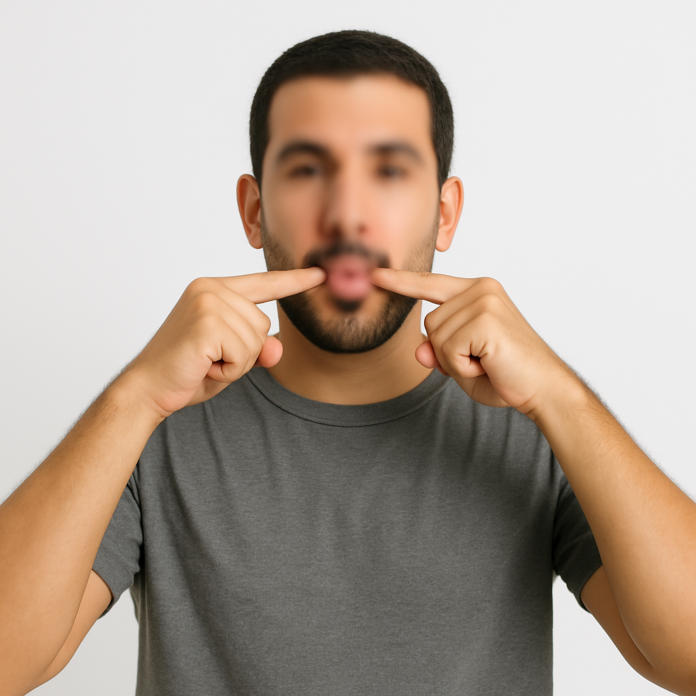

- **ID:** `urg-09`
- **Physical Description:** Insert the thumb and index finger of each hand into the mouth, pressing against the tongue; blow sharply to produce a loud whistle
- **Intent:** Get attention from a long distance with a piercing signal
- **Emotional State:** neutral | **Arousal:** high
- **Emotions:** urgency, excitement, assertiveness, alertness
- **Gesture Type:** emblem
- **Body Parts:** hands, fingers, mouth
- **People:** single | **Culture:** universal

---

## Wishful & Luck

### 98. Pinky Promise

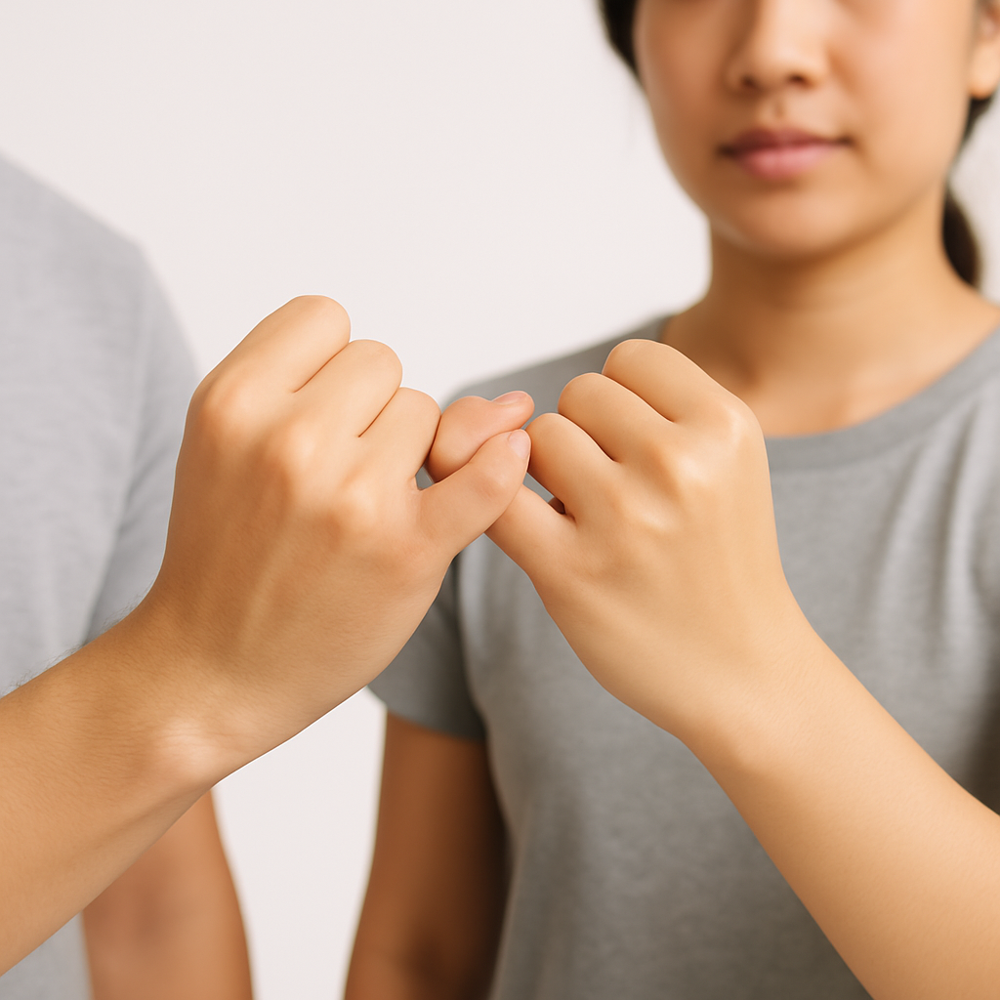

- **ID:** `wish-01`
- **Physical Description:** Hook the pinky finger of one hand around the pinky finger of the other person's hand; shake gently up and down
- **Intent:** Seal a solemn promise or pact between two people
- **Emotional State:** positive | **Arousal:** low
- **Emotions:** trust, commitment, sincerity, hope, loyalty
- **Gesture Type:** emblem
- **Body Parts:** hand, pinky finger
- **People:** 2 person | **Culture:** universal

### 99. Crossed Fingers for Luck

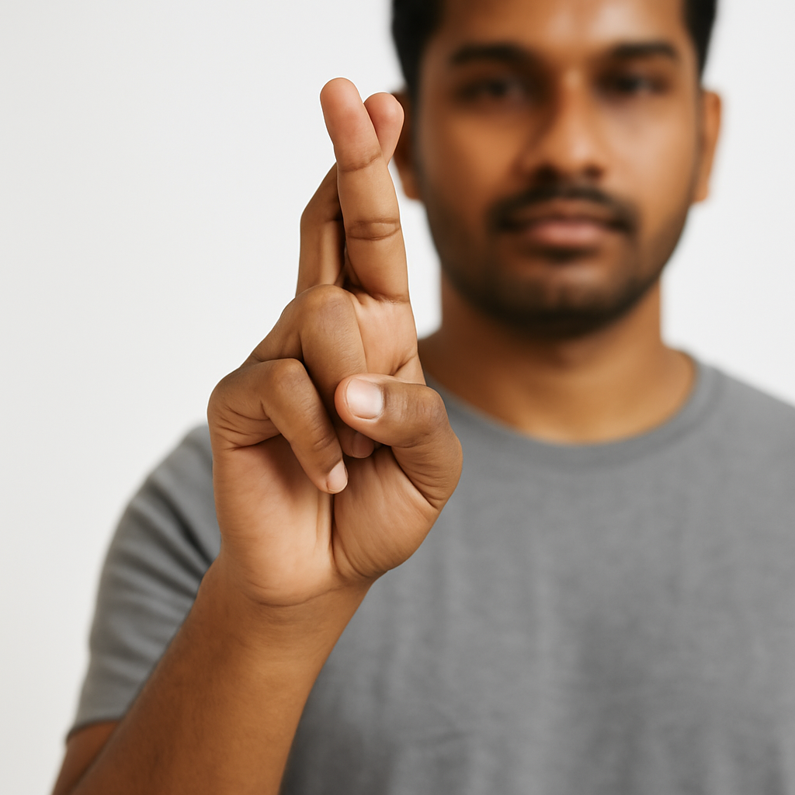

- **ID:** `wish-02`
- **Physical Description:** Cross the middle finger over the index finger on one hand and hold it up; sometimes hidden behind the back
- **Intent:** Hope for good luck or a favorable outcome
- **Emotional State:** positive | **Arousal:** low
- **Emotions:** hope, optimism, anticipation, anxiety, wishfulness
- **Gesture Type:** emblem
- **Body Parts:** hand, index finger, middle finger
- **People:** single | **Culture:** western

---
